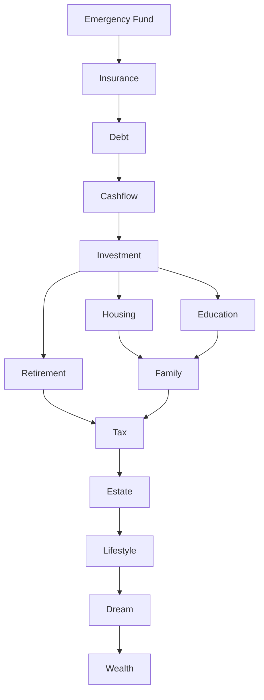

# Goal prioritization inputs and scoring
# Enterprise Inputs

Priority calculation consumes:

1. Goal
2. Life Goals
3. Decision Principles
4. Decision Rule Catalog
5. Scoring Model
6. Recommendation Priority Framework
7. Constraint Rules
8. Scenario Framework
9. Projection Engine Framework
10. Optimization Engine Framework
11. Financial Philosophy
12. Execution Plan Framework
13. Action Planning Framework
14. Budget
15. CashFlow
16. Portfolio
17. Loan
18. Insurance
19. Scenario
20. Decision


# Priority Dimensions

Every active or planned Goal is scored against the following dimensions. Each dimension is normalized to 0 to 100 before weighting.

| Dimension | Meaning |
|---|---|
| Financial Impact | Expected improvement to net worth, cashflow, liability position, or long-term sustainability. |
| Risk Reduction | Reduction in liquidity, insurance, debt, housing, retirement, or concentration risk. |
| Time Sensitivity | Degree to which delay worsens feasibility or cost. |
| Deadline | Proximity and strictness of target date or legal date. |
| Life Stage | Relevance to current household stage, age, dependents, and planning horizon. |
| Dependency | Whether another Goal, Recommendation, Scenario, or ExecutionPlan depends on this Goal. |
| Legal Requirement | Regulatory, contractual, tax, or mandatory compliance requirement. |
| Cashflow Impact | Positive or negative recurring cashflow effect. |
| Investment Opportunity | Expected value of investing now versus later. |
| Loan Interest | Interest saved or interest burden avoided. |
| Tax Saving | Tax reduction or avoidance of tax penalty. |
| Insurance Gap | Severity of coverage shortfall. |
| Family Requirement | Mandatory household, child, parent support, or shared family obligation. |
| Emergency | Immediate survivability or financial continuity need. |
| Health | Medical, health protection, or health-related financial resilience. |
| Education | Child education, self-education, or planned education funding need. |
| Retirement | Retirement readiness and funding sustainability. |
| Housing | Housing affordability, stability, upgrade, purchase, or rental strategy impact. |
| Lifestyle | Quality-of-life value after mandatory needs and constraints. |
| User Preference | Explicit user priority within allowed constraints. |
| AI Confidence | Confidence in calculation quality, data completeness, and model stability. |
| Expected ROI | Financial return relative to required funding. |
| Expected Utility | Total expected benefit including non-investment utility. |
| Expected Satisfaction | Expected subjective satisfaction when financially feasible. |


# Priority Score

Priority Score is the canonical Goal ranking score.

```text
Priority Score = clamp(
    0.22 * Urgency Score
  + 0.26 * Importance Score
  + 0.16 * Dependency Score
  + 0.12 * Constraint Score
  + 0.10 * Resource Fit Score
  + 0.08 * User Preference Score
  + 0.06 * AI Confidence Score
  + Critical Override
  - Deferral Penalty,
  0,
  100
)
```

Weight definitions:

| Component | Weight | Explanation |
|---|---:|---|
| Urgency Score | 22% | Captures deadline, penalty, opportunity cost, risk, and time window. |
| Importance Score | 26% | Captures financial impact, risk, return, need, and user preference. |
| Dependency Score | 16% | Rewards prerequisite Goals that unblock other Goals. |
| Constraint Score | 12% | Reflects regulatory, Hard, Soft, and Advisory constraint pressure. |
| Resource Fit Score | 10% | Measures feasibility with current budget, time, income, and cashflow. |
| User Preference Score | 8% | Preserves declared user intent after mandatory needs are satisfied. |
| AI Confidence Score | 6% | Reduces rank volatility when data quality is weak. |
| Critical Override | variable | Applies when Emergency, Legal Requirement, Health, or Hard constraint requires elevation. |
| Deferral Penalty | variable | Applies when a Goal is intentionally deferred, blocked, stale, or infeasible. |

Score rules:

1. All component scores must be normalized to 0 to 100.
2. The final score must be clamped to 0 to 100.
3. Hard constraints may cap or override rank before numeric sorting.
4. Missing mandatory inputs reject calculation.
5. Identical inputs must produce identical score and rank.


# Goal Categories

Goal Prioritization supports these canonical categories:

1. Emergency
2. Debt
3. Cashflow
4. Investment
5. Insurance
6. Housing
7. Education
8. Retirement
9. Family
10. Tax
11. Estate
12. Lifestyle
13. Dream

Category alignment with Life Goals:

| Goal Prioritization Category | Life Goals Alignment |
|---|---|
| Emergency | Financial, Health, Family |
| Debt | Financial, Housing |
| Cashflow | Financial |
| Investment | Financial, Retirement |
| Insurance | Family, Health, Financial |
| Housing | Housing |
| Education | Family, Career, Lifestyle |
| Retirement | Retirement |
| Family | Family |
| Tax | Financial, Estate |
| Estate | Retirement, Family |
| Lifestyle | Lifestyle |
| Dream | Lifestyle, Career, Financial |


# Goal Levels

| Level | Score Range | Meaning |
|---|---:|---|
| Critical | 90 to 100 | Immediate or mandatory priority; delay may cause major harm, violation, insolvency, or loss of essential protection. |
| High | 75 to 89 | Strong priority with clear financial, risk, dependency, or deadline value. |
| Medium | 60 to 74 | Valid Goal that should be funded after higher-priority needs. |
| Low | 40 to 59 | Useful but not urgent; schedule only when resources permit. |
| Optional | 20 to 39 | Discretionary Goal with low mandatory value. |
| Deferred | 0 to 19 | Not currently fundable, blocked, stale, or intentionally postponed. |


# Urgency Calculation

Urgency Score captures how costly it is to delay a Goal.

```text
Urgency Score = clamp(
    0.30 * Deadline Pressure
  + 0.22 * Penalty Severity
  + 0.18 * Opportunity Cost
  + 0.20 * Risk Escalation
  + 0.10 * Time Window Scarcity,
  0,
  100
)
```

Component definitions:

| Component | Definition |
|---|---|
| Deadline Pressure | 100 when target date is overdue or within required lead time; decreases as available months increase. |
| Penalty Severity | Financial, legal, tax, insurance, interest, or execution penalty caused by delay. |
| Opportunity Cost | Expected lost return, lost discount, lost compounding, or lost Scenario value from waiting. |
| Risk Escalation | Increase in liquidity, debt, health, family, retirement, housing, or insurance risk caused by delay. |
| Time Window Scarcity | Availability of an action window, enrollment window, rate lock, tax year, application period, or limited opportunity. |

Deadline Pressure formula:

```text
Deadline Pressure =
if MonthsToDeadline <= 0 then 100
else clamp(100 * (RequiredLeadMonths / MonthsToDeadline), 0, 100)
```

Penalty Severity formula:

```text
Penalty Severity = clamp(
    100 * ExpectedDelayPenaltyAmount / Max(GoalTargetAmount, MonthlyCoreExpense, 1),
    0,
    100
)
```

Opportunity Cost formula:

```text
Opportunity Cost = clamp(
    100 * ExpectedLostValueFromDelay / Max(GoalTargetAmount, 1),
    0,
    100
)
```

Risk Escalation formula:

```text
Risk Escalation = max(
    LiquidityRiskDelta,
    DebtRiskDelta,
    InsuranceGapRiskDelta,
    RetirementRiskDelta,
    HousingRiskDelta,
    HealthRiskDelta
)
```

Time Window Scarcity formula:

```text
Time Window Scarcity =
if WindowClosesWithinRequiredLeadTime then 100
else clamp(100 * RequiredLeadMonths / MonthsUntilWindowClose, 0, 100)
```


# Importance Calculation

Importance Score captures the intrinsic value of achieving the Goal.

```text
Importance Score = clamp(
    0.30 * Impact
  + 0.25 * Risk
  + 0.18 * Return
  + 0.17 * Need
  + 0.10 * Preference,
  0,
  100
)
```

Impact:

```text
Impact = normalized score of projected improvement in Net Worth, Monthly Net Cashflow, Emergency Fund Months, Debt Service Ratio, Retirement Readiness Ratio, Goal Achievement Ratio, or Scenario Safety Margin.
```

Risk:

```text
Risk = normalized score of risk reduction across liquidity, debt, insurance, retirement, housing, portfolio concentration, legal, family, health, and cashflow risks.
```

Return:

```text
Return = clamp(100 * ExpectedROI / TargetROI, 0, 100)
```

Need:

```text
Need = max(Emergency Need, Legal Need, Family Need, Health Need, Insurance Need, Housing Need, Retirement Need, Education Need)
```

Preference:

```text
Preference = normalized explicit user priority after Constraint Rules and Decision Principles are applied.
```


# Dependency Rule

Goal Prioritization must evaluate dependency before final ranking. A dependent Goal cannot outrank an unmet prerequisite when the prerequisite is required for feasibility or safety.

Canonical dependency chain:

```text
Emergency Fund
↓
Insurance
↓
Debt
↓
Cashflow
↓
Investment
↓
Housing
↓
Education
↓
Retirement
↓
Family
↓
Tax
↓
Estate
↓
Lifestyle
↓
Dream
↓
Wealth
```

Dependency Score formula:

```text
Dependency Score = clamp(
    45 * IsPrerequisiteForActiveGoal
  + 25 * NumberOfBlockedGoalsNormalized
  + 20 * DownstreamFundingImpact
  + 10 * ExecutionDependencyImpact,
  0,
  100
)
```

Dependency Graph:



