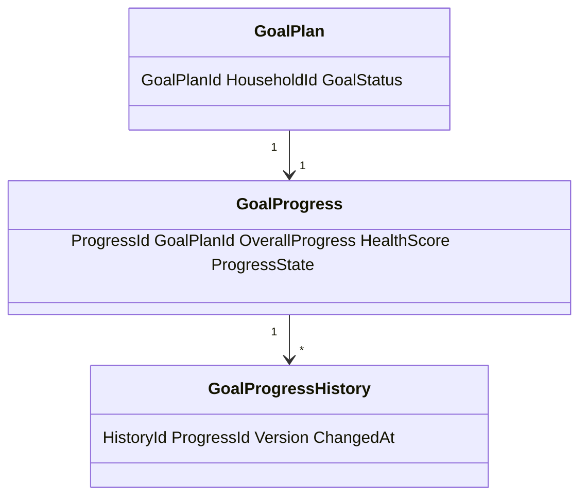
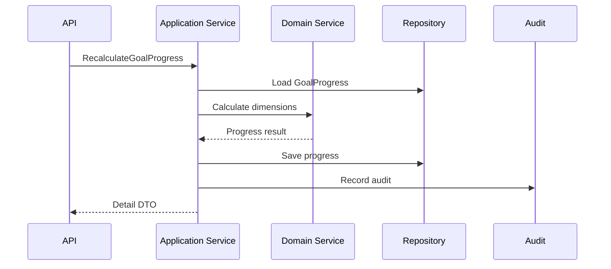
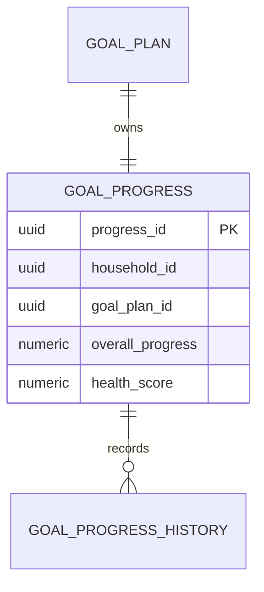
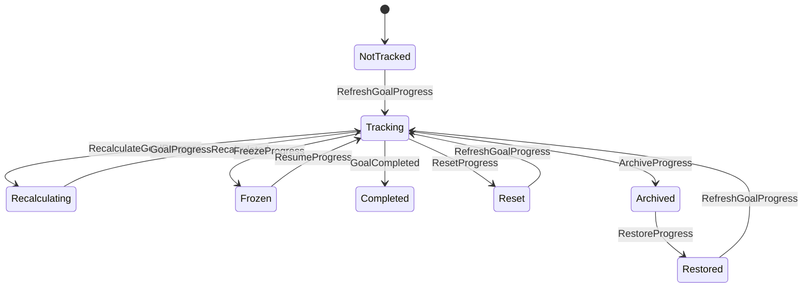
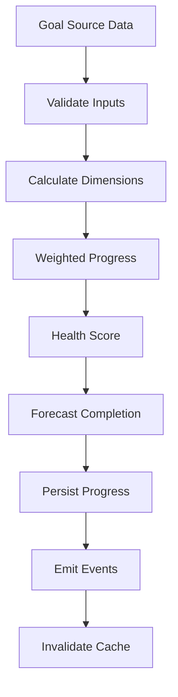

# Goal Progress Tracking
Version: 1.0 Status: Enterprise Specification Owner: Project Atlas Source of Truth: Atlas Goal Progress Tracking Specification Last Updated: 2026-07-13
## Split Navigation
- [Goal progress model and formulas](goal-progress-tracking/model-and-formulas.md)
- [Goal progress execution and dashboard](goal-progress-tracking/execution-and-dashboard.md)
# Goal Progress Overview
## Purpose
Goal Progress Tracking defines how Atlas measures, updates, validates, persists, exposes, audits, and reports progress for GoalPlan. It coordinates GoalPlan progress with Goal Lifecycle, Goal Dependency, Goal Prioritization, Goal Funding, Goal Review, DecisionSession, Recommendation, Scenario, Notification, Dashboard, Projection, Calculation, Audit, Security, Permission, Tenant, Database, Cache, API, and Reporting. It does not redesign Atlas. It does not modify existing Domain ownership. It does not create a new Business Concept. It does not replace GoalPlan, Goal Lifecycle, Goal Dependency, DecisionSession, Recommendation, Scenario, or Notification.
## Business Meaning
Goal Progress is the governed measurement of how close a GoalPlan is to its intended outcome. It gives the User and Household a consistent view of completion, financial readiness, schedule position, milestone state, dependency readiness, risk, confidence, health, and forecast. It supports dashboard visibility, recommendation refresh, decision review, scenario comparison, notification triggering, audit, and replay.
## Progress Model
Goal Progress is derived data attached to GoalPlan. GoalPlan remains the authoritative aggregate. Progress records store current values, forecast values, version, source snapshot, state, and history. Progress records are not independent goals.
## Tracking Scope
Tracking applies to Active, In Progress, Deferred, On Hold, Completed, Cancelled, and Archived GoalPlan according to lifecycle rules. Tracking includes GoalPlan, Milestone, Task when existing planning data supports it, Dependency, DecisionSession, Recommendation, Scenario, Notification, User, Household, Dashboard, API, and Audit. Completed progress is immutable at 100% unless approved correction restores the GoalPlan. Cancelled and Archived progress are read-only.
## Calculation Strategy
Calculation is deterministic for the same GoalPlan state, milestone state, task state, dependency state, financial state, decision state, recommendation state, scenario state, assumptions, formulas, and calculation version. Dimension weights are configuration-owned and versioned. All progress percentages use decimal values from 0 to 1. Manual updates are allowed only for permitted fields and allowed lifecycle states. Scenario simulation creates forecast progress and does not overwrite committed progress.
## Update Frequency
| Update | Frequency | Requirement |
|---|---|---|
| Manual Update | On user or service action | Validate, authorize, audit. |
| Automatic Update | On source mutation | Recalculate affected dimensions. |
| Event Driven Update | On Domain Event | Idempotent update with causation id. |
| Batch Update | Background Job | Bounded pages and checkpoint. |
| Scheduled Update | Configured cadence | Reconcile stale progress. |
| Scenario Simulation Update | On Scenario run | Forecast only. |
| Recommendation Update | On Recommendation change | Recalculate expected or realized impact. |
| Decision Update | On DecisionSession change | Commit or revert decision impact. |
## Consistency Requirements
Goal Progress is eventually consistent with ordinary source changes. Goal completion requires strong consistency before final 100% is exposed. Financial, milestone, dependency, decision, recommendation, and scenario values must be traceable to source records. Archived, Cancelled, and Completed progress must not be changed by ordinary updates.
## Relationship with Goal
GoalPlan owns the progress consistency boundary. GoalProgress references GoalPlanId, HouseholdId, TenantId when applicable, lifecycle state, and calculation version. Goal status controls update, freeze, reset, archive, restore, and completion behavior.
## Relationship with Milestone
Milestones contribute weighted completion. Milestone weights sum to 1 per GoalPlan. Completed milestones contribute full value. Blocked or delayed milestones affect health, dependency, schedule, and notification behavior.
## Relationship with Task
Tasks contribute to physical progress only when existing Goal planning data tracks task state. Task progress is subordinate to milestone and Goal completion rules. Task rollback triggers recalculation.
## Relationship with Decision
DecisionSession can update progress when accepted, rejected, replayed, or superseded. Accepted decisions may commit forecast or recommendation impact. Decision-driven changes must store DecisionSessionId and decision version.
## Relationship with Recommendation
Accepted Recommendation can increase forecast progress. Completed Recommendation can increase committed progress. Dismissed or suppressed Recommendation can recalculate forecast, confidence, and health. Recommendation-driven changes must store RecommendationId and version.
## Relationship with Scenario
Scenario supplies forecast progress and comparison values. Scenario progress remains forecast until accepted through DecisionSession. Scenario values must include ScenarioId, ScenarioVersion, generated time, and assumptions.
## Relationship with Notification
Notification is triggered by threshold crossing, delay, ahead state, behind state, health change, milestone completion, dependency block, forecast change, and Goal completion. Notification does not own progress. Notification suppression does not suppress audit.
## Relationship with User
User reads or updates progress through authenticated and authorized API, UI, dashboard, notification, or report paths. Manual update requires actor, permission, reason, and audit.
# Progress Model
## Physical Progress
Physical Progress measures non-financial execution completion.
```text
PhysicalProgress = sum(TaskWeight_i * TaskCompletion_i) / sum(TaskWeight_i)
```
If task data is not tracked:
```text
PhysicalProgress = MilestoneProgress
```
## Financial Progress
Financial Progress measures funding against target.
```text
FinancialProgress = clamp(CurrentFundedAmount / TargetAmount, 0, 1)
```
When TargetAmount is missing:
```text
FinancialProgress = null
```
## Time Progress
Time Progress measures elapsed time against planned time.
```text
TimeProgress = clamp((AsOfDate - StartDate) / (TargetDate - StartDate), 0, 1)
```
When TargetDate is missing:
```text
TimeProgress = null
```
## Milestone Progress
```text
MilestoneProgress = sum(MilestoneWeight_i * MilestoneCompletion_i)
```
```text
sum(MilestoneWeight_i) = 1
```
## Dependency Progress
```text
DependencyProgress = ReadyDependencyCount / RequiredDependencyCount
```
If RequiredDependencyCount is 0:
```text
DependencyProgress = 1
```
## Risk Progress
```text
RiskProgress = 1 - clamp(CurrentRiskScore / BaselineRiskScore, 0, 1)
```
If BaselineRiskScore is 0:
```text
RiskProgress = 1
```
## Confidence Score
```text
ConfidenceScore =
  0.35 * DataCompletenessScore +
  0.25 * CalculationFreshnessScore +
  0.20 * DependencyReliabilityScore +
  0.10 * ScenarioReliabilityScore +
  0.10 * DecisionReliabilityScore
```
## Completion Score
```text
CompletionScore =
  0.35 * FinancialProgressOrNeutral +
  0.25 * MilestoneProgress +
  0.20 * PhysicalProgress +
  0.10 * DependencyProgress +
  0.10 * DecisionCompletionScore
```
If FinancialProgress is null:
```text
FinancialProgressOrNeutral = MilestoneProgress
```
## Health Score
```text
HealthScore =
  0.30 * CompletionScore +
  0.20 * ScheduleHealth +
  0.20 * BudgetHealth +
  0.15 * RiskProgress +
  0.15 * ConfidenceScore
```
## Overall Progress
```text
OverallProgress =
  0.30 * MilestoneProgress +
  0.25 * FinancialProgressOrNeutral +
  0.15 * PhysicalProgress +
  0.10 * DependencyProgress +
  0.10 * RiskProgress +
  0.10 * ConfidenceScore
```
Completed GoalPlan forces:
```text
OverallProgress = 1
```
# Progress Calculation
## Weighted Progress
```text
WeightedProgress = sum(Weight_i * DimensionScore_i)
```
```text
0 <= Weight_i <= 1
sum(Weight_i) = 1
0 <= DimensionScore_i <= 1
```
## Milestone Contribution
```text
MilestoneContribution_i = MilestoneWeight_i * MilestoneCompletion_i
MilestoneProgress = sum(MilestoneContribution_i)
```
## Financial Contribution
```text
FinancialContribution = FinancialWeight * clamp(CurrentFundedAmount / TargetAmount, 0, 1)
```
## Elapsed Time %
```text
ElapsedTimePercent = clamp((AsOfDate - StartDate) / (TargetDate - StartDate), 0, 1)
```
## Remaining Time %
```text
RemainingTimePercent = 1 - ElapsedTimePercent
```
## Schedule Variance
```text
ScheduleVariance = OverallProgress - ElapsedTimePercent
```
## Budget Variance
```text
BudgetVariance = ActualFunding - ExpectedFundingAtDate
BudgetVariancePercent = BudgetVariance / TargetAmount
```
## Forecast Completion
```text
ForecastCompletion = clamp(CurrentProgress + ForecastProgressDelta, 0, 1)
```
## Expected Completion Date
```text
ExpectedCompletionDate = AsOfDate + ((1 - CurrentProgress) / ProgressRatePerDay)
```
If ProgressRatePerDay <= 0:
```text
ExpectedCompletionDate = null
```
## Progress Confidence
```text
ProgressConfidence =
  0.40 * DataCompletenessScore +
  0.20 * SourceFreshnessScore +
  0.15 * CalculationTraceScore +
  0.15 * DependencyStabilityScore +
  0.10 * ScenarioConfidenceScore
```
## Goal Health Score
```text
ScheduleHealth = clamp(1 + ScheduleVariance, 0, 1)
BudgetHealth = clamp(1 + BudgetVariancePercent, 0, 1)
GoalHealthScore =
  0.30 * OverallProgress +
  0.20 * ScheduleHealth +
  0.20 * BudgetHealth +
  0.15 * RiskProgress +
  0.15 * ProgressConfidence
```
## Risk Adjusted Progress
```text
RiskPenalty = clamp(CurrentRiskScore * RiskWeight, 0, 0.50)
RiskAdjustedProgress = OverallProgress * (1 - RiskPenalty)
```
## Composite Progress Score
```text
CompositeProgressScore =
  0.40 * OverallProgress +
  0.20 * CompletionScore +
  0.15 * GoalHealthScore +
  0.15 * RiskAdjustedProgress +
  0.10 * ProgressConfidence
```
# Progress Update Rules
## Manual Update
Manual update changes allowed fields directly. Manual update requires GoalProgress.Update permission, actor, reason, row version, and audit. Manual update cannot update Archived, Cancelled, or Completed GoalPlan except approved restore or correction.
## Automatic Update
Automatic update recalculates from source records. Automatic update must use current calculation version. Automatic update must preserve frozen state. Automatic update emits GoalProgressUpdated when committed values change.
## Event Driven Update
Event-driven update responds to Domain Events. It must be idempotent. It must record source event id and causation id.
## Batch Update
Batch update recalculates multiple GoalPlan records. It uses bounded pages, checkpoint, retry, and audit. It must not update Archived or Cancelled GoalPlan.
## Scheduled Update
Scheduled update detects stale progress, refreshes forecast values, and emits schedule-related events when thresholds change.
## Scenario Simulation Update
Scenario simulation update creates forecast progress. It must not overwrite committed progress without accepted DecisionSession.
## Recommendation Update
Recommendation update recalculates expected and realized recommendation contribution. Accepted Recommendation changes forecast. Completed Recommendation changes committed progress when source rules allow it.
## Decision Update
Decision update recalculates decision-dependent progress. Accepted Decision commits approved forecast or recommendation impact. Rejected Decision removes expected impact when applicable.
## Rollback Rules
Rollback restores prior progress version. Rollback preserves audit history. Rollback cannot violate Completed GoalPlan invariant. Rollback requires RestoreProgress before archived records can become editable.
## Recalculation Rules
Recalculation must use deterministic calculation version. Recalculation must include every dimension. Recalculation must preserve frozen fields. Recalculation emits event only when stored values change.
# Validation Rules
1. GoalPlanId is required. 2. HouseholdId is required.
3. TenantId is required when tenant scope exists. 4. ProgressId is required for persisted progress.
5. OverallProgress must be between 0 and 1. 6. PhysicalProgress must be between 0 and 1.
7. FinancialProgress must be null or between 0 and 1. 8. TimeProgress must be null or between 0 and 1.
9. MilestoneProgress must be between 0 and 1. 10. DependencyProgress must be between 0 and 1.
11. RiskProgress must be between 0 and 1. 12. ConfidenceScore must be between 0 and 1.
13. CompletionScore must be between 0 and 1. 14. HealthScore must be between 0 and 1.
15. CompositeProgressScore must be between 0 and 1. 16. Dimension weights must sum to 1.
17. Milestone weights must sum to 1 when milestones exist. 18. TargetAmount must be greater than 0 when FinancialProgress is calculated.
19. CurrentFundedAmount must not be negative unless source financial model permits it. 20. TargetDate must be after StartDate when both are present.
21. AsOfDate is required. 22. ExpectedCompletionDate must be null or on or after AsOfDate.
23. ScheduleVariance must be between -1 and 1. 24. BudgetVariance must preserve currency.
25. Manual update requires reason. 26. Manual update requires actor.
27. Manual update requires permission. 28. Automatic update requires source reference.
29. Event-driven update requires source event id. 30. Batch update requires batch id.
31. Scheduled update requires scheduler run id. 32. Scenario forecast requires ScenarioId.
33. Recommendation update requires RecommendationId when recommendation-driven. 34. Decision update requires DecisionSessionId when decision-driven.
35. Archived GoalPlan cannot update progress. 36. Cancelled GoalPlan cannot update progress.
37. Completed GoalPlan cannot fall below 100%. 38. Frozen progress cannot update except allowed fields.
39. Reset requires explicit permission. 40. Restore requires archived source version.
41. Rollback requires prior version. 42. Recalculation requires calculation version.
43. Forecast requires forecast version. 44. CorrelationId is required.
45. CausationId is required for event-driven update. 46. RequestId is required for API update.
47. RowVersion is required for concurrent update. 48. Deleted progress record cannot be updated.
49. Progress projection must match source GoalPlan scope. 50. Cache key must include GoalPlanId, HouseholdId, and TenantId when applicable.
51. API cursor must preserve scope. 52. Sorting field must be allowlisted.
53. Filtering field must be allowlisted. 54. Field-level security must be evaluated before response.
55. Masking must be applied before export. 56. Notification threshold must be valid.
57. Event emission must be idempotent. 58. Health band must match HealthScore.
59. Forecast values must be marked forecast. 60. Audit record must include changed fields.
# Business Rules
1. Goal Progress belongs to GoalPlan. 2. Goal Progress is derived from approved sources.
3. Goal Progress must not redefine GoalPlan. 4. Goal Progress must not redefine Milestone.
5. Goal Progress must not redefine Task. 6. Goal Progress must not redefine DecisionSession.
7. Goal Progress must not redefine Recommendation. 8. Goal Progress must not redefine Scenario.
9. Progress cannot decrease unexpectedly. 10. Decrease requires rollback, correction, reset, rejected decision, reversed recommendation, dependency block, or approved manual update.
11. Completed Goal must remain 100%. 12. Archived Goal cannot update.
13. Cancelled Goal cannot update. 14. Frozen progress blocks automatic updates.
15. Dependency blocking reduces health score. 16. Dependency blocking can prevent 100% completion.
17. Milestone synchronization runs when milestone state changes. 18. Financial synchronization runs when funding source changes.
19. Decision synchronization runs when DecisionSession changes. 20. Recommendation synchronization runs when Recommendation changes.
21. Scenario synchronization runs when Scenario simulation changes forecast. 22. Notification triggering runs when thresholds are crossed.
23. Manual update requires audit. 24. Recalculation requires audit.
25. Reset requires audit. 26. Freeze requires audit.
27. Resume requires audit. 28. Archive requires audit.
29. Restore requires audit. 30. Event-driven update must be idempotent.
31. Scheduled update must not override manual freeze. 32. Batch update must use bounded pages.
33. Batch update must checkpoint. 34. Batch update must be retryable.
35. Progress calculations must be deterministic. 36. Calculation version must be recorded.
37. Forecast version must be recorded. 38. Manual update must include reason.
39. Financial progress must preserve currency. 40. Time progress must use UTC date boundary unless local date is explicitly configured.
41. Goal without target date has null TimeProgress. 42. Goal without target amount has null FinancialProgress.
43. Null FinancialProgress must not fail non-financial goals. 44. OverallProgress must remain between 0 and 1.
45. HealthScore must remain between 0 and 1. 46. ConfidenceScore must remain between 0 and 1.
47. RiskAdjustedProgress must not exceed OverallProgress. 48. Milestone completion must not exceed 100%.
49. Task completion must not exceed 100%. 50. Dependency progress equals 1 when no required dependencies exist.
51. Blocked dependencies must be visible in detail DTO. 52. GoalDelayed emits when delay threshold is crossed.
53. GoalAheadOfSchedule emits when ahead threshold is crossed. 54. GoalBehindSchedule emits when behind threshold is crossed.
55. GoalHealthChanged emits when health band changes. 56. GoalForecastChanged emits when expected completion changes materially.
57. GoalCompleted emits once. 58. Duplicate GoalCompleted emission is prohibited.
59. GoalProgressReset emits when reset commits. 60. GoalProgressRecalculated emits when recalculation changes stored values.
61. GoalProgressUpdated emits when committed values change. 62. Notification suppression must not suppress audit.
63. API must not expose another Household progress. 64. API must not expose another Tenant progress.
65. Repository must apply Household filter. 66. Repository must apply Tenant filter when applicable.
67. Cache must invalidate after committed update. 68. Projection must refresh after committed update.
69. Dashboard must show generated time. 70. Forecast must show scenario and assumption version.
71. Search must use allowlisted filters. 72. Sorting must use allowlisted columns.
73. Aggregation must preserve Household scope. 74. Export requires permission.
75. Restore preserves history. 76. Archive preserves last committed progress.
77. Recalculation cannot hide source inconsistency. 78. Scenario forecast cannot become committed without accepted DecisionSession.
79. Recommendation forecast cannot become realized without source confirmation. 80. User-visible values must respect field-level security.
# State Machine
## States
| State | Meaning |
|---|---|
| NotTracked | Progress has not been initialized. |
| Tracking | Progress is active and recalculates from sources. |
| Frozen | Progress is held at last committed values. |
| Recalculating | Progress is being recalculated. |
| Forecasted | Forecast progress exists for Scenario or Recommendation analysis. |
| Completed | Goal progress is locked at 100%. |
| Reset | Progress was reset and awaits refresh or manual update. |
| Archived | Progress is read-only historical record. |
| Restored | Archived progress was restored. |
## Transitions
| From | To | Trigger |
|---|---|---|
| NotTracked | Tracking | RefreshGoalProgress |
| Tracking | Recalculating | RecalculateGoalProgress |
| Recalculating | Tracking | GoalProgressRecalculated |
| Tracking | Frozen | FreezeProgress |
| Frozen | Tracking | ResumeProgress |
| Tracking | Forecasted | Scenario Simulation Update |
| Forecasted | Tracking | Decision accepts forecast |
| Tracking | Completed | GoalCompleted |
| Tracking | Reset | ResetProgress |
| Reset | Tracking | RefreshGoalProgress |
| Tracking | Archived | ArchiveProgress |
| Archived | Restored | RestoreProgress |
| Restored | Tracking | RefreshGoalProgress |
## Triggers
Triggers include command, Domain Event, Scheduler run, Background Job, Scenario simulation, Decision acceptance, Recommendation completion, financial mutation, milestone mutation, and dependency mutation.
## Invariant
Completed state has OverallProgress = 1. Archived state is read-only. Cancelled GoalPlan progress is read-only. Frozen state blocks automatic source updates. Every state change is audited.
## Illegal Transition
| From | To | Reason |
|---|---|---|
| Archived | Tracking | RestoreProgress is required first. |
| Completed | Tracking | Approved correction is required first. |
| Frozen | Recalculating | ResumeProgress is required first. |
| Reset | Archived | Refresh or approved archive correction is required first. |
| NotTracked | Completed | Initialization and validation are required first. |
# Commands
## RefreshGoalProgress
Refreshes GoalPlan progress from current source data. Input: GoalPlanId, HouseholdId, TenantId, AsOfDate, RequestedBy, CorrelationId. Output: ProgressId, OverallProgress, HealthScore, UpdatedAt.
## RecalculateGoalProgress
Runs deterministic recalculation. Input: GoalPlanId, CalculationVersion, RecalculationReason, SourceSnapshotId, CorrelationId. Output: PreviousVersion, NewVersion, ChangedFields.
## UpdateGoalProgress
Applies manual update to allowed fields. Input: GoalPlanId, PhysicalProgress, MilestoneProgress, FinancialProgress, Reason, RowVersion. Output: ProgressId, Version, UpdatedFields.
## FreezeProgress
Prevents automatic updates. Input: GoalPlanId, FreezeReason, EffectiveAt, CorrelationId. Output: ProgressState = Frozen.
## ResumeProgress
Resumes automatic updates. Input: GoalPlanId, ResumeReason, RecalculateOnResume, CorrelationId. Output: ProgressState, RecalculationStatus.
## ResetProgress
Resets progress to baseline or selected version. Input: GoalPlanId, ResetMode, ResetReason, TargetVersion, CorrelationId. Output: ProgressState = Reset, ResetVersion.
## ArchiveProgress
Archives progress as read-only history. Input: GoalPlanId, ArchiveReason, CorrelationId. Output: ProgressState = Archived.
## RestoreProgress
Restores archived progress. Input: GoalPlanId, RestoreReason, RestoreVersion, CorrelationId. Output: ProgressState = Restored.
## All related Domain Commands
| Command | Progress Relationship |
|---|---|
| CreateGoal | Initializes NotTracked progress. |
| UpdateGoal | Recalculates affected dimensions. |
| SubmitGoal | Validates progress readiness. |
| ActivateGoal | Starts Tracking. |
| CompleteGoal | Locks progress at 100%. |
| CancelGoal | Locks progress read-only. |
| ArchiveGoal | Archives progress. |
| RestoreGoal | Restores progress when allowed. |
| UpdateGoalDependency | Recalculates DependencyProgress. |
| AcceptRecommendation | Updates expected progress. |
| CompleteRecommendation | Updates realized progress. |
| AcceptDecision | Commits decision impact. |
| RunScenario | Creates forecast progress. |
# Domain Events
## GoalProgressUpdated
Payload: GoalPlanId, ProgressId, ChangedFields, OverallProgress, HealthScore, Version, CorrelationId.
## GoalProgressRecalculated
Payload: GoalPlanId, PreviousVersion, NewVersion, CalculationVersion, ChangedFields, CorrelationId.
## GoalCompleted
Payload: GoalPlanId, CompletionDate, OverallProgress = 1, CorrelationId.
## GoalDelayed
Payload: GoalPlanId, TargetDate, ExpectedCompletionDate, DelayDays, CorrelationId.
## GoalAheadOfSchedule
Emitted when ScheduleVariance exceeds ahead threshold.
## GoalBehindSchedule
Emitted when ScheduleVariance falls below behind threshold.
## GoalHealthChanged
Emitted when health band changes.
## GoalForecastChanged
Emitted when forecast completion or expected completion date materially changes.
## GoalProgressReset
Emitted when progress reset commits.
## All related Events
| Event | Progress Impact |
|---|---|
| GoalCreated | Initialize progress. |
| GoalUpdated | Recalculate affected dimensions. |
| GoalActivated | Start tracking. |
| GoalCompleted | Force 100%. |
| GoalCancelled | Lock read-only. |
| GoalArchived | Archive progress. |
| GoalRestored | Restore progress. |
| GoalDependencyUpdated | Recalculate dependency progress. |
| RecommendationAccepted | Update expected progress. |
| RecommendationCompleted | Update realized progress. |
| DecisionAccepted | Commit decision impact. |
| DecisionRejected | Recalculate expected impact. |
| ScenarioSimulated | Update forecast progress. |
| NotificationTriggered | Record notification outcome. |
# Repository
## Interface
```csharp
public interface IGoalProgressRepository
{
    Task<GoalProgress?> GetByGoalPlanIdAsync(Guid householdId, Guid goalPlanId, CancellationToken cancellationToken);
    Task<GoalProgress?> GetByIdAsync(Guid householdId, Guid progressId, CancellationToken cancellationToken);
    Task<IReadOnlyList<GoalProgress>> SearchAsync(GoalProgressSearchSpecification specification, CancellationToken cancellationToken);
    Task<GoalProgressSummary> GetSummaryAsync(Guid householdId, GoalProgressSummarySpecification specification, CancellationToken cancellationToken);
    Task AddAsync(GoalProgress progress, CancellationToken cancellationToken);
    Task UpdateAsync(GoalProgress progress, CancellationToken cancellationToken);
    Task ArchiveAsync(Guid householdId, Guid goalPlanId, string reason, CancellationToken cancellationToken);
}
```
## Methods
Methods include GetByGoalPlanIdAsync, GetByIdAsync, SearchAsync, GetSummaryAsync, GetDashboardAsync, GetForecastAsync, GetHistoryAsync, AddAsync, UpdateAsync, ArchiveAsync, RestoreAsync, and SaveCheckpointAsync.
## Queries
Queries include progress by GoalPlanId, HouseholdId, state, health band, forecast delay, milestone completion, dependency block, recommendation impact, decision impact, and updated time.
## Specification
GoalProgressSearchSpecification fields: HouseholdId, TenantId, GoalPlanIds, ProgressStates, HealthBands, MinOverallProgress, MaxOverallProgress, HasDependencyBlock, UpdatedFrom, UpdatedTo, Sort, PageSize, Cursor.
## Filtering
Allowed filters: goalPlanId, householdId, progressState, healthBand, overallProgress, healthScore, expectedCompletionDate, hasDependencyBlock, updatedAt.
## Sorting
Allowed sorting: updatedAt, overallProgress, healthScore, expectedCompletionDate, scheduleVariance, budgetVariance.
## Aggregation
Supported aggregations: average overall progress, average health score, count by health band, count by state, count delayed goals, count blocked goals, count completed goals.
## Projection
Supported projections: summary, detail, dashboard, forecast, search, history.
# Domain Service Interaction
GoalProgressDomainService validates lifecycle invariants, calculates dimensions, evaluates unexpected decrease, applies milestone contribution, applies dependency blocking, applies financial synchronization, applies schedule variance, applies risk adjustment, evaluates completion readiness, and emits Domain Events.
| Service | Interaction |
|---|---|
| GoalLifecycleDomainService | Provides editable state and transition rules. |
| GoalDependencyDomainService | Provides readiness and blockers. |
| GoalPrioritizationDomainService | Consumes progress for ranking. |
| GoalFundingDomainService | Supplies financial inputs. |
| DecisionDomainService | Supplies decision acceptance state. |
| RecommendationDomainService | Supplies recommendation impact state. |
| ScenarioDomainService | Supplies forecast result. |
| NotificationDomainService | Consumes threshold events. |
# Application Service Interaction
GoalProgressApplicationService authorizes request, resolves Household scope, loads GoalPlan, loads progress, loads source data, invokes Domain Service, persists result, publishes events, invalidates cache, updates projection, records audit, and returns DTO.
```csharp
Task<GoalProgressDetailDto> RefreshGoalProgressAsync(RefreshGoalProgressRequest request);
Task<GoalProgressDetailDto> RecalculateGoalProgressAsync(RecalculateGoalProgressRequest request);
Task<GoalProgressDetailDto> UpdateGoalProgressAsync(UpdateGoalProgressRequest request);
Task<GoalProgressDetailDto> FreezeProgressAsync(FreezeProgressRequest request);
Task<GoalProgressDetailDto> ResumeProgressAsync(ResumeProgressRequest request);
Task<GoalProgressDetailDto> ResetProgressAsync(ResetProgressRequest request);
Task<GoalProgressDetailDto> ArchiveProgressAsync(ArchiveProgressRequest request);
Task<GoalProgressDetailDto> RestoreProgressAsync(RestoreProgressRequest request);
Task<GoalProgressSearchResultDto> SearchGoalProgressAsync(GoalProgressSearchRequest request);
```
# API
## REST Endpoints
| Method | Endpoint | Purpose |
|---|---|---|
| GET | /api/goal-progress | Search progress. |
| GET | /api/goal-progress/{progressId} | Get progress detail. |
| GET | /api/goals/{goalPlanId}/progress | Get progress by GoalPlan. |
| POST | /api/goals/{goalPlanId}/progress/refresh | Refresh progress. |
| POST | /api/goals/{goalPlanId}/progress/recalculate | Recalculate progress. |
| PATCH | /api/goals/{goalPlanId}/progress | Manual update progress. |
| POST | /api/goals/{goalPlanId}/progress/freeze | Freeze progress. |
| POST | /api/goals/{goalPlanId}/progress/resume | Resume progress. |
| POST | /api/goals/{goalPlanId}/progress/reset | Reset progress. |
| POST | /api/goals/{goalPlanId}/progress/archive | Archive progress. |
| POST | /api/goals/{goalPlanId}/progress/restore | Restore progress. |
| GET | /api/goals/{goalPlanId}/progress/forecast | Get forecast. |
| GET | /api/goal-progress/dashboard | Get dashboard. |
## HTTP Methods
GET reads progress. POST executes commands. PATCH applies partial manual update. DELETE is not supported.
## Requests
```json
{
  "asOfDate": "2026-07-13",
  "reason": "source-refresh",
  "calculationVersion": "1.0"
}
```
## Responses
Detail response returns GoalProgressDetailDto. Search response returns paginated GoalProgressSummaryDto. Forecast response returns GoalProgressForecastDto. Dashboard response returns GoalProgressDashboardDto.
## Errors
| Status | Error |
|---|---|
| 400 | InvalidProgressValue |
| 401 | Unauthenticated |
| 403 | GoalProgressPermissionDenied |
| 404 | GoalProgressNotFound |
| 409 | GoalProgressConcurrencyConflict |
| 422 | GoalProgressLifecycleViolation |
| 423 | GoalProgressFrozen |
## Pagination
Cursor pagination is required. Default page size is 50. Maximum page size is 200. Cursor preserves filters, sorting, HouseholdId, and TenantId.
## Filtering
API supports allowlisted filters only.
## Sorting
API supports allowlisted sorting only. Default sorting is updatedAt desc.
## Projection
Projection parameter supports summary, detail, forecast, and dashboard.
# DTO
## Create DTO
```json
{ "goalPlanId": "uuid", "asOfDate": "2026-07-13", "calculationVersion": "1.0" }
```
## Update DTO
```json
{ "physicalProgress": 0.6, "milestoneProgress": 0.5, "reason": "manual update", "rowVersion": "base64" }
```
## Detail DTO
```json
{
  "progressId": "uuid",
  "goalPlanId": "uuid",
  "overallProgress": 0.72,
  "financialProgress": 0.68,
  "timeProgress": 0.55,
  "milestoneProgress": 0.75,
  "dependencyProgress": 1.0,
  "riskProgress": 0.80,
  "confidenceScore": 0.90,
  "completionScore": 0.73,
  "healthScore": 0.82,
  "expectedCompletionDate": "2027-04-30",
  "progressState": "Tracking",
  "updatedAt": "2026-07-13T00:00:00Z"
}
```
## Summary DTO
```json
{ "progressId": "uuid", "goalPlanId": "uuid", "overallProgress": 0.72, "healthScore": 0.82, "healthBand": "Healthy", "updatedAt": "2026-07-13T00:00:00Z" }
```
## Search DTO
```json
{ "filters": { "healthBand": "Behind", "hasDependencyBlock": true }, "sort": "updatedAt:desc", "pageSize": 50, "cursor": null }
```
## Progress DTO
```json
{ "overallProgress": 0.72, "completionScore": 0.73, "healthScore": 0.82, "confidenceScore": 0.90 }
```
## Forecast DTO
```json
{ "goalPlanId": "uuid", "forecastCompletion": 0.91, "expectedCompletionDate": "2027-04-30", "scenarioId": "uuid", "scenarioVersion": "1.0" }
```
## Dashboard DTO
```json
{ "householdId": "uuid", "averageProgress": 0.64, "averageHealthScore": 0.78, "behindScheduleCount": 2, "blockedGoalCount": 1, "generatedAt": "2026-07-13T00:00:00Z" }
```
# Database Mapping
## Table
Primary table: goal_progress. History table: goal_progress_history.
## Columns
Columns: progress_id, tenant_id, household_id, goal_plan_id, progress_state, overall_progress, physical_progress, financial_progress, time_progress, milestone_progress, dependency_progress, risk_progress, confidence_score, completion_score, health_score, schedule_variance, budget_variance, expected_completion_date, calculation_version, forecast_version, source_snapshot_id, row_version, created_at, updated_at, archived_at.
## Indexes
Indexes: ix_goal_progress_household_goal, ix_goal_progress_household_state, ix_goal_progress_household_health, ix_goal_progress_updated_at, ix_goal_progress_expected_completion.
## Constraints
Constraints: primary key on progress_id, FK to GoalPlan, progress values from 0 to 1, completed invariant, unique household_id and goal_plan_id.
## FK
fk_goal_progress_goal_plan.
## Unique
uq_goal_progress_household_goal_plan.
## Check Constraint
overall_progress between 0 and 1.
## Partition Strategy
Partition history by updated_at month when volume requires it.
# PostgreSQL Schema
```sql
CREATE TABLE goal_progress (
    progress_id uuid PRIMARY KEY,
    tenant_id uuid NULL,
    household_id uuid NOT NULL,
    goal_plan_id uuid NOT NULL,
    progress_state varchar(32) NOT NULL,
    overall_progress numeric(7,6) NOT NULL,
    physical_progress numeric(7,6) NOT NULL,
    financial_progress numeric(7,6) NULL,
    time_progress numeric(7,6) NULL,
    milestone_progress numeric(7,6) NOT NULL,
    dependency_progress numeric(7,6) NOT NULL,
    risk_progress numeric(7,6) NOT NULL,
    confidence_score numeric(7,6) NOT NULL,
    completion_score numeric(7,6) NOT NULL,
    health_score numeric(7,6) NOT NULL,
    schedule_variance numeric(7,6) NOT NULL,
    budget_variance numeric(18,2) NULL,
    expected_completion_date date NULL,
    calculation_version varchar(32) NOT NULL,
    forecast_version varchar(32) NULL,
    source_snapshot_id uuid NULL,
    is_dependency_blocked boolean NOT NULL DEFAULT false,
    health_band varchar(32) GENERATED ALWAYS AS (
        CASE WHEN health_score >= 0.80 THEN 'Healthy'
             WHEN health_score >= 0.60 THEN 'Watch'
             ELSE 'Behind' END
    ) STORED,
    row_version bigint NOT NULL DEFAULT 1,
    created_at timestamptz NOT NULL,
    updated_at timestamptz NOT NULL,
    archived_at timestamptz NULL,
    CONSTRAINT uq_goal_progress_household_goal_plan UNIQUE (household_id, goal_plan_id),
    CONSTRAINT ck_goal_progress_overall CHECK (overall_progress >= 0 AND overall_progress <= 1),
    CONSTRAINT ck_goal_progress_physical CHECK (physical_progress >= 0 AND physical_progress <= 1),
    CONSTRAINT ck_goal_progress_financial CHECK (financial_progress IS NULL OR (financial_progress >= 0 AND financial_progress <= 1)),
    CONSTRAINT ck_goal_progress_time CHECK (time_progress IS NULL OR (time_progress >= 0 AND time_progress <= 1)),
    CONSTRAINT ck_goal_progress_milestone CHECK (milestone_progress >= 0 AND milestone_progress <= 1),
    CONSTRAINT ck_goal_progress_dependency CHECK (dependency_progress >= 0 AND dependency_progress <= 1),
    CONSTRAINT ck_goal_progress_risk CHECK (risk_progress >= 0 AND risk_progress <= 1),
    CONSTRAINT ck_goal_progress_confidence CHECK (confidence_score >= 0 AND confidence_score <= 1),
    CONSTRAINT ck_goal_progress_completion CHECK (completion_score >= 0 AND completion_score <= 1),
    CONSTRAINT ck_goal_progress_health CHECK (health_score >= 0 AND health_score <= 1)
);
CREATE INDEX ix_goal_progress_household_goal ON goal_progress (household_id, goal_plan_id);
CREATE INDEX ix_goal_progress_household_state ON goal_progress (household_id, progress_state);
CREATE INDEX ix_goal_progress_household_health ON goal_progress (household_id, health_band, health_score);
CREATE INDEX ix_goal_progress_updated_at ON goal_progress (updated_at DESC);
CREATE INDEX ix_goal_progress_expected_completion ON goal_progress (household_id, expected_completion_date);
CREATE TABLE goal_progress_history (
    history_id uuid PRIMARY KEY,
    progress_id uuid NOT NULL,
    tenant_id uuid NULL,
    household_id uuid NOT NULL,
    goal_plan_id uuid NOT NULL,
    version bigint NOT NULL,
    change_reason varchar(256) NOT NULL,
    changed_by uuid NULL,
    previous_values jsonb NOT NULL,
    new_values jsonb NOT NULL,
    correlation_id uuid NOT NULL,
    created_at timestamptz NOT NULL
);
CREATE INDEX ix_goal_progress_history_progress ON goal_progress_history (progress_id, version DESC);
CREATE INDEX ix_goal_progress_history_household_goal ON goal_progress_history (household_id, goal_plan_id, created_at DESC);
CREATE VIEW goal_progress_dashboard_view AS
SELECT household_id,
       count(*) AS goal_count,
       avg(overall_progress) AS average_progress,
       avg(health_score) AS average_health_score,
       count(*) FILTER (WHERE health_band = 'Behind') AS behind_count,
       count(*) FILTER (WHERE is_dependency_blocked = true) AS blocked_count,
       max(updated_at) AS generated_at
FROM goal_progress
WHERE archived_at IS NULL
GROUP BY household_id;
```
# EF Core Mapping
## Fluent API
```csharp
builder.ToTable("goal_progress");
builder.HasKey(x => x.ProgressId);
builder.Property(x => x.ProgressId).HasColumnName("progress_id");
builder.Property(x => x.TenantId).HasColumnName("tenant_id");
builder.Property(x => x.HouseholdId).HasColumnName("household_id").IsRequired();
builder.Property(x => x.GoalPlanId).HasColumnName("goal_plan_id").IsRequired();
builder.Property(x => x.ProgressState).HasColumnName("progress_state").HasMaxLength(32).IsRequired();
builder.Property(x => x.OverallProgress).HasColumnName("overall_progress").HasPrecision(7, 6);
builder.Property(x => x.PhysicalProgress).HasColumnName("physical_progress").HasPrecision(7, 6);
builder.Property(x => x.FinancialProgress).HasColumnName("financial_progress").HasPrecision(7, 6);
builder.Property(x => x.TimeProgress).HasColumnName("time_progress").HasPrecision(7, 6);
builder.Property(x => x.MilestoneProgress).HasColumnName("milestone_progress").HasPrecision(7, 6);
builder.Property(x => x.DependencyProgress).HasColumnName("dependency_progress").HasPrecision(7, 6);
builder.Property(x => x.RiskProgress).HasColumnName("risk_progress").HasPrecision(7, 6);
builder.Property(x => x.ConfidenceScore).HasColumnName("confidence_score").HasPrecision(7, 6);
builder.Property(x => x.CompletionScore).HasColumnName("completion_score").HasPrecision(7, 6);
builder.Property(x => x.HealthScore).HasColumnName("health_score").HasPrecision(7, 6);
builder.Property(x => x.RowVersion).HasColumnName("row_version").IsConcurrencyToken();
builder.HasIndex(x => new { x.HouseholdId, x.GoalPlanId }).IsUnique();
builder.HasIndex(x => new { x.HouseholdId, x.ProgressState });
builder.HasIndex(x => new { x.HouseholdId, x.HealthScore });
builder.HasQueryFilter(x => x.ArchivedAt == null);
```
## Owned Types
GoalProgressScore can be modeled as owned value object when existing code supports owned progress scores.
## Value Conversion
ProgressState and HealthBand use string conversion. Percent values use decimal conversion.
## Indexes
Indexes match PostgreSQL schema.
## Query Filters
Default query filter excludes archived progress. Repository specification applies Household and Tenant filters.
# Cache Strategy
## Redis Key
Detail key:
```text
atlas:{tenantId}:household:{householdId}:goal:{goalPlanId}:progress:v1
```
Dashboard key:
```text
atlas:{tenantId}:household:{householdId}:goal-progress:dashboard:v1
```
Search key:
```text
atlas:{tenantId}:household:{householdId}:goal-progress:search:{hash}:v1
```
## Expiration
Detail TTL is 5 minutes. Dashboard TTL is 2 minutes. Forecast TTL is 10 minutes. Search TTL is 1 minute.
## Invalidation
Invalidate on GoalProgressUpdated, GoalProgressRecalculated, GoalCompleted, GoalDelayed, GoalAheadOfSchedule, GoalBehindSchedule, GoalHealthChanged, GoalForecastChanged, GoalProgressReset, Goal archived, Goal restored, Recommendation change, Decision change, Scenario simulation, Milestone change, and Dependency change.
## Refresh Strategy
Refresh detail cache after committed command. Refresh dashboard cache asynchronously. Refresh forecast cache after scenario simulation.
# Security
## Authorization
Permissions: GoalProgress.Read, GoalProgress.Update, GoalProgress.Refresh, GoalProgress.Recalculate, GoalProgress.Freeze, GoalProgress.Resume, GoalProgress.Reset, GoalProgress.Archive, GoalProgress.Restore, GoalProgress.Export.
## Permission
Permission evaluation includes Principal, HouseholdId, TenantId, GoalPlanId, action, lifecycle state, and field scope.
## Field Level Security
Sensitive fields include BudgetVariance, financial source amounts, forecast assumptions, Decision references, and Recommendation impact details.
## Masking
Mask financial values when user lacks financial read permission. Mask decision and recommendation references when user lacks source permission.
# Audit
## Audit Trail
Audit is required for manual update, refresh, recalculation, freeze, resume, reset, archive, restore, completion, delay detection, health band change, and forecast change.
## History
History records store previous values, new values, version, actor, reason, and correlation.
## Versioning
Progress version increments on every persisted change. CalculationVersion records formula and weight version. ForecastVersion records scenario forecast model. RowVersion supports concurrency.
## Change Tracking
Changed fields are stored in audit payload. Source snapshot reference is stored when recalculation occurs. Manual reason is stored when manual update occurs.
# Performance
## Bulk Update
Use bounded batches. Default batch size is 500. Maximum batch size is 5000. Use checkpoint by household and goalPlanId.
## Parallel Calculation
Parallel calculation is allowed across GoalPlan records. Parallel calculation is not allowed for the same GoalPlan version. Concurrency uses RowVersion.
## Incremental Refresh
Only affected dimensions recalculate when source event scope is known. Full recalculation is required when formula version changes.
## Materialized View Strategy
Dashboard view can be materialized when read volume requires it. Refresh must expose generated time.
## Caching
Use Redis for detail, dashboard, forecast, and search cache. Cache values include version and updatedAt.
## Read Optimization
Use summary projection for list views. Use detail projection for single GoalPlan. Use dashboard view for household dashboard.
# Example JSON
## Create
```json
{ "goalPlanId": "5e4b510a-6f80-43c7-9978-89f2b9f89a11", "householdId": "afc64d0c-cc24-48bb-a2e9-7bb8736fbdf4", "asOfDate": "2026-07-13", "calculationVersion": "1.0" }
```
## Update
```json
{ "physicalProgress": 0.45, "milestoneProgress": 0.50, "reason": "milestone evidence accepted", "rowVersion": "AAAAAAAAB9E=" }
```
## Refresh
```json
{ "asOfDate": "2026-07-13", "sourceSnapshotId": "b89a0d52-909c-42f7-91b6-b6fe9c6af7cd", "reason": "scheduled refresh" }
```
## Detail
```json
{ "progressId": "6bd52a38-462e-4c21-82c7-bdffdf70110a", "goalPlanId": "5e4b510a-6f80-43c7-9978-89f2b9f89a11", "progressState": "Tracking", "overallProgress": 0.72, "healthScore": 0.82, "healthBand": "Healthy", "expectedCompletionDate": "2027-04-30", "updatedAt": "2026-07-13T00:00:00Z" }
```
## Dashboard
```json
{ "householdId": "afc64d0c-cc24-48bb-a2e9-7bb8736fbdf4", "goalCount": 8, "averageProgress": 0.64, "averageHealthScore": 0.78, "behindCount": 2, "blockedCount": 1, "generatedAt": "2026-07-13T00:00:00Z" }
```
## Forecast
```json
{ "goalPlanId": "5e4b510a-6f80-43c7-9978-89f2b9f89a11", "forecastCompletion": 0.91, "expectedCompletionDate": "2027-04-30", "confidenceScore": 0.87, "scenarioId": "393b984d-bdf4-4f2c-a2ef-a64793adf78a", "scenarioVersion": "1.0" }
```
## Search
```json
{ "items": [{ "progressId": "6bd52a38-462e-4c21-82c7-bdffdf70110a", "goalPlanId": "5e4b510a-6f80-43c7-9978-89f2b9f89a11", "overallProgress": 0.72, "healthScore": 0.82, "healthBand": "Healthy" }], "nextCursor": null }
```
# Mermaid
## Class Diagram

## Sequence Diagram

## ER Diagram

## State Diagram

## Progress Calculation Flow

# Testing
## Unit Test
Unit tests cover weighted progress, milestone contribution, financial contribution, time progress, schedule variance, budget variance, health score, risk-adjusted progress, completed invariant, and archived update rejection.
## Integration Test
Integration tests cover refresh API, recalculation API, manual update audit, freeze behavior, resume behavior, reset history, archive read-only behavior, restore behavior, dashboard query, and search query.
## Calculation Test
Calculation tests cover deterministic recalculation, formula version, expected completion, null financial progress, and null time progress.
## Performance Test
Performance tests cover bulk recalculation, dashboard query latency, search query latency, cache hit ratio, and materialized view refresh.
## Concurrency Test
Concurrency tests cover RowVersion conflict, parallel recalculation same GoalPlan rejection, batch retry, duplicate event idempotency, and cache invalidation race.
# Edge Cases
1. GoalPlan missing. 2. GoalPlan archived.
3. GoalPlan cancelled. 4. GoalPlan completed and update attempts 99%.
5. Progress record missing. 6. Duplicate progress record exists.
7. Milestone weights do not sum to 1. 8. Milestone completion exceeds 1.
9. Task completion missing. 10. TargetAmount is zero.
11. CurrentFundedAmount exceeds TargetAmount. 12. CurrentFundedAmount is negative.
13. TargetDate is before StartDate. 14. TargetDate is missing.
15. StartDate is missing. 16. AsOfDate before StartDate.
17. ExpectedCompletionDate cannot be calculated. 18. ProgressRatePerDay is zero.
19. Dependency count is zero. 20. Dependency is blocked.
21. DecisionSession is accepted twice. 22. Recommendation is completed after dismissal.
23. Scenario forecast is stale. 24. Scenario version is incompatible.
25. Notification threshold crosses twice. 26. Event is delivered twice.
27. Event arrives out of order. 28. Cache returns stale version.
29. RowVersion conflict occurs. 30. Manual update lacks reason.
31. User lacks permission. 32. HouseholdId mismatch.
33. TenantId mismatch. 34. Audit write fails.
35. Projection refresh fails. 36. Batch job stops mid-page.
37. Scheduler overlaps previous run. 38. Restore references missing history.
39. Reset target version is invalid. 40. Financial currency mismatch.
# Version History
| Version | Date | Description |
|---|---|---|
| 1.0 | 2026-07-13 | Enterprise Specification for Goal Progress Tracking. |

## Phase 2 Executable Specification Addendum

### Progress Calculation Contract

| Field | Required | Description |
|---|---|---|
| ProgressCalculationId | Yes | Stable progress calculation identifier |
| ProgressId | Yes | Progress record identifier |
| HouseholdId | Yes | Household scope |
| GoalPlanId | Yes | Goal scope |
| ProgressModelVersion | Yes | Progress formula model version |
| SourceSnapshotId | Yes | Source data snapshot |
| DimensionResults | Yes | Milestone, financial, physical, dependency, risk, confidence results |
| OverallProgress | Yes | Calculated progress value |
| CorrelationId | Yes | Audit correlation |

### Required Commands

| Command | Actor | Output |
|---|---|---|
| ExecuteGoalProgressCalculation | GoalProgressApplicationService | GoalProgressCalculated |
| RefreshGoalProgressSnapshot | GoalProgressApplicationService | GoalProgressRefreshed |
| FreezeGoalProgress | GoalProgressApplicationService | GoalProgressFrozen |
| ReplayGoalProgressCalculation | AdministrationApplicationService | GoalProgressCalculationReplayed |

### Addendum Validation Rules

| Rule ID | Rule | Failure |
|---|---|---|
| GPT-P2-VR-001 | Progress calculation must include model version and source snapshot. | Reject calculation |
| GPT-P2-VR-002 | Completed goal progress must remain 100 percent unless correction policy applies. | Reject update |
| GPT-P2-VR-003 | Frozen progress cannot be refreshed until resumed. | Reject refresh |
| GPT-P2-VR-004 | Replay must use original progress model and source snapshot. | Reject replay |

### Addendum Testing Matrix

| Test | Expected Result |
|---|---|
| Missing source snapshot | Calculation fails |
| Completed goal set to 99 percent | Update is rejected |
| Frozen progress refresh | Refresh is rejected |
| Duplicate source event | Idempotent result is returned |
| Historical replay | Original progress value reproduces |

| Version | Date | Description |
|---|---|---|
| 1.0-p2 | 2026-07-15 | Phase 2 executable addendum added. |

## Phase 2 Executable Specification Addendum

### Progress Calculation Contract

| Field | Required | Description |
|---|---|---|
| ProgressCalculationId | Yes | Stable progress calculation identifier |
| ProgressId | Yes | Progress record identifier |
| HouseholdId | Yes | Household scope |
| GoalPlanId | Yes | Goal scope |
| ProgressModelVersion | Yes | Progress formula model version |
| SourceSnapshotId | Yes | Source data snapshot |
| DimensionResults | Yes | Milestone, financial, physical, dependency, risk, confidence results |
| OverallProgress | Yes | Calculated progress value |
| CorrelationId | Yes | Audit correlation |

### Required Commands

| Command | Actor | Output |
|---|---|---|
| ExecuteGoalProgressCalculation | GoalProgressApplicationService | GoalProgressCalculated |
| RefreshGoalProgressSnapshot | GoalProgressApplicationService | GoalProgressRefreshed |
| FreezeGoalProgress | GoalProgressApplicationService | GoalProgressFrozen |
| ReplayGoalProgressCalculation | AdministrationApplicationService | GoalProgressCalculationReplayed |

### Addendum Validation Rules

| Rule ID | Rule | Failure |
|---|---|---|
| GPT-P2-VR-001 | Progress calculation must include model version and source snapshot. | Reject calculation |
| GPT-P2-VR-002 | Completed goal progress must remain 100 percent unless correction policy applies. | Reject update |
| GPT-P2-VR-003 | Frozen progress cannot be refreshed until resumed. | Reject refresh |
| GPT-P2-VR-004 | Replay must use original progress model and source snapshot. | Reject replay |

### Addendum Testing Matrix

| Test | Expected Result |
|---|---|
| Missing source snapshot | Calculation fails |
| Completed goal set to 99 percent | Update is rejected |
| Frozen progress refresh | Refresh is rejected |
| Duplicate source event | Idempotent result is returned |
| Historical replay | Original progress value reproduces |

| Version | Date | Description |
|---|---|---|
| 1.0-p2 | 2026-07-15 | Phase 2 executable addendum added. |
