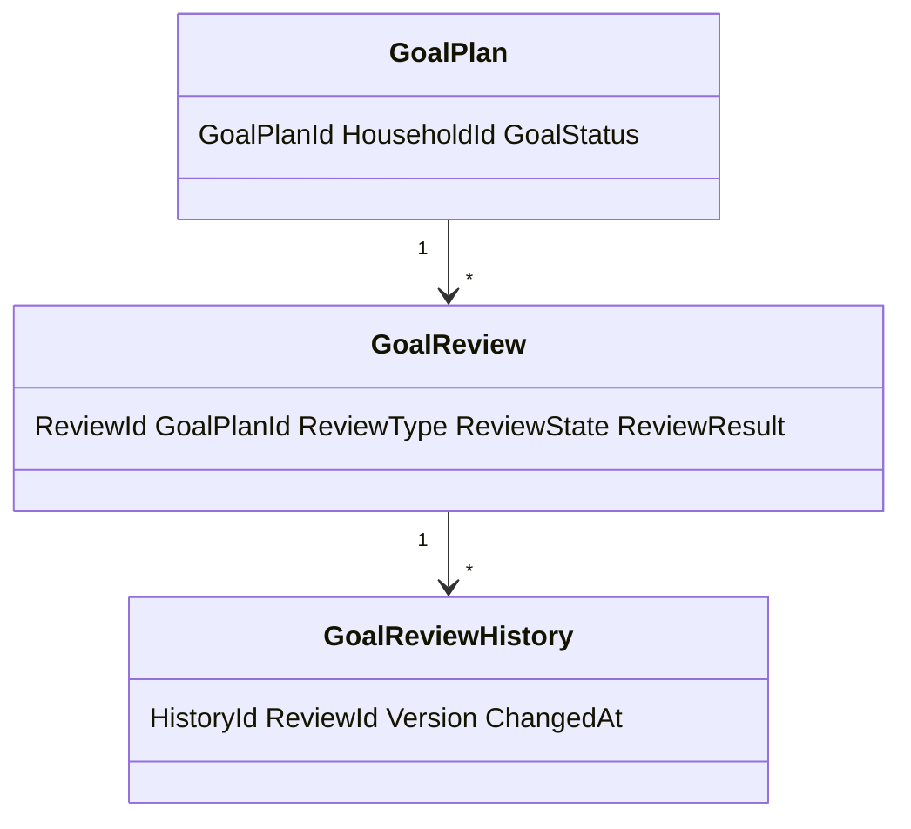
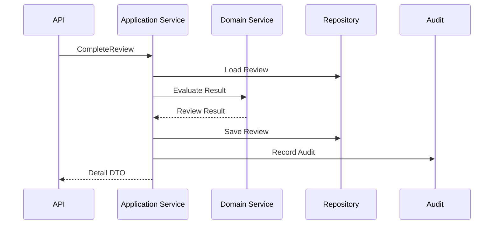
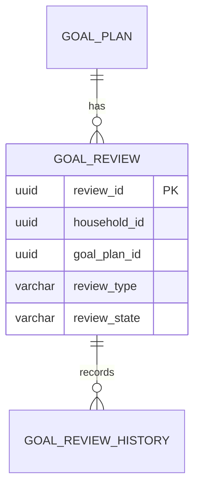
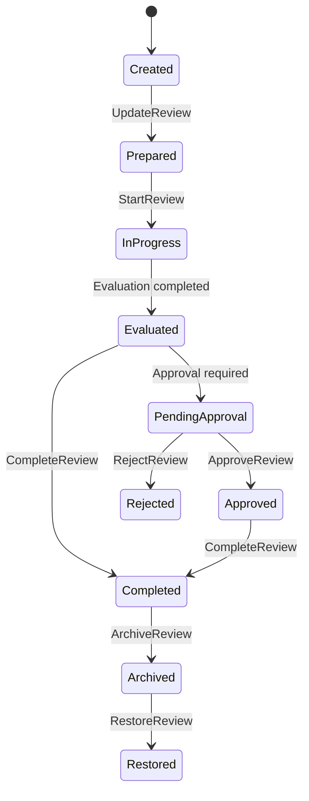
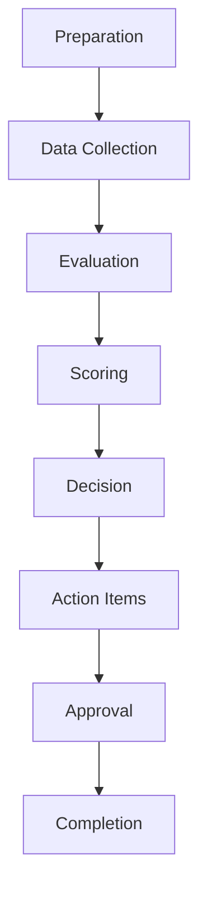

# Goal Review
Version: 1.0
Status: Enterprise Specification
Owner: Project Atlas
Source of Truth: Atlas Goal Review Specification
Last Updated: 2026-07-13
# Goal Review Overview
## Purpose
Goal Review defines how Atlas evaluates a GoalPlan at a point in time, compares current state against expected progress, records review findings, and coordinates resulting decisions, recommendations, notifications, and follow-up actions.
Goal Review does not redesign Atlas.
Goal Review does not modify existing Domain ownership.
Goal Review does not create a new Business Concept.
GoalPlan remains the authoritative business objective.
DecisionSession remains the authoritative decision record.
Recommendation remains the authoritative recommended action.
Scenario remains the authoritative simulation and comparison context.
## Business Meaning
Goal Review is the governed review record for deciding whether a GoalPlan remains on track, needs adjustment, has become blocked, should trigger a recommendation, should trigger a decision, or should be completed.
It provides a repeatable evaluation of progress, budget, cash flow, risk, dependencies, milestones, decision quality, recommendation adoption, health score, forecast accuracy, priority alignment, business value, and return on investment.
## Review Lifecycle
Review lifecycle begins when review is created by schedule, user action, event, exception, risk change, financial change, or completion candidate.
Review lifecycle continues through preparation, data collection, evaluation, scoring, decision, action item creation, approval, and completion.
Review lifecycle ends with Approved, Rejected, Completed, Archived, or Deleted according to state rules.
## Review Frequency
Periodic review can run monthly, quarterly, annual, or configured cadence.
Monthly review is default for active household goals with measurable financial or progress data.
Quarterly review is default for strategic goals, portfolio goals, and long-horizon goals.
Annual review is default for long-term planning goals and goal portfolio health.
Exception review can run immediately when material deviation occurs.
Completion review can run when Goal Progress reaches completion threshold.
## Review Trigger
Review can be triggered by schedule, manual request, automatic rule, GoalProgressUpdated, GoalHealthChanged, GoalForecastChanged, GoalDelayed, GoalAheadOfSchedule, GoalBehindSchedule, RecommendationAccepted, RecommendationCompleted, DecisionAccepted, ScenarioSimulated, milestone change, dependency block, portfolio change, cashflow change, risk change, or notification escalation.
## Review Participants
Participants include User, Household member, reviewer Principal, Application Service, Domain Service, Scheduler, Automation, Background Job, DecisionSession, Recommendation, Notification, and Audit.
Participants must be authorized before viewing protected review data.
## Review Scope
Review scope includes one GoalPlan, a set of GoalPlan records in a Household, or dashboard-level review aggregation.
Review scope must include HouseholdId.
Review scope must include TenantId when tenant scope exists.
Review scope must identify whether it includes milestone, task, decision, recommendation, scenario, portfolio, cashflow, notification, and user activity data.
## Review Result
Review result is a governed outcome describing status, scores, findings, decision, recommendation impact, action items, next review date, and audit reference.
Valid result categories are OnTrack, Watch, AdjustmentRecommended, ReplanRecommended, CriticalIntervention, CompletionCandidate, Completed, Rejected, and Archived.
## Relationship with Goal
GoalPlan owns the review target.
Goal Review references GoalPlanId.
Goal status controls whether review can start, complete, approve, archive, restore, or delete.
Completed GoalPlan can be reviewed only as historical or completion confirmation.
Archived GoalPlan can be reviewed only as read-only history unless restored.
## Relationship with Milestone
Milestones provide milestone completion, delay, blocker, and readiness evidence.
Milestone review findings must reference milestone identifiers when available.
Milestone delay can trigger Exception Review.
Milestone completion can trigger Goal Completion Review.
## Relationship with Task
Tasks provide execution evidence when existing Goal planning data tracks task state.
Task review does not replace milestone review.
Task review findings must remain subordinate to GoalPlan and milestone consistency.
## Relationship with Decision
DecisionSession supplies accepted, rejected, pending, or superseded decision state.
Review can create decision need, evaluate decision quality, or record decision impact.
Review approval can require accepted DecisionSession when material change is recommended.
## Relationship with Recommendation
Recommendation adoption, dismissal, suppression, completion, and refresh affect review score and action items.
Review can request recommendation refresh.
Review can mark recommendation adoption gap.
Review cannot directly execute recommendation without approved command path.
## Relationship with Scenario
Scenario provides forecast, comparison, stress, and what-if evidence.
Scenario result used in review must include ScenarioId, ScenarioVersion, generated time, assumptions, and staleness.
Scenario forecast does not replace committed Goal state.
## Relationship with Portfolio
Portfolio provides allocation, performance, risk, liquidity, and investment readiness evidence when the GoalPlan depends on portfolio state.
Portfolio review findings must preserve source timestamp and valuation assumptions.
## Relationship with CashFlow
CashFlow provides contribution capacity, funding gap, recurring surplus, recurring deficit, and runway evidence.
CashFlow review findings must preserve period and currency.
## Relationship with Notification
Notification may trigger review and may be triggered by review.
Notification does not own review result.
Notification suppression does not suppress audit.
## Relationship with User
User can request, update, approve, reject, or view review only through permissioned paths.
User-visible review data must obey household isolation, tenant isolation, masking, and field-level security.
# Review Types
## Periodic Review
Periodic Review is generated by configured cadence for active or in-progress goals.
Periodic Review checks progress, budget, cashflow, risk, and priority alignment.
## Monthly Review
Monthly Review checks short-term progress, cashflow, funding variance, recommendation adoption, and notification thresholds.
## Quarterly Review
Quarterly Review checks strategic alignment, portfolio impact, scenario forecast, recommendation effectiveness, and priority changes.
## Annual Review
Annual Review checks long-term goal feasibility, assumption drift, business value, ROI, risk, and household planning alignment.
## Manual Review
Manual Review is requested by an authorized User or service actor.
Manual Review requires reason and audit.
## Automatic Review
Automatic Review is created by system rules after source events or scheduled checks.
Automatic Review must be idempotent.
## Exception Review
Exception Review is created when material deviation, dependency block, risk increase, budget variance, or schedule variance crosses threshold.
## Risk Review
Risk Review focuses on risk score, risk trend, stress result, portfolio impact, cash reserve, and confidence.
## Financial Review
Financial Review focuses on funding, budget, cashflow, ROI, contribution capacity, and forecast.
## Goal Completion Review
Goal Completion Review confirms completion evidence before GoalPlan is completed or after completion for historical validation.
# Review Criteria
## Progress
Review evaluates OverallProgress, PhysicalProgress, FinancialProgress, TimeProgress, MilestoneProgress, DependencyProgress, CompletionScore, and HealthScore.
## Budget
Review evaluates TargetAmount, CurrentFundedAmount, ExpectedFundingAtDate, BudgetVariance, BudgetVariancePercent, contribution gap, and funding gap.
## Cash Flow
Review evaluates recurring surplus, recurring deficit, planned contributions, actual contributions, contribution capacity, and liquidity pressure.
## Risk
Review evaluates CurrentRiskScore, risk trend, risk band, stress scenario result, dependency risk, schedule risk, and financial risk.
## Dependencies
Review evaluates dependency readiness, blockers, prerequisite goals, external decision dependencies, and unresolved constraints.
## Milestones
Review evaluates milestone completion, overdue milestone count, blocked milestone count, milestone quality, and milestone contribution.
## Decision Quality
Review evaluates whether decisions are accepted, stale, rejected, superseded, explainable, and aligned with GoalPlan.
## Recommendation Adoption
Review evaluates accepted, completed, dismissed, suppressed, expired, and pending Recommendation records.
## Health Score
Review evaluates health score and health band movement.
## Forecast Accuracy
Review compares forecast result against actual progress and current projection.
## Priority Alignment
Review evaluates Goal priority score, ranking, dependency impact, and business value.
## Business Value
Review evaluates expected household value, financial impact, risk reduction, readiness, and decision usefulness.
# Review Workflow
## Preparation
Prepare review scope, review type, trigger, reviewer, expected source data, prior review, and required permissions.
## Data Collection
Collect GoalPlan, progress, milestone, task, dependency, decision, recommendation, scenario, portfolio, cashflow, notification, and prior review data.
## Evaluation
Evaluate review criteria, source freshness, deviations, blockers, risks, and consistency.
## Scoring
Calculate metrics, health, confidence, risk, priority, business impact, and ROI.
## Decision
Determine review result and whether DecisionSession is required.
## Action Items
Record recommended follow-up, recommendation refresh, scenario rerun, progress recalculation, dependency resolution, or notification.
## Approval
Approve review when reviewer has permission and review result is valid.
## Completion
Complete review by storing result, emitting event, updating projection, invalidating cache, and writing audit.
# Review Metrics
## Goal Achievement %
```text
GoalAchievementPercent = OverallProgress * 100
```
## Budget Variance
```text
BudgetVariance = ActualFunding - ExpectedFundingAtDate
```
```text
BudgetVariancePercent = BudgetVariance / TargetAmount
```
## Schedule Variance
```text
ScheduleVariance = OverallProgress - ElapsedTimePercent
```
## Progress %
```text
ProgressPercent = OverallProgress * 100
```
## Forecast Accuracy
```text
ForecastAccuracy = 1 - abs(ActualProgress - ForecastProgress)
```
## Health Score
```text
HealthScore = 0.30 * CompletionScore + 0.20 * ScheduleHealth + 0.20 * BudgetHealth + 0.15 * RiskScoreInverse + 0.15 * ConfidenceScore
```
## Risk Score
```text
RiskScore = clamp(WeightedRiskExposure, 0, 1)
```
## Confidence Score
```text
ConfidenceScore = 0.40 * DataCompleteness + 0.20 * SourceFreshness + 0.20 * Traceability + 0.20 * ReviewConsistency
```
## Completion Probability
```text
CompletionProbability = clamp(0.45 * OverallProgress + 0.25 * ForecastCompletion + 0.15 * ConfidenceScore + 0.15 * RiskScoreInverse, 0, 1)
```
## Priority Score
```text
PriorityScore = GoalPriorityScore
```
## Business Impact
```text
BusinessImpact = FinancialImpactScore + RiskReductionScore + GoalReadinessScore + RecommendationValueScore
```
## ROI
```text
ROI = (EstimatedBenefit - EstimatedCost) / EstimatedCost
```
# Validation Rules
1. ReviewId is required for persisted review.
2. GoalPlanId is required.
3. HouseholdId is required.
4. TenantId is required when tenant scope exists.
5. ReviewType is required.
6. ReviewTrigger is required.
7. ReviewState is required.
8. ReviewDate is required.
9. ReviewerId is required for manual review.
10. ReviewerId is required for approval.
11. Scheduled review requires scheduler run id.
12. Automatic review requires source event id or rule id.
13. Exception review requires exception reason.
14. Risk review requires risk score.
15. Financial review requires currency.
16. Completion review requires progress evidence.
17. GoalPlan must exist.
18. GoalPlan scope must match HouseholdId.
19. GoalPlan scope must match TenantId when applicable.
20. Review result is required before completion.
21. Approved review requires completed evaluation.
22. Rejected review requires rejection reason.
23. Archived review cannot be updated.
24. Deleted review cannot be restored unless soft delete policy stores it.
25. Review metrics must be between allowed ranges.
26. Goal Achievement % must be between 0 and 100.
27. Forecast Accuracy must be between 0 and 1.
28. Health Score must be between 0 and 1.
29. Risk Score must be between 0 and 1.
30. Confidence Score must be between 0 and 1.
31. Completion Probability must be between 0 and 1.
32. ROI denominator must not be zero.
33. Budget variance must preserve currency.
34. Schedule variance must be between -1 and 1.
35. Review frequency must be valid.
36. NextReviewDate must be after ReviewDate when present.
37. SourceSnapshotId is required for completed review.
38. CalculationVersion is required for calculated metrics.
39. ScenarioVersion is required when scenario data is used.
40. RecommendationId is required when recommendation action is recorded.
41. DecisionSessionId is required when decision impact is recorded.
42. Portfolio snapshot time is required when portfolio data is used.
43. CashFlow period is required when cashflow data is used.
44. Action item owner is required when action item is created.
45. Approval cannot occur before start.
46. Completion cannot occur before evaluation.
47. Archive cannot occur before completion or rejection.
48. Restore requires archived review.
49. Delete requires permission.
50. CorrelationId is required.
51. CausationId is required for event-driven review.
52. RequestId is required for API commands.
53. RowVersion is required for update.
54. Filter fields must be allowlisted.
55. Sort fields must be allowlisted.
56. Projection name must be allowlisted.
57. Field-level security must be evaluated before response.
58. Masking must be applied before export.
59. Audit record must include changed fields.
60. Domain Event emission must be idempotent.
# Business Rules
1. Goal Review belongs to GoalPlan.
2. Goal Review is a governed review record.
3. Goal Review does not replace GoalPlan.
4. Goal Review does not replace Goal Progress.
5. Goal Review does not replace Goal Dependency.
6. Goal Review does not replace DecisionSession.
7. Goal Review does not replace Recommendation.
8. Goal Review does not replace Scenario.
9. Review must preserve Household scope.
10. Review must preserve Tenant scope when applicable.
11. Manual Review requires reason.
12. Manual Review requires permission.
13. Automatic Review must be idempotent.
14. Scheduled Review must be retryable.
15. Exception Review requires material trigger.
16. Risk Review requires risk evidence.
17. Financial Review requires financial evidence.
18. Completion Review requires progress evidence.
19. Completed GoalPlan can still have historical review.
20. Archived GoalPlan review is read-only unless restored.
21. Cancelled GoalPlan review is read-only except cancellation review.
22. Review cannot approve itself when segregation is required.
23. Approval must be audited.
24. Rejection must be audited.
25. Archive must be audited.
26. Restore must be audited.
27. Delete must be audited.
28. Review update must increment version.
29. Review result must preserve source snapshot.
30. Review metrics must record calculation version.
31. Review with scenario must record ScenarioId and ScenarioVersion.
32. Review with recommendation must record RecommendationId.
33. Review with decision must record DecisionSessionId.
34. Review with portfolio data must record valuation time.
35. Review with cashflow data must record period.
36. Critical result must trigger notification.
37. Behind schedule result must trigger notification when threshold is crossed.
38. Budget variance result must trigger notification when threshold is crossed.
39. Dependency block result must trigger notification.
40. Goal completion candidate must trigger completion review.
41. Review result can request recommendation refresh.
42. Review result can request scenario rerun.
43. Review result can request progress recalculation.
44. Review result can request decision review.
45. Review result cannot directly mutate portfolio.
46. Review result cannot directly mutate cashflow.
47. Review result cannot directly execute recommendation.
48. Review action items must have owner or service actor.
49. Review action items must have status.
50. Review action items must have due date when time-bound.
51. Review history is append-only.
52. Review audit is mandatory for state changes.
53. Review cache invalidates after update.
54. Review dashboard refreshes after completion.
55. Review search projection refreshes after completion.
56. Review report must respect masking.
57. Review export requires permission.
58. Review metrics must not expose another Household.
59. Review metrics must not expose another Tenant.
60. Review status must follow state machine.
61. Review cannot be completed without result.
62. Review cannot be approved without completed state.
63. Review cannot be rejected without reason.
64. Review cannot be deleted after approval unless policy allows soft delete.
65. Review restore must preserve prior history.
66. Review deletion must not delete audit.
67. Review forecast accuracy must be recalculated when actual progress changes.
68. Review priority alignment must use current Goal priority score.
69. Review recommendation adoption must use current Recommendation state.
70. Review decision quality must use current DecisionSession state.
# State Machine
## States
| State | Meaning |
|---|---|
| Created | Review exists but has not started. |
| Prepared | Scope and source requirements are prepared. |
| InProgress | Review is collecting and evaluating data. |
| Evaluated | Metrics and findings are calculated. |
| PendingApproval | Review awaits approval. |
| Approved | Review result is approved. |
| Rejected | Review result is rejected. |
| Completed | Review is completed and published. |
| Archived | Review is read-only history. |
| Deleted | Review is soft deleted when policy permits. |
| Restored | Review was restored from archive. |
## Transitions
| From | To | Trigger |
|---|---|---|
| None | Created | CreateReview |
| Created | Prepared | UpdateReview |
| Prepared | InProgress | StartReview |
| InProgress | Evaluated | Evaluation completed |
| Evaluated | PendingApproval | Approval required |
| Evaluated | Completed | CompleteReview |
| PendingApproval | Approved | ApproveReview |
| PendingApproval | Rejected | RejectReview |
| Approved | Completed | CompleteReview |
| Completed | Archived | ArchiveReview |
| Rejected | Archived | ArchiveReview |
| Archived | Restored | RestoreReview |
| Restored | Prepared | UpdateReview |
| Created | Deleted | DeleteReview |
| Rejected | Deleted | DeleteReview |
## Triggers
Triggers include CreateReview, UpdateReview, StartReview, CompleteReview, ApproveReview, RejectReview, ArchiveReview, RestoreReview, DeleteReview, scheduled run, automatic rule, exception trigger, risk trigger, financial trigger, and completion trigger.
## Invariant
Review must reference GoalPlan.
Completed review must have ReviewResult.
Approved review must have approver.
Rejected review must have rejection reason.
Archived review is read-only.
Deleted review is not visible in normal queries.
## Illegal Transition
| From | To | Reason |
|---|---|---|
| Created | Approved | Evaluation is required. |
| Created | Completed | Review result is required. |
| Archived | InProgress | Restore is required first. |
| Deleted | InProgress | Restore policy is required first. |
| Completed | Created | Completed review cannot return to Created. |
# Commands
## CreateReview
Creates a review for GoalPlan.
Input: GoalPlanId, HouseholdId, TenantId, ReviewType, ReviewTrigger, ReviewDate, RequestedBy, CorrelationId.
Output: ReviewId, ReviewState.
## UpdateReview
Updates editable review fields.
Input: ReviewId, ReviewNotes, ReviewScope, ActionItems, RowVersion, CorrelationId.
Output: ReviewId, Version, ChangedFields.
## StartReview
Starts prepared review.
Input: ReviewId, SourceSnapshotId, StartedBy, CorrelationId.
Output: ReviewState = InProgress.
## CompleteReview
Completes evaluated review.
Input: ReviewId, ReviewResult, Metrics, Findings, NextReviewDate, CorrelationId.
Output: ReviewState = Completed.
## ApproveReview
Approves review result.
Input: ReviewId, ApprovedBy, ApprovalReason, RowVersion, CorrelationId.
Output: ReviewState = Approved.
## RejectReview
Rejects review result.
Input: ReviewId, RejectedBy, RejectionReason, RowVersion, CorrelationId.
Output: ReviewState = Rejected.
## ArchiveReview
Archives review.
Input: ReviewId, ArchiveReason, RowVersion, CorrelationId.
Output: ReviewState = Archived.
## RestoreReview
Restores archived review.
Input: ReviewId, RestoreReason, RowVersion, CorrelationId.
Output: ReviewState = Restored.
## DeleteReview
Soft deletes review when policy permits.
Input: ReviewId, DeleteReason, RowVersion, CorrelationId.
Output: ReviewState = Deleted.
## All related Domain Commands
| Command | Relationship |
|---|---|
| RefreshGoalProgress | Supplies progress evidence. |
| RecalculateGoalProgress | Supplies recalculated progress. |
| UpdateGoalProgress | Can trigger review. |
| CompleteGoal | Requires completion review when policy requires it. |
| UpdateGoalDependency | Can trigger dependency review. |
| AcceptDecision | Updates decision quality. |
| RejectDecision | Updates decision quality. |
| AcceptRecommendation | Updates adoption. |
| CompleteRecommendation | Updates adoption. |
| RunScenario | Supplies forecast evidence. |
| TriggerNotification | Sends review notification. |
# Domain Events
## ReviewCreated
Payload: ReviewId, GoalPlanId, HouseholdId, ReviewType, ReviewTrigger, CorrelationId.
## ReviewStarted
Payload: ReviewId, GoalPlanId, StartedAt, SourceSnapshotId, CorrelationId.
## ReviewCompleted
Payload: ReviewId, GoalPlanId, ReviewResult, Metrics, NextReviewDate, CorrelationId.
## ReviewApproved
Payload: ReviewId, ApprovedBy, ApprovalReason, CorrelationId.
## ReviewRejected
Payload: ReviewId, RejectedBy, RejectionReason, CorrelationId.
## ReviewArchived
Payload: ReviewId, ArchiveReason, ArchivedAt, CorrelationId.
## ReviewUpdated
Payload: ReviewId, ChangedFields, Version, CorrelationId.
## All related Events
| Event | Review Impact |
|---|---|
| GoalProgressUpdated | Can trigger automatic review. |
| GoalHealthChanged | Can trigger risk or exception review. |
| GoalForecastChanged | Can trigger forecast review. |
| GoalDelayed | Can trigger exception review. |
| GoalCompleted | Can trigger completion review. |
| RecommendationAccepted | Updates adoption evidence. |
| RecommendationCompleted | Updates adoption evidence. |
| DecisionAccepted | Updates decision evidence. |
| DecisionRejected | Updates decision evidence. |
| ScenarioSimulated | Updates forecast evidence. |
| NotificationTriggered | Records notification evidence. |
# Repository
## Interface
```csharp
public interface IGoalReviewRepository
{
    Task<GoalReview?> GetByIdAsync(Guid householdId, Guid reviewId, CancellationToken cancellationToken);
    Task<IReadOnlyList<GoalReview>> SearchAsync(GoalReviewSearchSpecification specification, CancellationToken cancellationToken);
    Task<GoalReviewDashboard> GetDashboardAsync(Guid householdId, GoalReviewDashboardSpecification specification, CancellationToken cancellationToken);
    Task AddAsync(GoalReview review, CancellationToken cancellationToken);
    Task UpdateAsync(GoalReview review, CancellationToken cancellationToken);
    Task ArchiveAsync(Guid householdId, Guid reviewId, string reason, CancellationToken cancellationToken);
}
```
## Methods
Methods include GetByIdAsync, GetByGoalPlanIdAsync, SearchAsync, GetDashboardAsync, GetHistoryAsync, AddAsync, UpdateAsync, ArchiveAsync, RestoreAsync, DeleteAsync, and SaveReviewTrailAsync.
## Queries
Queries include review by id, goal, household, state, type, trigger, result, reviewer, next review date, health band, risk band, updated time, and archived status.
## Filtering
Allowed filters: goalPlanId, householdId, reviewType, reviewState, reviewTrigger, reviewResult, reviewerId, nextReviewDate, createdAt, completedAt.
## Sorting
Allowed sorting: reviewDate, createdAt, updatedAt, completedAt, healthScore, riskScore, priorityScore, businessImpact.
## Aggregation
Aggregations include count by type, count by state, count by result, average health score, average forecast accuracy, average ROI, overdue review count, critical review count.
## Projection
Supported projections: summary, detail, dashboard, search, result, history.
## Specification
GoalReviewSearchSpecification fields: HouseholdId, TenantId, GoalPlanIds, ReviewTypes, ReviewStates, ReviewResults, ReviewTriggers, ReviewerId, DateFrom, DateTo, Sort, PageSize, Cursor.
# Domain Service Interaction
GoalReviewDomainService validates review state, evaluates review criteria, calculates review metrics, determines review result, enforces approval rules, validates action items, detects exception review requirements, and emits Domain Events.
| Service | Interaction |
|---|---|
| GoalLifecycleDomainService | Supplies GoalPlan lifecycle state. |
| GoalProgressDomainService | Supplies progress and health evidence. |
| GoalDependencyDomainService | Supplies blockers. |
| GoalPrioritizationDomainService | Supplies priority alignment. |
| GoalFundingDomainService | Supplies financial readiness. |
| DecisionDomainService | Supplies decision quality. |
| RecommendationDomainService | Supplies adoption status. |
| ScenarioDomainService | Supplies forecast evidence. |
| NotificationDomainService | Consumes review triggers. |
# Application Service Interaction
GoalReviewApplicationService authorizes request, resolves scope, loads GoalPlan, loads review, loads source evidence, invokes Domain Service, persists review, publishes events, invalidates cache, updates projection, records audit, and returns DTO.
```csharp
Task<GoalReviewDetailDto> CreateReviewAsync(CreateReviewRequest request);
Task<GoalReviewDetailDto> UpdateReviewAsync(UpdateReviewRequest request);
Task<GoalReviewDetailDto> StartReviewAsync(StartReviewRequest request);
Task<GoalReviewDetailDto> CompleteReviewAsync(CompleteReviewRequest request);
Task<GoalReviewDetailDto> ApproveReviewAsync(ApproveReviewRequest request);
Task<GoalReviewDetailDto> RejectReviewAsync(RejectReviewRequest request);
Task<GoalReviewDetailDto> ArchiveReviewAsync(ArchiveReviewRequest request);
Task<GoalReviewDetailDto> RestoreReviewAsync(RestoreReviewRequest request);
Task<GoalReviewSearchResultDto> SearchReviewsAsync(GoalReviewSearchRequest request);
```
# API
## REST Endpoints
| Method | Endpoint | Purpose |
|---|---|---|
| GET | /api/goal-reviews | Search reviews. |
| GET | /api/goal-reviews/{reviewId} | Get detail. |
| POST | /api/goal-reviews | Create review. |
| PATCH | /api/goal-reviews/{reviewId} | Update review. |
| POST | /api/goal-reviews/{reviewId}/start | Start review. |
| POST | /api/goal-reviews/{reviewId}/complete | Complete review. |
| POST | /api/goal-reviews/{reviewId}/approve | Approve review. |
| POST | /api/goal-reviews/{reviewId}/reject | Reject review. |
| POST | /api/goal-reviews/{reviewId}/archive | Archive review. |
| POST | /api/goal-reviews/{reviewId}/restore | Restore review. |
| DELETE | /api/goal-reviews/{reviewId} | Soft delete review. |
| GET | /api/goal-reviews/dashboard | Get dashboard. |
## HTTP Methods
GET reads reviews.
POST executes commands.
PATCH updates editable fields.
DELETE soft deletes when policy permits.
## Request
```json
{ "goalPlanId": "uuid", "reviewType": "MonthlyReview", "reviewTrigger": "Scheduled", "reviewDate": "2026-07-13", "reason": "monthly cadence" }
```
## Response
```json
{ "reviewId": "uuid", "goalPlanId": "uuid", "reviewState": "Created", "reviewType": "MonthlyReview", "reviewTrigger": "Scheduled", "reviewDate": "2026-07-13" }
```
## Errors
| Status | Error |
|---|---|
| 400 | InvalidReviewRequest |
| 401 | Unauthenticated |
| 403 | GoalReviewPermissionDenied |
| 404 | GoalReviewNotFound |
| 409 | GoalReviewConcurrencyConflict |
| 422 | GoalReviewStateViolation |
## Pagination
Cursor pagination is required.
Default page size is 50.
Maximum page size is 200.
## Filtering
API supports allowlisted filters only.
## Sorting
Default sorting is reviewDate desc.
API supports allowlisted sorting only.
## Projection
Projection supports summary, detail, dashboard, result, search, and history.
# DTO
## Create DTO
```json
{ "goalPlanId": "uuid", "reviewType": "MonthlyReview", "reviewTrigger": "Scheduled", "reviewDate": "2026-07-13", "reason": "monthly cadence" }
```
## Update DTO
```json
{ "reviewNotes": "cash flow variance reviewed", "nextReviewDate": "2026-08-13", "rowVersion": "base64" }
```
## Detail DTO
```json
{ "reviewId": "uuid", "goalPlanId": "uuid", "reviewState": "Completed", "reviewResult": "OnTrack", "healthScore": 0.82, "riskScore": 0.22, "confidenceScore": 0.90, "completedAt": "2026-07-13T00:00:00Z" }
```
## Summary DTO
```json
{ "reviewId": "uuid", "goalPlanId": "uuid", "reviewType": "MonthlyReview", "reviewResult": "OnTrack", "reviewDate": "2026-07-13" }
```
## Dashboard DTO
```json
{ "householdId": "uuid", "reviewCount": 12, "completedCount": 10, "criticalCount": 1, "averageHealthScore": 0.78, "generatedAt": "2026-07-13T00:00:00Z" }
```
## Search DTO
```json
{ "filters": { "reviewType": "MonthlyReview", "reviewResult": "OnTrack" }, "sort": "reviewDate:desc", "pageSize": 50, "cursor": null }
```
## Review Result DTO
```json
{ "reviewResult": "AdjustmentRecommended", "findings": ["budget variance exceeded threshold"], "actionItems": ["refresh recommendation"], "nextReviewDate": "2026-08-13" }
```
# Database Mapping
## Table
Primary table: goal_review.
History table: goal_review_history.
## Columns
Columns: review_id, tenant_id, household_id, goal_plan_id, review_type, review_trigger, review_state, review_result, review_date, reviewer_id, approver_id, goal_achievement_percent, budget_variance, schedule_variance, progress_percent, forecast_accuracy, health_score, risk_score, confidence_score, completion_probability, priority_score, business_impact, roi, source_snapshot_id, calculation_version, next_review_date, row_version, created_at, updated_at, completed_at, archived_at, deleted_at.
## Indexes
Indexes: ix_goal_review_household_goal, ix_goal_review_household_state, ix_goal_review_household_type, ix_goal_review_review_date, ix_goal_review_next_review_date.
## Constraints
Constraints: primary key on review_id, FK to GoalPlan, score values from 0 to 1, percent values from 0 to 100, unique active review key when required.
## FK
fk_goal_review_goal_plan.
## Unique
uq_goal_review_household_goal_type_date.
## Check Constraint
health_score between 0 and 1.
# PostgreSQL Schema
```sql
CREATE TABLE goal_review (
    review_id uuid PRIMARY KEY,
    tenant_id uuid NULL,
    household_id uuid NOT NULL,
    goal_plan_id uuid NOT NULL,
    review_type varchar(64) NOT NULL,
    review_trigger varchar(64) NOT NULL,
    review_state varchar(32) NOT NULL,
    review_result varchar(64) NULL,
    review_date date NOT NULL,
    reviewer_id uuid NULL,
    approver_id uuid NULL,
    goal_achievement_percent numeric(7,4) NULL,
    budget_variance numeric(18,2) NULL,
    schedule_variance numeric(7,6) NULL,
    progress_percent numeric(7,4) NULL,
    forecast_accuracy numeric(7,6) NULL,
    health_score numeric(7,6) NULL,
    risk_score numeric(7,6) NULL,
    confidence_score numeric(7,6) NULL,
    completion_probability numeric(7,6) NULL,
    priority_score numeric(10,4) NULL,
    business_impact numeric(10,4) NULL,
    roi numeric(18,6) NULL,
    source_snapshot_id uuid NULL,
    calculation_version varchar(32) NULL,
    next_review_date date NULL,
    row_version bigint NOT NULL DEFAULT 1,
    created_at timestamptz NOT NULL,
    updated_at timestamptz NOT NULL,
    completed_at timestamptz NULL,
    archived_at timestamptz NULL,
    deleted_at timestamptz NULL,
    CONSTRAINT uq_goal_review_household_goal_type_date UNIQUE (household_id, goal_plan_id, review_type, review_date),
    CONSTRAINT ck_goal_review_health CHECK (health_score IS NULL OR (health_score >= 0 AND health_score <= 1)),
    CONSTRAINT ck_goal_review_risk CHECK (risk_score IS NULL OR (risk_score >= 0 AND risk_score <= 1)),
    CONSTRAINT ck_goal_review_confidence CHECK (confidence_score IS NULL OR (confidence_score >= 0 AND confidence_score <= 1)),
    CONSTRAINT ck_goal_review_completion_probability CHECK (completion_probability IS NULL OR (completion_probability >= 0 AND completion_probability <= 1)),
    CONSTRAINT ck_goal_review_progress_percent CHECK (progress_percent IS NULL OR (progress_percent >= 0 AND progress_percent <= 100))
);
CREATE INDEX ix_goal_review_household_goal ON goal_review (household_id, goal_plan_id);
CREATE INDEX ix_goal_review_household_state ON goal_review (household_id, review_state);
CREATE INDEX ix_goal_review_household_type ON goal_review (household_id, review_type);
CREATE INDEX ix_goal_review_review_date ON goal_review (review_date DESC);
CREATE INDEX ix_goal_review_next_review_date ON goal_review (household_id, next_review_date);
CREATE TABLE goal_review_history (
    history_id uuid PRIMARY KEY,
    review_id uuid NOT NULL,
    household_id uuid NOT NULL,
    goal_plan_id uuid NOT NULL,
    version bigint NOT NULL,
    change_reason varchar(256) NOT NULL,
    changed_by uuid NULL,
    previous_values jsonb NOT NULL,
    new_values jsonb NOT NULL,
    correlation_id uuid NOT NULL,
    created_at timestamptz NOT NULL
);
CREATE INDEX ix_goal_review_history_review ON goal_review_history (review_id, version DESC);
CREATE VIEW goal_review_dashboard_view AS
SELECT household_id,
       count(*) AS review_count,
       count(*) FILTER (WHERE review_state = 'Completed') AS completed_count,
       count(*) FILTER (WHERE review_result = 'CriticalIntervention') AS critical_count,
       avg(health_score) AS average_health_score,
       max(updated_at) AS generated_at
FROM goal_review
WHERE archived_at IS NULL AND deleted_at IS NULL
GROUP BY household_id;
```
# EF Core Mapping
## Fluent API
```csharp
builder.ToTable("goal_review");
builder.HasKey(x => x.ReviewId);
builder.Property(x => x.ReviewId).HasColumnName("review_id");
builder.Property(x => x.TenantId).HasColumnName("tenant_id");
builder.Property(x => x.HouseholdId).HasColumnName("household_id").IsRequired();
builder.Property(x => x.GoalPlanId).HasColumnName("goal_plan_id").IsRequired();
builder.Property(x => x.ReviewType).HasColumnName("review_type").HasMaxLength(64).IsRequired();
builder.Property(x => x.ReviewTrigger).HasColumnName("review_trigger").HasMaxLength(64).IsRequired();
builder.Property(x => x.ReviewState).HasColumnName("review_state").HasMaxLength(32).IsRequired();
builder.Property(x => x.ReviewResult).HasColumnName("review_result").HasMaxLength(64);
builder.Property(x => x.HealthScore).HasColumnName("health_score").HasPrecision(7, 6);
builder.Property(x => x.RiskScore).HasColumnName("risk_score").HasPrecision(7, 6);
builder.Property(x => x.ConfidenceScore).HasColumnName("confidence_score").HasPrecision(7, 6);
builder.Property(x => x.RowVersion).HasColumnName("row_version").IsConcurrencyToken();
builder.HasIndex(x => new { x.HouseholdId, x.GoalPlanId });
builder.HasIndex(x => new { x.HouseholdId, x.ReviewState });
builder.HasIndex(x => new { x.HouseholdId, x.ReviewType });
builder.HasQueryFilter(x => x.DeletedAt == null);
```
## Owned Types
ReviewMetrics can be modeled as owned value object when existing code supports owned metric values.
## Indexes
Indexes match PostgreSQL schema.
## Query Filters
Default query filter excludes deleted reviews.
Repository specification applies Household and Tenant filters.
# Cache Strategy
Redis detail key: atlas:{tenantId}:household:{householdId}:goal-review:{reviewId}:v1.
Redis goal key: atlas:{tenantId}:household:{householdId}:goal:{goalPlanId}:reviews:v1.
Redis dashboard key: atlas:{tenantId}:household:{householdId}:goal-review:dashboard:v1.
Detail TTL is 5 minutes.
Dashboard TTL is 2 minutes.
Search TTL is 1 minute.
Invalidate on ReviewCreated, ReviewStarted, ReviewCompleted, ReviewApproved, ReviewRejected, ReviewArchived, ReviewUpdated, RestoreReview, DeleteReview, GoalProgressUpdated, GoalHealthChanged, GoalForecastChanged, Recommendation change, Decision change, and Scenario simulation.
# Security
## Authorization
Review access requires authenticated Principal.
Protected data access requires Household membership or approved delegated permission.
## Permissions
Permissions: GoalReview.Read, GoalReview.Create, GoalReview.Update, GoalReview.Start, GoalReview.Complete, GoalReview.Approve, GoalReview.Reject, GoalReview.Archive, GoalReview.Restore, GoalReview.Delete, GoalReview.Export.
## Masking
Mask financial values when user lacks financial read permission.
Mask portfolio details when user lacks portfolio read permission.
Mask decision details when user lacks decision read permission.
Mask recommendation details when user lacks recommendation read permission.
# Audit
## History
History records store previous values, new values, version, actor, reason, and correlation.
## Review Trail
Review trail records create, update, start, complete, approve, reject, archive, restore, delete, notification trigger, recommendation refresh request, scenario rerun request, and decision request.
## Versioning
Review version increments on every persisted change.
RowVersion supports concurrency.
CalculationVersion records metric calculation version.
# Performance
Use summary projection for list views.
Use dashboard view for household dashboard.
Use bounded batch creation for scheduled reviews.
Use cursor pagination for search.
Use Redis cache for detail, dashboard, and search.
Use materialized dashboard view when read volume requires it.
Parallel scheduled review creation is allowed across Household records.
Parallel update of same ReviewId is prohibited by RowVersion.
# Example JSON
## Create
```json
{ "goalPlanId": "5e4b510a-6f80-43c7-9978-89f2b9f89a11", "reviewType": "MonthlyReview", "reviewTrigger": "Scheduled", "reviewDate": "2026-07-13", "reason": "monthly cadence" }
```
## Update
```json
{ "reviewNotes": "budget variance reviewed", "nextReviewDate": "2026-08-13", "rowVersion": "AAAAAAAAB9E=" }
```
## Review Result
```json
{ "reviewResult": "AdjustmentRecommended", "healthScore": 0.68, "riskScore": 0.42, "confidenceScore": 0.84, "findings": ["schedule variance below threshold"], "actionItems": ["refresh recommendation"] }
```
## Dashboard
```json
{ "householdId": "afc64d0c-cc24-48bb-a2e9-7bb8736fbdf4", "reviewCount": 12, "completedCount": 10, "criticalCount": 1, "averageHealthScore": 0.78, "generatedAt": "2026-07-13T00:00:00Z" }
```
## Search
```json
{ "items": [{ "reviewId": "uuid", "goalPlanId": "uuid", "reviewType": "MonthlyReview", "reviewResult": "OnTrack", "reviewDate": "2026-07-13" }], "nextCursor": null }
```
# Mermaid
## Class Diagram

## Sequence Diagram

## ER Diagram

## State Diagram

## Review Workflow Diagram

# Testing
## Unit Test
Unit tests cover review metric formulas, review state transition rules, validation rules, result classification, action item validation, permission checks, and illegal transitions.
## Integration Test
Integration tests cover create, update, start, complete, approve, reject, archive, restore, delete, dashboard query, search query, cache invalidation, event emission, and audit trail.
## Validation Test
Validation tests cover required fields, invalid score ranges, missing reason, missing source snapshot, stale scenario, missing reviewer, invalid next review date, invalid filter, invalid sort, and concurrency conflict.
## Performance Test
Performance tests cover scheduled review creation, dashboard query latency, search query latency, aggregation latency, cache hit ratio, and materialized view refresh.
# Edge Cases
1. GoalPlan missing.
2. GoalPlan archived.
3. GoalPlan cancelled.
4. Review already exists for same type and date.
5. Review is deleted.
6. Review is archived.
7. Review update has stale RowVersion.
8. Review starts without source snapshot.
9. Review completes without result.
10. Review approval lacks approver.
11. Review rejection lacks reason.
12. Scheduled review duplicates existing review.
13. Automatic event arrives twice.
14. Event arrives out of order.
15. Scenario data is stale.
16. Scenario version is incompatible.
17. Recommendation is suppressed.
18. Recommendation is dismissed.
19. DecisionSession is rejected.
20. Portfolio valuation is stale.
21. CashFlow period is missing.
22. Budget variance currency mismatches Goal currency.
23. ROI denominator is zero.
24. Forecast accuracy cannot be calculated.
25. Health score is missing.
26. Risk score is missing.
27. User lacks permission.
28. HouseholdId mismatch.
29. TenantId mismatch.
30. Audit write fails.
31. Cache invalidation fails.
32. Dashboard projection fails.
33. Notification trigger is suppressed.
34. Action item owner is missing.
35. NextReviewDate is before ReviewDate.
36. Delete requested after approval.
37. Restore requested for non-archived review.
38. CompleteReview called twice.
39. ApproveReview called twice.
40. Critical review notification is duplicated.
# Version History
| Version | Date | Description |
|---|---|---|
| 1.0 | 2026-07-13 | Enterprise Specification for Goal Review. |

## Phase 2 Executable Specification Addendum

### Goal Review Command Contract

| Field | Required | Description |
|---|---|---|
| GoalReviewExecutionId | Yes | Stable review execution identifier |
| ReviewId | Yes | Goal review identifier |
| HouseholdId | Yes | Household scope |
| GoalPlanId | Yes | Goal scope |
| ReviewType | Yes | Scheduled, manual, event-driven, or critical |
| SourceSnapshotId | Yes | Source data snapshot |
| AssumptionVersionSet | Yes | Assumptions used |
| ReviewResult | Yes | Review outcome classification |
| CorrelationId | Yes | Audit correlation |

### Required Commands

| Command | Actor | Output |
|---|---|---|
| ExecuteGoalReviewCommand | GoalReviewApplicationService | GoalReviewCompleted |
| ApproveGoalReview | GoalReviewApplicationService | GoalReviewApproved |
| RejectGoalReview | GoalReviewApplicationService | GoalReviewRejected |
| ReplayGoalReviewCommand | AdministrationApplicationService | GoalReviewReplayed |

### Addendum Validation Rules

| Rule ID | Rule | Failure |
|---|---|---|
| GRV-P2-VR-001 | Review execution must include source snapshot and assumption versions. | Reject review |
| GRV-P2-VR-002 | Approval requires approver and approval reason. | Reject approval |
| GRV-P2-VR-003 | Rejection requires reason and next action. | Reject rejection |
| GRV-P2-VR-004 | Replay must not emit new notifications or mutate current state. | Reject replay |

### Addendum Testing Matrix

| Test | Expected Result |
|---|---|
| Missing source snapshot | Review start fails |
| Complete without result | Completion is rejected |
| Approval without approver | Approval is rejected |
| Critical review completed | Alert or notification event is emitted once |
| Historical replay | Original review result reproduces |

| Version | Date | Description |
|---|---|---|
| 1.0-p2 | 2026-07-15 | Phase 2 executable addendum added. |

## Phase 2 Executable Specification Addendum

### Goal Review Command Contract

| Field | Required | Description |
|---|---|---|
| GoalReviewExecutionId | Yes | Stable review execution identifier |
| ReviewId | Yes | Goal review identifier |
| HouseholdId | Yes | Household scope |
| GoalPlanId | Yes | Goal scope |
| ReviewType | Yes | Scheduled, manual, event-driven, or critical |
| SourceSnapshotId | Yes | Source data snapshot |
| AssumptionVersionSet | Yes | Assumptions used |
| ReviewResult | Yes | Review outcome classification |
| CorrelationId | Yes | Audit correlation |

### Required Commands

| Command | Actor | Output |
|---|---|---|
| ExecuteGoalReviewCommand | GoalReviewApplicationService | GoalReviewCompleted |
| ApproveGoalReview | GoalReviewApplicationService | GoalReviewApproved |
| RejectGoalReview | GoalReviewApplicationService | GoalReviewRejected |
| ReplayGoalReviewCommand | AdministrationApplicationService | GoalReviewReplayed |

### Addendum Validation Rules

| Rule ID | Rule | Failure |
|---|---|---|
| GRV-P2-VR-001 | Review execution must include source snapshot and assumption versions. | Reject review |
| GRV-P2-VR-002 | Approval requires approver and approval reason. | Reject approval |
| GRV-P2-VR-003 | Rejection requires reason and next action. | Reject rejection |
| GRV-P2-VR-004 | Replay must not emit new notifications or mutate current state. | Reject replay |

### Addendum Testing Matrix

| Test | Expected Result |
|---|---|
| Missing source snapshot | Review start fails |
| Complete without result | Completion is rejected |
| Approval without approver | Approval is rejected |
| Critical review completed | Alert or notification event is emitted once |
| Historical replay | Original review result reproduces |

| Version | Date | Description |
|---|---|---|
| 1.0-p2 | 2026-07-15 | Phase 2 executable addendum added. |
