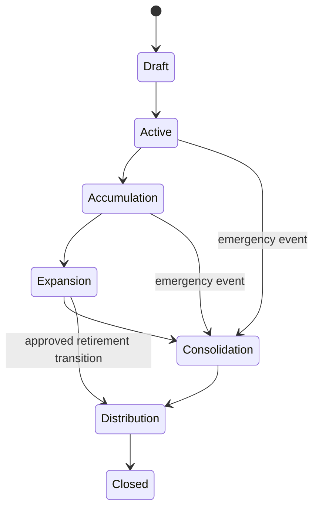

# Portfolio Lifecycle States and Transitions

## Purpose
This split document isolates portfolio lifecycle states, phase meaning, transition triggers, and explainability requirements from the parent Portfolio Lifecycle specification.

## Source
- Parent specification: [Portfolio Lifecycle](../portfolio-lifecycle.md)

## Lifecycle Phases

| Phase | Primary Focus | Entry Triggers | Key Outputs |
|---|---|---|---|
| Portfolio Creation | IPS-aligned onboarding | IPS completed, risk capacity evaluated, initial funding confirmed | Strategic asset allocation, benchmark, rebalancing policy |
| Accumulation | Long-term growth | Regular contributions and active goal funding | Dollar-cost averaging, periodic rebalancing, performance monitoring |
| Expansion | Multi-goal investing | Income growth, home purchase, family expansion | Diversification, tax efficiency, goal-linked allocation |
| Consolidation | Wealth protection | Retirement approaching, debt reduction, lower risk capacity | Lower risk allocation, higher income stability |
| Distribution | Sustainable withdrawals | Retirement or withdrawal phase start | Withdrawal strategy, cash reserve coordination, longevity monitoring |
| Legacy / Closure | Transfer or termination | Estate transfer, beneficiary planning, portfolio retirement | Closure evidence, archived portfolio state |

## State Machine

## Transition Principles
- Every portfolio has exactly one active lifecycle state.
- Historical transitions are immutable.
- Lifecycle changes require validation events.
- Major transitions generate domain events.
- Emergency state transitions are allowed after major financial events when approval evidence exists.

## Explainability
Every transition records previous state, new state, trigger event, supporting rules, validation result, and expected financial impact.

