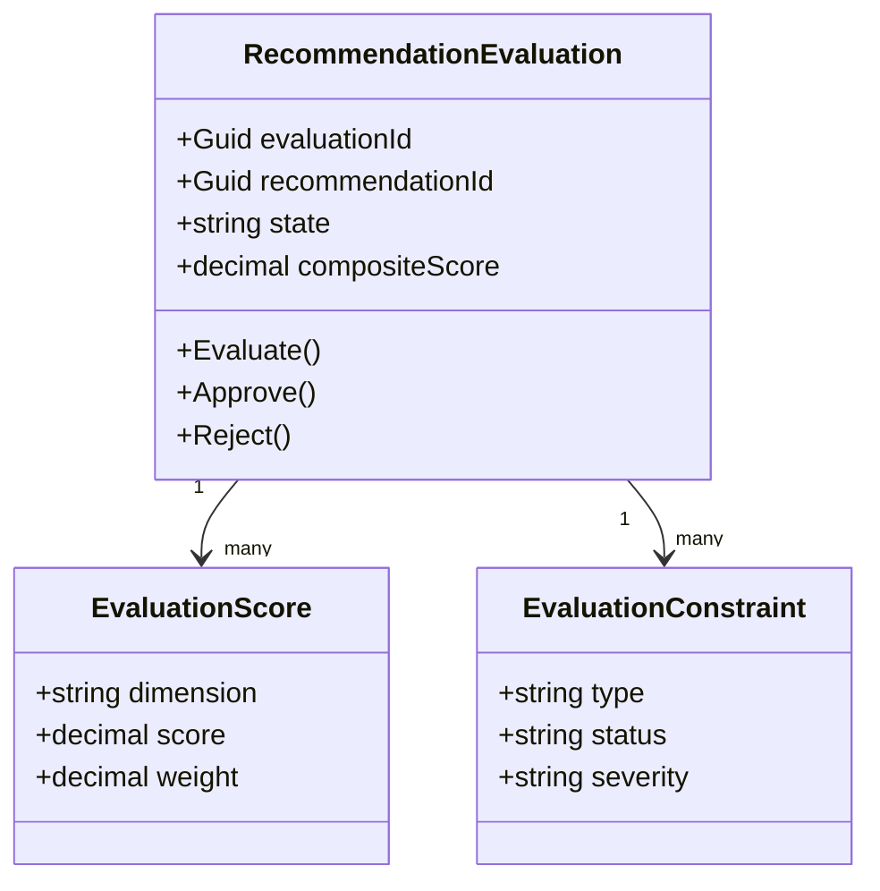
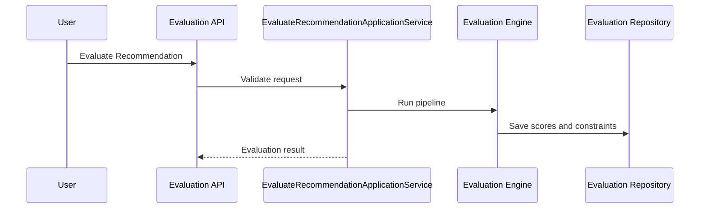
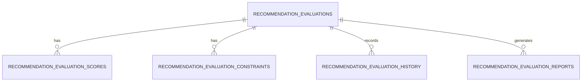
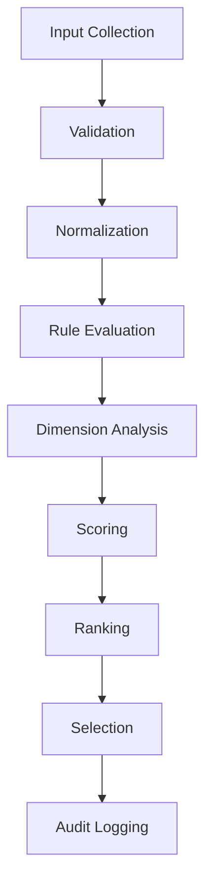
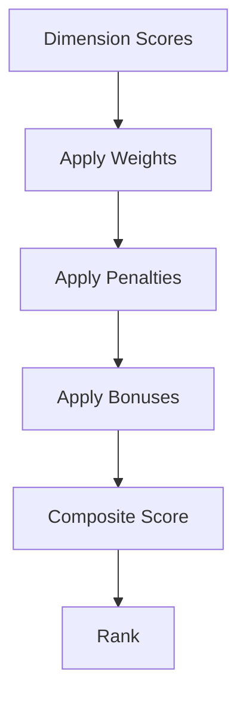
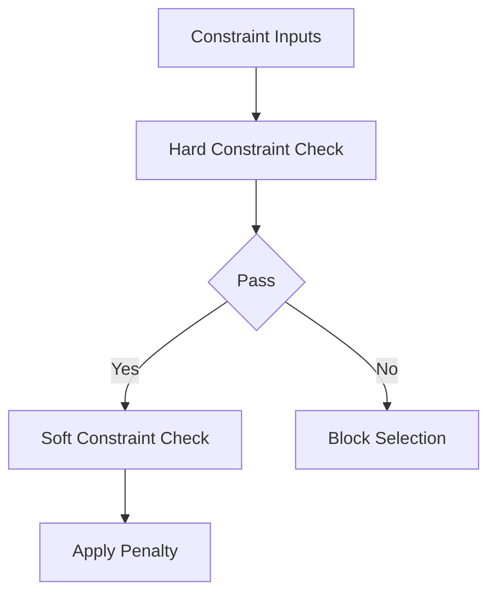

# Recommendation Evaluation Overview
Version: 1.0.0
Status: Enterprise Specification
Owner: Atlas Recommendation Domain
Source of Truth: Recommendation Catalog
Last Updated: 2026-07-13
## Split Navigation
- [Recommendation evaluation scoring](recommendation-evaluation/scoring-and-constraints.md)
- [Recommendation evaluation execution](recommendation-evaluation/execution-and-audit.md)

## Purpose
Recommendation Evaluation defines how Atlas evaluates, scores, ranks, explains, approves, reports, and audits Recommendations. It uses existing Recommendation, Recommendation Lifecycle, Recommendation Rule, Recommendation Priority, Decision, Decision Evaluation, Goal, Scenario, Portfolio, CashFlow, Risk, Optimization, Simulation, Workflow, Automation, Business Calendar, Notification, and User data.
It provides deterministic evaluation without redesigning Atlas or changing existing domain ownership.

## Business Meaning
Recommendation Evaluation determines whether a Recommendation is useful, feasible, timely, explainable, and aligned with business context. It converts existing evidence into scores, constraints, rankings, reports, and audit records.
It supports approval, publication, prioritization, dashboard display, analytics, reporting, and implementation decisions.

## Evaluation Scope
Evaluation scope includes input collection, validation, normalization, rule evaluation, Goal alignment, financial analysis, Risk analysis, Scenario analysis, Portfolio analysis, Simulation, Optimization, scoring, ranking, selection, explanation, approval, archive, restore, delete, report, and audit. Evaluation scope excludes creation of unknown Recommendation categories, Decision types, Goal types, Portfolio types, CashFlow concepts, or Risk concepts.

## Evaluation Lifecycle
The lifecycle begins when an evaluation is created for a Recommendation. The lifecycle continues through validation, calculation, scoring, ranking, approval, rejection, report generation, archive, restore, and deletion.
Every lifecycle action must preserve version, source reference, operator, reason, timestamp, and correlation identifier.

## Evaluation Objectives
1. Evaluate Recommendations with consistent formulas. 2. Preserve source evidence and calculation traceability. 3. Support scoring, ranking, approval, reporting, and audit. 4. Enforce constraints before Recommendation selection. 5. Apply tenant isolation and field-level security. 6. Keep Recommendation aggregate ownership unchanged. 7. Make evaluation reproducible from stored inputs and rule versions.

## Ownership
Recommendation Evaluation is owned by the Recommendation domain. Evaluation records reference source domains but do not own their data.
Evaluation approval is controlled by Recommendation permissions and Workflow context.

## Aggregate Root
Recommendation Evaluation is an aggregate root when it owns evaluation identity, state, scores, constraints, approval, report, history, and audit. Recommendation remains the business aggregate being evaluated.
Evaluation must reference `recommendation_id`.

## Relationship with Recommendation
Recommendation is the evaluated aggregate. Evaluation reads Recommendation content, source references, priority, state, evidence, and owner.
Evaluation does not directly publish, accept, decline, or implement Recommendation.

## Relationship with Recommendation Lifecycle
Recommendation Lifecycle provides current state, allowed commands, transition history, and lifecycle timing. Evaluation output may allow or block lifecycle commands through existing lifecycle rules.

## Relationship with Recommendation Rule
Recommendation Rule provides deterministic rule conditions, thresholds, weights, constraints, and versions. Rule-based evaluation must store rule identifier and rule version.

## Relationship with Recommendation Priority
Recommendation Priority provides urgency and priority context. Evaluation may calculate priority score but priority ownership remains with Recommendation Priority.

## Relationship with Decision
Decision provides business context, state, impact, and adoption relevance. Evaluation may score Decision alignment and Decision dependency.

## Relationship with Decision Evaluation
Decision Evaluation provides evidence quality, Decision score, confidence, and criteria output. Recommendation Evaluation may consume those values as inputs.

## Relationship with Goal
Goal provides target alignment, priority, health, progress, and business value. Evaluation calculates Goal Alignment and Business Value from authorized Goal projections.

## Relationship with Scenario
Scenario provides alternative assumption and outcome context. Evaluation compares Recommendation value across Scenario outputs.

## Relationship with Portfolio
Portfolio provides exposure, allocation, concentration, and performance context. Evaluation calculates Portfolio Impact and Portfolio Constraints.

## Relationship with CashFlow
CashFlow provides timing, amount, gap, surplus, shortfall, and forecast context. Evaluation calculates Cash Flow Impact and Cash Flow Constraints.

## Relationship with Risk
Risk provides severity, likelihood, mitigation, residual risk, and exposure. Evaluation calculates Risk Level and Risk Constraints.

## Relationship with Optimization
Optimization provides candidate scores, objective functions, and constraint results. Evaluation may use Optimization output as evidence for rank and expected value.

## Relationship with Simulation
Simulation provides projected outcomes under assumptions. Evaluation may use Simulation output for expected ROI, expected value, feasibility, and confidence.

## Relationship with Workflow
Workflow routes evaluation approval, rejection, review, and escalation. Evaluation commands may be triggered by Workflow events.

## Relationship with Automation
Automation triggers scheduled evaluation, re-evaluation, batch evaluation, and expiration review.

## Relationship with Business Calendar
Business Calendar provides business-day timing, due date, urgency, expiration, and scheduled evaluation windows.

## Relationship with Notification
Notification informs authorized Users about evaluation completion, approval, rejection, report, and exception events.

## Relationship with User
User provides evaluator, approver, owner, viewer, permission, masking, and preference context.

---

# Evaluation Architecture

## Evaluation Engine
Coordinates input collection, validation, rule evaluation, scoring, ranking, approval, report, cache, and audit.

## Scoring Engine
Calculates weighted score, composite score, normalized score, confidence score, penalties, bonuses, and final score.

## Ranking Engine
Ranks Recommendations by final score, priority, urgency, confidence, business value, risk, and tie-breaking rules.

## Risk Engine
Evaluates Risk Level, residual risk, mitigation status, and risk penalty.

## Financial Engine
Evaluates Financial Benefit, Expected ROI, Expected Value, and budget-related constraints.

## Goal Alignment Engine
Evaluates Goal Alignment, Goal priority fit, Goal health impact, and Goal progress contribution.

## Portfolio Engine
Evaluates Portfolio Impact, exposure, allocation, concentration, and portfolio constraints.

## Scenario Engine
Evaluates Recommendation performance across Scenario outputs.

## Simulation Engine
Evaluates projected outcomes, downside, upside, and confidence from Simulation results.

## Optimization Engine
Evaluates optimization gain, selected candidate quality, and constraint fit.

## Explainability Engine
Produces reason, score breakdown, rule trace, evidence reference, penalties, bonuses, and constraint result.

## Audit Engine
Records evaluation lifecycle, source snapshot, score changes, constraint results, approval, rejection, report, access, and export.

---

# Evaluation Pipeline

## Input Collection
1. Collect Recommendation identity, state, priority, owner, category, source, and evidence. 2. Collect Recommendation Rule versions. 3. Collect Recommendation Priority values. 4. Collect Decision and Decision Evaluation context. 5. Collect Goal, Scenario, Portfolio, CashFlow, Risk, Optimization, and Simulation projections. 6. Collect Workflow, Automation, Business Calendar, Notification, and User context.

## Validation
1. Validate tenant access. 2. Validate Recommendation access. 3. Validate source references. 4. Validate required inputs. 5. Validate rule versions. 6. Validate field-level security.

## Normalization
1. Normalize scores to `0.0000` through `1.0000`. 2. Normalize monetary values to evaluation currency. 3. Normalize dates with Business Calendar. 4. Normalize risk values to severity score. 5. Normalize missing optional values as unavailable.

## Rule Evaluation
1. Evaluate hard rules. 2. Evaluate soft rules. 3. Evaluate thresholds. 4. Evaluate penalties. 5. Evaluate bonuses. 6. Store rule trace.

## Goal Alignment
1. Compare Recommendation target with Goal priority. 2. Compare Recommendation outcome with Goal health. 3. Calculate alignment score.

## Financial Analysis
1. Calculate expected benefit. 2. Calculate expected cost. 3. Calculate expected ROI. 4. Calculate net value.

## Risk Analysis
1. Calculate risk exposure. 2. Calculate residual risk penalty. 3. Validate mitigation state.

## Scenario Analysis
1. Compare base Scenario. 2. Compare downside Scenario. 3. Compare upside Scenario. 4. Calculate Scenario spread.

## Portfolio Analysis
1. Calculate exposure change. 2. Calculate concentration change. 3. Validate Portfolio constraint.

## Simulation
1. Load Simulation result. 2. Compare simulated outcome with Recommendation target. 3. Calculate Simulation confidence.

## Optimization
1. Load Optimization candidate. 2. Compare optimized score with current Recommendation score. 3. Calculate optimization gain.

## Scoring
1. Calculate dimension scores. 2. Apply weights. 3. Apply penalties. 4. Apply bonuses. 5. Calculate final composite score.

## Ranking
1. Rank evaluated Recommendations. 2. Apply tie-breaking rules. 3. Store ranking position.

## Recommendation Selection
1. Select eligible Recommendations. 2. Exclude failed hard constraints. 3. Prefer highest composite score.

## Audit Logging
1. Store input snapshot. 2. Store rule trace. 3. Store score breakdown. 4. Store constraint result. 5. Store operator and correlation identifier.

---

# Evaluation Dimensions

## Goal Alignment
Definition: Measures how strongly the Recommendation supports related Goal context. Business Meaning: Higher score means stronger strategic fit.
Calculation Formula: `goal_alignment_score = matched_goal_weight / total_goal_weight`. Inputs: Goal priority, Goal health, Recommendation category, Decision context.
Outputs: Goal alignment score. Weight: `0.1200`.
Threshold: Warning below `0.6000`. Validation: Goal reference must be authorized.
Example: Recommendation supports an active high-priority Goal.

## Financial Benefit
Definition: Measures expected financial improvement. Business Meaning: Higher score means stronger financial value.
Calculation Formula: `financial_benefit_score = normalized(expected_benefit - expected_cost)`. Inputs: Expected benefit, expected cost, currency, period.
Outputs: Financial benefit score. Weight: `0.1000`.
Threshold: Warning below `0.5000`. Validation: Currency must be valid.
Example: Recommendation reduces projected cost.

## Cash Flow Impact
Definition: Measures impact on CashFlow timing and gap. Business Meaning: Higher score means better liquidity effect.
Calculation Formula: `cashflow_score = normalized(projected_inflow - projected_outflow)`. Inputs: CashFlow period, inflow, outflow, shortfall.
Outputs: CashFlow impact score. Weight: `0.0800`.
Threshold: Critical below `0.3000`. Validation: CashFlow period is required.
Example: Recommendation reduces next-period shortfall.

## Portfolio Impact
Definition: Measures effect on Portfolio allocation and exposure. Business Meaning: Higher score means better portfolio fit.
Calculation Formula: `portfolio_score = 1 - normalized(exposure_breach)`. Inputs: Portfolio value, exposure, allocation limit.
Outputs: Portfolio impact score. Weight: `0.0700`.
Threshold: Warning below `0.5500`. Validation: Portfolio value must be positive.
Example: Recommendation reduces concentration.

## Risk Level
Definition: Measures risk severity after Recommendation adoption. Business Meaning: Lower risk produces higher score.
Calculation Formula: `risk_score = 1 - (likelihood * impact * residual_factor)`. Inputs: Risk likelihood, impact, mitigation, residual risk.
Outputs: Risk score and risk penalty. Weight: `0.1000`.
Threshold: Critical below `0.4000`. Validation: Risk values must be current.
Example: Recommendation reduces residual risk.

## Priority
Definition: Measures urgency and business priority fit. Business Meaning: Higher score means the Recommendation should be considered earlier.
Calculation Formula: `priority_score = priority_weight / max_priority_weight`. Inputs: Recommendation Priority, Goal priority, Decision priority.
Outputs: Priority score. Weight: `0.0700`.
Threshold: Warning below `0.5000`. Validation: Priority must exist in Catalog.
Example: Critical Recommendation receives high priority score.

## Urgency
Definition: Measures time pressure before value loss or risk increase. Business Meaning: Higher score means sooner action is needed.
Calculation Formula: `urgency_score = 1 - normalized(days_until_due)`. Inputs: Due date, Business Calendar, expiration date.
Outputs: Urgency score. Weight: `0.0600`.
Threshold: Warning above `0.7500`. Validation: Due date must use Business Calendar.
Example: Recommendation expires within three business days.

## Feasibility
Definition: Measures practical ability to apply Recommendation. Business Meaning: Higher score means easier implementation.
Calculation Formula: `feasibility_score = 1 - normalized(implementation_barrier_score)`. Inputs: dependencies, effort, Workflow status, constraints.
Outputs: Feasibility score. Weight: `0.0700`.
Threshold: Warning below `0.5000`. Validation: Dependency data must be available.
Example: Recommendation has no blocking dependencies.

## Execution Complexity
Definition: Measures complexity of implementation. Business Meaning: Lower complexity improves evaluation score.
Calculation Formula: `complexity_score = 1 - normalized(step_count + dependency_count + approval_count)`. Inputs: Workflow steps, dependencies, approvals.
Outputs: Complexity score. Weight: `0.0500`.
Threshold: Warning below `0.4500`. Validation: Workflow projection must be current.
Example: Recommendation requires only one approval.

## Dependency
Definition: Measures dependency readiness. Business Meaning: Higher score means dependencies are satisfied.
Calculation Formula: `dependency_score = ready_dependency_count / total_dependency_count`. Inputs: dependency status, blocked status, owner.
Outputs: Dependency score. Weight: `0.0500`.
Threshold: Critical below `0.5000`. Validation: Total dependency count cannot be negative.
Example: All dependencies are ready.

## Expected ROI
Definition: Measures expected return relative to cost. Business Meaning: Higher score means stronger return.
Calculation Formula: `expected_roi = (expected_benefit - expected_cost) / nullif(expected_cost, 0)`. Inputs: Expected benefit, expected cost.
Outputs: ROI and normalized ROI score. Weight: `0.0800`.
Threshold: Warning below `0.0000`. Validation: Cost cannot be negative.
Example: Benefit is twice expected cost.

## Expected Value
Definition: Measures probability-weighted value. Business Meaning: Higher score means stronger expected business outcome.
Calculation Formula: `expected_value = success_probability * benefit - failure_probability * cost`. Inputs: Probability, benefit, cost, Simulation output.
Outputs: Expected value score. Weight: `0.0800`.
Threshold: Warning below `0.5000`. Validation: Probabilities must sum to `1.0000`.
Example: High success probability creates strong expected value.

## Confidence Score
Definition: Measures reliability of evaluation. Business Meaning: Higher score means stronger evidence and lower uncertainty.
Calculation Formula: `confidence_score = evidence_quality * data_freshness * rule_reliability`. Inputs: Evidence quality, data freshness, rule reliability.
Outputs: Confidence score. Weight: `0.0700`.
Threshold: Warning below `0.6500`. Validation: Evidence score is required.
Example: Current evidence and active rules produce high confidence.

## Explainability Score
Definition: Measures clarity of evaluation rationale. Business Meaning: Higher score means easier review and approval.
Calculation Formula: `explainability_score = explained_dimension_count / evaluated_dimension_count`. Inputs: Rule trace, score breakdown, evidence references.
Outputs: Explainability score. Weight: `0.0400`.
Threshold: Warning below `0.7000`. Validation: Evaluated dimension count must be greater than zero.
Example: All major score drivers have evidence.

## User Preference Alignment
Definition: Measures alignment with authorized User preference. Business Meaning: Higher score means Recommendation better matches known User preferences.
Calculation Formula: `preference_score = matched_preference_count / applicable_preference_count`. Inputs: User preferences, Recommendation characteristics.
Outputs: Preference score. Weight: `0.0300`.
Threshold: Warning below `0.5000`. Validation: Preference use must be authorized.
Example: Recommendation matches preferred time horizon.

## Time Sensitivity
Definition: Measures sensitivity to timing changes. Business Meaning: Higher score means delayed action reduces value or increases risk.
Calculation Formula: `time_sensitivity_score = normalized(value_decay_per_day + risk_increase_per_day)`. Inputs: value decay, risk increase, Business Calendar.
Outputs: Time sensitivity score. Weight: `0.0400`.
Threshold: Warning above `0.7000`. Validation: Business Calendar must be valid.
Example: Recommendation value declines quickly after due date.

## Business Value
Definition: Measures total business value contribution. Business Meaning: Higher score means stronger business benefit.
Calculation Formula: `business_value_score = normalized(financial_value + goal_value + risk_reduction_value)`. Inputs: financial value, Goal value, risk reduction value.
Outputs: Business value score. Weight: `0.1000`.
Threshold: Warning below `0.6000`. Validation: Value components must be traceable.
Example: Recommendation improves Goal health and lowers risk.

---

# Scoring Model

## Weighted Score
`weighted_score = sum(dimension_score_i * weight_i)`.

## Composite Score
`composite_score = weighted_score + bonus_score - penalty_score`.

## Normalized Score
`normalized_score = (raw_value - min_value) / nullif(max_value - min_value, 0)`.

## Confidence Score
`confidence_score = evidence_quality_score * data_freshness_score * rule_reliability_score`.

## Penalty Rules
1. Hard constraint failure sets eligible score to zero. 2. Stale source data applies penalty up to `0.2000`. 3. Missing evidence applies penalty up to `0.2500`. 4. High residual Risk applies penalty up to `0.3000`. 5. Low explainability applies penalty up to `0.1000`.

## Bonus Rules
1. Strong Goal alignment may add up to `0.0500`. 2. High confidence may add up to `0.0300`. 3. Positive CashFlow impact may add up to `0.0500`. 4. Reduced Portfolio concentration may add up to `0.0400`. 5. High expected ROI may add up to `0.0600`.

## Ranking Rules
1. Exclude failed hard constraints before ranking. 2. Rank higher composite score first. 3. Rank Critical priority before High priority when composite scores are equal. 4. Rank higher confidence before lower confidence. 5. Rank earlier expiration before later expiration when urgency matters.

## Tie-breaking Rules
1. Higher Business Value wins. 2. Higher Confidence Score wins. 3. Lower Risk Level wins. 4. Higher Goal Alignment wins. 5. Earlier generated timestamp wins.

---

# Constraint Evaluation

## Hard Constraints
Hard constraints must pass before Recommendation can be selected.

## Soft Constraints
Soft constraints affect score, rank, or approval requirement.

## Budget Constraints
Budget constraints validate cost, available budget, and financial limit.

## Risk Constraints
Risk constraints validate maximum Risk Level and mitigation state.

## Portfolio Constraints
Portfolio constraints validate allocation, concentration, and exposure.

## Cash Flow Constraints
Cash Flow constraints validate shortfall, timing, and period impact.

## Goal Constraints
Goal constraints validate Goal state, priority, and alignment.

## Scenario Constraints
Scenario constraints validate downside Scenario acceptability.

## Compliance Constraints
Compliance constraints validate required policy and audit evidence.

## User Preference Constraints
User Preference constraints validate authorized preference use.

---

# Validation Rules

1. `evaluation_id` is required. 2. `tenant_id` is required. 3. `recommendation_id` is required. 4. Recommendation must exist. 5. User must have Recommendation access. 6. Evaluation state must be valid. 7. Evaluation type must exist in Catalog. 8. Evaluation currency must be valid when financial values exist. 9. Score values must be between `0.0000` and `1.0000`. 10. Weight values must be between `0.0000` and `1.0000`. 11. Sum of active dimension weights must be greater than zero. 12. Composite score must be clamped between `0.0000` and `1.0000`. 13. Rule identifier is required for rule-based evaluation. 14. Rule version is required for rule-based evaluation. 15. Source snapshot identifier is required for completed evaluation. 16. Goal reference must be authorized when Goal Alignment is evaluated. 17. Scenario reference must be authorized when Scenario Analysis is evaluated. 18. Portfolio reference must be authorized when Portfolio Analysis is evaluated. 19. CashFlow period is required when Cash Flow Impact is evaluated. 20. Risk reference must be authorized when Risk Analysis is evaluated. 21. Simulation reference must be authorized when Simulation is evaluated. 22. Optimization reference must be authorized when Optimization is evaluated. 23. Business Calendar must be valid when urgency is evaluated. 24. Evaluation cannot approve itself without approval permission. 25. Rejection reason is required. 26. Approval reason is required when policy requires it. 27. Archive reason is required. 28. Restore reason is required. 29. Delete reason is required. 30. Report name is required for report generation. 31. Idempotency key is required for command endpoints. 32. Correlation identifier is required for event-driven evaluation. 33. Version must match for update commands. 34. Archived evaluation cannot be updated. 35. Deleted evaluation cannot be restored unless soft delete policy allows. 36. Completed evaluation cannot be recalculated without new version. 37. Hard constraint failure must be recorded. 38. Constraint result must include pass, fail, or warning. 39. Evaluation detail response must apply field-level security. 40. Search filter field must be allowlisted. 41. Sort field must be allowlisted. 42. Projection must be valid. 43. Pagination page size must not exceed limit. 44. Batch size must not exceed limit. 45. Evaluation report must use authorized projection. 46. Masked fields must not appear unmasked in report. 47. Tenant isolation must occur before aggregation. 48. Cache key must include authorization hash. 49. Audit record must include operator or system actor. 50. Score history must record prior and new values. 51. Constraint history must record source and rule version. 52. Evaluation approval must record approver. 53. Evaluation rejection must record rejector. 54. Evaluation deletion must satisfy retention policy. 55. Evaluation restore must validate source Recommendation. 56. Evaluation report generation must record access history. 57. Evaluation date range start must not exceed end. 58. Expected ROI denominator zero must be handled. 59. Probability values must be between `0.0000` and `1.0000`. 60. Probability sum must not exceed `1.0000` unless model explicitly supports independent probabilities.

---

# Business Rules

1. Recommendation Evaluation must not redesign Atlas. 2. Recommendation Evaluation must not change existing domain ownership. 3. Recommendation Evaluation must not create unknown business concepts. 4. Evaluation must reference an existing Recommendation. 5. Evaluation must be tenant-isolated. 6. Evaluation must be permission-filtered. 7. Evaluation must preserve source evidence. 8. Evaluation must store rule version when rules are used. 9. Evaluation must store score formula version. 10. Evaluation must be reproducible from stored inputs. 11. Evaluation must not mutate Recommendation Lifecycle directly. 12. Evaluation may emit RecommendationEvaluated event. 13. Evaluation may inform Recommendation Ranking. 14. Evaluation may inform Recommendation Priority. 15. Evaluation may inform approval workflow. 16. Evaluation cannot bypass Workflow approval. 17. Evaluation cannot bypass Recommendation permissions. 18. Evaluation cannot mutate Decision directly. 19. Evaluation cannot mutate Goal directly. 20. Evaluation cannot mutate Scenario directly. 21. Evaluation cannot mutate Portfolio directly. 22. Evaluation cannot mutate CashFlow directly. 23. Evaluation cannot mutate Risk directly. 24. Evaluation cannot mutate Notification directly. 25. Evaluation may request Notification through Notification command. 26. Hard constraint failure blocks selection. 27. Soft constraint failure lowers score or requires approval. 28. Budget constraint failure must be visible in explanation. 29. Risk constraint failure must be visible in explanation. 30. Portfolio constraint failure must be visible in explanation. 31. Cash Flow constraint failure must be visible in explanation. 32. Goal constraint failure must be visible in explanation. 33. Scenario constraint failure must be visible in explanation. 34. Compliance constraint failure must be visible in explanation. 35. User preference constraint cannot override hard constraints. 36. Low confidence must lower ranking. 37. Missing evidence must lower confidence. 38. Stale evidence must lower confidence. 39. Masked evidence must remain masked in response. 40. Evaluation score must be decimal with four-place precision. 41. Weight changes must create new evaluation version. 42. Rule changes must create new evaluation version. 43. Re-evaluation must preserve previous result. 44. Re-evaluation must record reason. 45. Approval requires approver permission. 46. Rejection requires reason. 47. Archive requires retention check. 48. Restore requires source Recommendation validation. 49. Delete is soft delete unless retention allows otherwise. 50. Evaluation report must be auditable. 51. Evaluation export must be auditable. 52. Search must exclude deleted evaluations by default. 53. Search must exclude archived evaluations unless requested. 54. Summary projection must exclude heavy evidence. 55. Detail projection may include evidence when authorized. 56. Report projection must include score breakdown. 57. Dashboard projection must include only current authorized values. 58. Cache must be invalidated after evaluation update. 59. Cache must be invalidated after score change. 60. Cache must be invalidated after approval or rejection. 61. Cache must be invalidated after archive, restore, or delete. 62. Batch evaluation must isolate per-item failure. 63. Parallel evaluation must be deterministic. 64. Incremental evaluation must use source change cursor. 65. Duplicate event processing must be idempotent. 66. Duplicate evaluation for same Recommendation and rule version must be prevented unless versioned. 67. Manual evaluation requires evaluator permission. 68. Automatic evaluation requires Automation or system actor. 69. Scheduled evaluation must use Business Calendar. 70. Urgency calculation must use Business Calendar. 71. Time sensitivity must use business days when configured. 72. Financial benefit must use normalized currency. 73. CashFlow impact must include period. 74. Portfolio impact must include Portfolio identifier. 75. Risk Level must include likelihood and impact. 76. Scenario Analysis must include Scenario identifier. 77. Simulation must include Simulation identifier. 78. Optimization must include candidate or objective identifier. 79. Expected ROI must handle zero cost safely. 80. Expected Value must include probability source. 81. Explainability Score must include evidence coverage. 82. Ranking must exclude failed hard constraints. 83. Tie-breaking must be deterministic. 84. Final score must be clamped to valid range. 85. Penalties must be traceable. 86. Bonuses must be traceable. 87. Score history is append-only. 88. Constraint history is append-only. 89. Evaluation history is append-only. 90. Audit history is append-only. 91. Evaluation approval cannot occur after deletion. 92. Evaluation rejection cannot occur after deletion. 93. Archived evaluation is read-only. 94. Deleted evaluation is excluded from normal reads. 95. Restored evaluation must return to valid state. 96. Evaluation report must preserve filter context. 97. Evaluation report must preserve projection name. 98. Evaluation API must enforce idempotency. 99. Evaluation API must enforce optimistic concurrency. 100. Evaluation metrics must be consistent across API, database, and cache. 101. Evaluation cannot select Recommendation when hard constraints fail. 102. Evaluation can recommend review when confidence is low. 103. Evaluation can require approval when risk is high. 104. Evaluation can prioritize Recommendation when value is high. 105. Evaluation can expire when source Recommendation is no longer applicable.

---

# State Machine

## States
1. `Created`: Evaluation exists and awaits processing. 2. `Validating`: Input validation is running. 3. `Invalid`: Validation failed. 4. `Evaluating`: Calculation and constraint checks are running. 5. `Evaluated`: Scores and constraints are complete. 6. `Ranked`: Evaluation has ranking result. 7. `PendingApproval`: Evaluation requires approval. 8. `Approved`: Evaluation is approved. 9. `Rejected`: Evaluation is rejected. 10. `Reported`: Evaluation report was generated. 11. `Archived`: Evaluation is read-only. 12. `Restored`: Evaluation was restored. 13. `Deleted`: Evaluation is soft deleted. 14. `Failed`: Evaluation failed due to processing error.

## Transitions
1. `Created -> Validating`. 2. `Validating -> Invalid`. 3. `Validating -> Evaluating`. 4. `Evaluating -> Evaluated`. 5. `Evaluating -> Failed`. 6. `Evaluated -> Ranked`. 7. `Evaluated -> PendingApproval`. 8. `Ranked -> PendingApproval`. 9. `PendingApproval -> Approved`. 10. `PendingApproval -> Rejected`. 11. `Approved -> Reported`. 12. `Rejected -> Reported`. 13. `Reported -> Archived`. 14. `Evaluated -> Archived`. 15. `Failed -> Archived`. 16. `Archived -> Restored`. 17. `Restored -> Validating`. 18. `Archived -> Deleted`.

## Triggers
1. Create command. 2. Update command. 3. Evaluate command. 4. Re-evaluate command. 5. Approval command. 6. Rejection command. 7. Archive command. 8. Restore command. 9. Delete command. 10. Report command. 11. Automation event. 12. Workflow event.

## Invariant
1. Tenant identifier never changes. 2. Recommendation identifier never changes. 3. Source snapshot remains immutable. 4. Score history is append-only. 5. Constraint history is append-only. 6. Deleted evaluation is excluded from standard queries. 7. Archived evaluation is read-only.

## Illegal Transition
1. `Deleted -> Approved`. 2. `Deleted -> Evaluating`. 3. `Archived -> Evaluating` without restore. 4. `Invalid -> Approved`. 5. `Failed -> Approved`. 6. `Created -> Approved`. 7. `Rejected -> Approved` without re-evaluation. 8. `Approved -> Rejected` without new version. 9. `Reported -> Evaluating` without re-evaluation. 10. `PendingApproval -> Ranked`.

---

# Commands

1. `CreateEvaluation`: Creates evaluation record for Recommendation. 2. `UpdateEvaluation`: Updates mutable evaluation metadata. 3. `EvaluateRecommendation`: Runs evaluation. 4. `ReEvaluateRecommendation`: Creates new evaluation version and recalculates. 5. `ApproveEvaluation`: Approves evaluated result. 6. `RejectEvaluation`: Rejects evaluated result. 7. `ArchiveEvaluation`: Archives evaluation. 8. `RestoreEvaluation`: Restores archived evaluation. 9. `DeleteEvaluation`: Soft deletes evaluation. 10. `GenerateEvaluationReport`: Generates evaluation report.

## All Related Domain Commands
1. `CalculateEvaluationScore`. 2. `EvaluateRecommendationConstraints`. 3. `RankEvaluatedRecommendation`. 4. `RefreshEvaluationInputs`. 5. `CreateEvaluationSnapshot`. 6. `ApproveEvaluationScore`. 7. `RejectEvaluationScore`. 8. `ExportEvaluationReport`. 9. `BulkEvaluateRecommendations`. 10. `InvalidateEvaluationCache`.

---

# Domain Events

1. `EvaluationCreated`. 2. `EvaluationUpdated`. 3. `RecommendationEvaluated`. 4. `EvaluationApproved`. 5. `EvaluationRejected`. 6. `EvaluationArchived`. 7. `EvaluationRestored`. 8. `EvaluationDeleted`. 9. `EvaluationReportGenerated`. 10. `EvaluationScoreCalculated`. 11. `EvaluationConstraintFailed`. 12. `EvaluationConstraintPassed`. 13. `EvaluationRankingChanged`. 14. `EvaluationFailed`. 15. `EvaluationRecalculated`. 16. `EvaluationSnapshotCreated`. 17. `EvaluationCacheInvalidated`. 18. `EvaluationNotificationRequested`.

---

# Repository

## Interface
```csharp
public interface IRecommendationEvaluationRepository
{
    Task<RecommendationEvaluation?> GetByIdAsync(Guid tenantId, Guid evaluationId, CancellationToken cancellationToken);
    Task<IReadOnlyList<RecommendationEvaluation>> SearchAsync(RecommendationEvaluationSearchSpecification specification, CancellationToken cancellationToken);
    Task AddAsync(RecommendationEvaluation evaluation, CancellationToken cancellationToken);
    Task UpdateAsync(RecommendationEvaluation evaluation, CancellationToken cancellationToken);
    Task AddHistoryAsync(RecommendationEvaluationHistory history, CancellationToken cancellationToken);
    Task SaveChangesAsync(CancellationToken cancellationToken);
}
```

## Methods
1. `GetByIdAsync`. 2. `GetByRecommendationIdAsync`. 3. `GetLatestByRecommendationIdAsync`. 4. `SearchAsync`. 5. `CountAsync`. 6. `AggregateByStateAsync`. 7. `AggregateByScoreRangeAsync`. 8. `AddAsync`. 9. `UpdateAsync`. 10. `AddScoreHistoryAsync`. 11. `AddConstraintHistoryAsync`. 12. `AddHistoryAsync`. 13. `AddReportAsync`. 14. `SoftDeleteAsync`. 15. `SaveChangesAsync`.

## Queries
1. Evaluations by Recommendation. 2. Latest evaluation by Recommendation. 3. Evaluations pending approval. 4. Evaluations with failed constraints. 5. Evaluations by score range. 6. Evaluations by rule version. 7. Evaluations by Goal. 8. Evaluations by Scenario. 9. Evaluations by Portfolio. 10. Evaluations by CashFlow period. 11. Archived evaluations. 12. Deleted evaluations when authorized.

## Filtering
1. `tenant_id`. 2. `evaluation_id`. 3. `recommendation_id`. 4. `state`. 5. `score_min`. 6. `score_max`. 7. `confidence_min`. 8. `confidence_max`. 9. `has_failed_constraint`. 10. `rule_id`. 11. `rule_version`. 12. `created_from`. 13. `created_to`. 14. `approved_by`. 15. `rejected_by`.

## Sorting
1. `composite_score desc`. 2. `confidence_score desc`. 3. `created_at desc`. 4. `updated_at desc`. 5. `approved_at desc`. 6. `state asc`. 7. `recommendation_id asc`.

## Aggregation
1. Count by state. 2. Count by failed constraint. 3. Average composite score. 4. Average confidence score. 5. Average risk score. 6. Average Goal Alignment. 7. Approval count. 8. Rejection count. 9. Report count. 10. Evaluation duration average.

## Projection
1. Summary projection. 2. Detail projection. 3. Score projection. 4. Constraint projection. 5. Risk projection. 6. Report projection. 7. Search projection. 8. Audit projection.

## Specification
`RecommendationEvaluationSearchSpecification` includes tenant, authorization context, filters, sorting, pagination, projection, include archived flag, and include deleted flag.

---

# Domain Service Interaction

1. `RecommendationEvaluationDomainService` validates aggregate behavior. 2. `RecommendationEvaluationEngine` runs pipeline. 3. `RecommendationEvaluationScoringService` calculates scores. 4. `RecommendationEvaluationConstraintService` evaluates constraints. 5. `RecommendationEvaluationRankingService` calculates rank. 6. `RecommendationEvaluationRiskService` calculates risk impact. 7. `RecommendationEvaluationFinancialService` calculates financial values. 8. `RecommendationEvaluationGoalService` calculates Goal alignment. 9. `RecommendationEvaluationPortfolioService` calculates Portfolio impact. 10. `RecommendationEvaluationScenarioService` compares Scenario outputs. 11. `RecommendationEvaluationSimulationService` reads Simulation outputs. 12. `RecommendationEvaluationOptimizationService` reads Optimization outputs. 13. `RecommendationEvaluationExplainabilityService` builds explanation. 14. `RecommendationEvaluationAuditService` records audit. 15. `RecommendationEvaluationCacheService` invalidates cache.

---

# Application Service Interaction

1. `CreateEvaluationApplicationService`. 2. `UpdateEvaluationApplicationService`. 3. `EvaluateRecommendationApplicationService`. 4. `ReEvaluateRecommendationApplicationService`. 5. `ApproveEvaluationApplicationService`. 6. `RejectEvaluationApplicationService`. 7. `ArchiveEvaluationApplicationService`. 8. `RestoreEvaluationApplicationService`. 9. `DeleteEvaluationApplicationService`. 10. `GenerateEvaluationReportApplicationService`. 11. `SearchEvaluationApplicationService`. 12. `RecommendationApplicationService`. 13. `RecommendationLifecycleApplicationService`. 14. `RecommendationRuleApplicationService`. 15. `RecommendationPriorityApplicationService`. 16. `DecisionApplicationService`. 17. `DecisionEvaluationApplicationService`. 18. `GoalApplicationService`. 19. `ScenarioApplicationService`. 20. `PortfolioApplicationService`. 21. `CashFlowApplicationService`. 22. `RiskApplicationService`. 23. `WorkflowApplicationService`. 24. `NotificationApplicationService`. 25. `BusinessCalendarApplicationService`.

---

# API

## REST Endpoints
| Endpoint | Method | Purpose |
|---|---:|---|
| `/api/recommendation-evaluations` | `POST` | Create evaluation |
| `/api/recommendation-evaluations` | `GET` | Search evaluations |
| `/api/recommendation-evaluations/{evaluationId}` | `GET` | Get detail |
| `/api/recommendation-evaluations/{evaluationId}` | `PATCH` | Update evaluation |
| `/api/recommendation-evaluations/{evaluationId}/evaluate` | `POST` | Evaluate Recommendation |
| `/api/recommendation-evaluations/{evaluationId}/re-evaluate` | `POST` | Re-evaluate Recommendation |
| `/api/recommendation-evaluations/{evaluationId}/approve` | `POST` | Approve evaluation |
| `/api/recommendation-evaluations/{evaluationId}/reject` | `POST` | Reject evaluation |
| `/api/recommendation-evaluations/{evaluationId}/archive` | `POST` | Archive evaluation |
| `/api/recommendation-evaluations/{evaluationId}/restore` | `POST` | Restore evaluation |
| `/api/recommendation-evaluations/{evaluationId}` | `DELETE` | Delete evaluation |
| `/api/recommendation-evaluations/{evaluationId}/reports` | `POST` | Generate report |
| `/api/recommendation-evaluations/bulk/evaluate` | `POST` | Bulk evaluate |

## HTTP Methods
`GET` reads evaluation resources. `POST` creates evaluation resources or executes commands.
`PATCH` updates mutable metadata. `DELETE` soft deletes evaluation.

## Request
Requests include tenant context, authorization token, idempotency key, correlation identifier, version, filters, sorting, pagination, and projection.

## Response
Responses include data, metadata, links, errors, trace identifier, timestamp, and version.

## Errors
1. `400 Bad Request`: Invalid request. 2. `401 Unauthorized`: Authentication missing. 3. `403 Forbidden`: Permission denied. 4. `404 Not Found`: Evaluation or Recommendation not found. 5. `409 Conflict`: Invalid state or duplicate evaluation. 6. `412 Precondition Failed`: Version conflict. 7. `422 Unprocessable Entity`: Business rule violation. 8. `429 Too Many Requests`: Batch or rate limit exceeded. 9. `500 Internal Server Error`: Unexpected failure.

## Pagination
Pagination uses `pageNumber`, `pageSize`, `totalCount`, `totalPages`, and `hasNext`.

## Filtering
Filtering supports allowlisted evaluation fields.

## Sorting
Sorting supports allowlisted fields and stable secondary sorting.

## Projection
Projection options are `summary`, `detail`, `score`, `constraint`, `risk`, `report`, `search`, and `audit`.

## Bulk API
Bulk API supports batch evaluation with per-item result.

## Evaluation API
Evaluation API handles lifecycle and calculation commands.

---

# DTO

## Create DTO
```json
{
  "recommendationId": "11111111-1111-1111-1111-111111111111",
  "evaluationType": "StandardRecommendationEvaluation",
  "ruleId": "22222222-2222-2222-2222-222222222222"
}
```

## Update DTO
```json
{
  "description": "Updated evaluation context",
  "version": 2
}
```

## Evaluation DTO
Fields: `evaluationId`, `recommendationId`, `state`, `compositeScore`, `confidenceScore`, `rankPosition`, `version`.

## Score DTO
Fields: `dimension`, `score`, `weight`, `weightedScore`, `penalty`, `bonus`.

## Constraint DTO
Fields: `constraintType`, `status`, `severity`, `reason`, `ruleId`, `ruleVersion`.

## Risk DTO
Fields: `riskScore`, `likelihood`, `impact`, `residualRisk`, `mitigationStatus`.

## Summary DTO
Fields: `evaluationId`, `recommendationId`, `state`, `compositeScore`, `confidenceScore`, `updatedAt`.

## Detail DTO
Fields: summary fields, `scores`, `constraints`, `inputs`, `explanation`, `history`, `audit`.

## Search DTO
Fields: `filters`, `sort`, `pagination`, `projection`, `includeArchived`, `includeDeleted`.

## Report DTO
Fields: `reportId`, `evaluationId`, `scoreBreakdown`, `constraintResults`, `explanation`, `generatedAt`.

---

# Database Mapping

## Table
Primary table: `recommendation_evaluations`. Score table: `recommendation_evaluation_scores`.
Constraint table: `recommendation_evaluation_constraints`. History table: `recommendation_evaluation_history`.
Report table: `recommendation_evaluation_reports`.

## Columns
1. `evaluation_id`. 2. `tenant_id`. 3. `recommendation_id`. 4. `evaluation_type`. 5. `state`. 6. `composite_score`. 7. `normalized_score`. 8. `confidence_score`. 9. `rank_position`. 10. `rule_id`. 11. `rule_version`. 12. `source_snapshot_id`. 13. `approved_by`. 14. `approved_at`. 15. `rejected_by`. 16. `rejected_at`. 17. `archived_at`. 18. `deleted_at`. 19. `created_at`. 20. `updated_at`. 21. `version`.

## Indexes
1. Primary key on `evaluation_id`. 2. Index on `tenant_id`, `recommendation_id`. 3. Index on `tenant_id`, `state`. 4. Index on `tenant_id`, `composite_score`. 5. Index on `tenant_id`, `confidence_score`. 6. Index on `tenant_id`, `rule_id`, `rule_version`.

## Constraints
1. Tenant identifier is required. 2. Recommendation identifier is required. 3. State is required. 4. Score range is enforced. 5. Version is greater than zero.

## FK
1. `recommendation_evaluations.recommendation_id` references `recommendations.recommendation_id`. 2. Score, constraint, history, and report tables reference `recommendation_evaluations.evaluation_id`.

## Unique
Latest active evaluation can be unique by tenant, Recommendation, evaluation type, and rule version when policy requires.

## Check Constraint
State and score ranges are validated by database checks.

## Partition Strategy
History and report tables may be partitioned by tenant and month.

---

# PostgreSQL Schema

```sql
CREATE TABLE recommendation_evaluations (
    evaluation_id uuid PRIMARY KEY,
    tenant_id uuid NOT NULL,
    recommendation_id uuid NOT NULL,
    evaluation_type varchar(80) NOT NULL,
    state varchar(40) NOT NULL,
    composite_score numeric(7,4) NOT NULL DEFAULT 0,
    normalized_score numeric(7,4) NOT NULL DEFAULT 0,
    confidence_score numeric(7,4) NOT NULL DEFAULT 0,
    rank_position integer NULL,
    rule_id uuid NULL,
    rule_version integer NULL,
    source_snapshot_id uuid NULL,
    approved_by uuid NULL,
    approved_at timestamptz NULL,
    rejected_by uuid NULL,
    rejected_at timestamptz NULL,
    archived_at timestamptz NULL,
    deleted_at timestamptz NULL,
    created_at timestamptz NOT NULL,
    updated_at timestamptz NOT NULL,
    version integer NOT NULL DEFAULT 1,
    CONSTRAINT ck_recommendation_evaluations_state CHECK (state IN ('Created','Validating','Invalid','Evaluating','Evaluated','Ranked','PendingApproval','Approved','Rejected','Reported','Archived','Restored','Deleted','Failed')),
    CONSTRAINT ck_recommendation_evaluations_scores CHECK (composite_score BETWEEN 0 AND 1 AND normalized_score BETWEEN 0 AND 1 AND confidence_score BETWEEN 0 AND 1),
    CONSTRAINT ck_recommendation_evaluations_version CHECK (version > 0)
);

CREATE TABLE recommendation_evaluation_scores (
    score_id uuid PRIMARY KEY,
    evaluation_id uuid NOT NULL REFERENCES recommendation_evaluations(evaluation_id),
    tenant_id uuid NOT NULL,
    dimension_name varchar(80) NOT NULL,
    score numeric(7,4) NOT NULL,
    weight numeric(7,4) NOT NULL,
    weighted_score numeric(7,4) NOT NULL,
    penalty numeric(7,4) NOT NULL DEFAULT 0,
    bonus numeric(7,4) NOT NULL DEFAULT 0,
    formula text NOT NULL,
    created_at timestamptz NOT NULL,
    CONSTRAINT ck_recommendation_evaluation_scores_range CHECK (score BETWEEN 0 AND 1 AND weight BETWEEN 0 AND 1 AND weighted_score BETWEEN 0 AND 1)
);

CREATE TABLE recommendation_evaluation_constraints (
    constraint_id uuid PRIMARY KEY,
    evaluation_id uuid NOT NULL REFERENCES recommendation_evaluations(evaluation_id),
    tenant_id uuid NOT NULL,
    constraint_type varchar(80) NOT NULL,
    status varchar(20) NOT NULL,
    severity varchar(20) NOT NULL,
    reason text NOT NULL,
    rule_id uuid NULL,
    rule_version integer NULL,
    created_at timestamptz NOT NULL,
    CONSTRAINT ck_recommendation_evaluation_constraints_status CHECK (status IN ('Pass','Fail','Warning'))
);

CREATE TABLE recommendation_evaluation_history (
    history_id uuid PRIMARY KEY,
    evaluation_id uuid NOT NULL REFERENCES recommendation_evaluations(evaluation_id),
    tenant_id uuid NOT NULL,
    from_state varchar(40) NULL,
    to_state varchar(40) NOT NULL,
    action_name varchar(80) NOT NULL,
    reason text NULL,
    operator_user_id uuid NULL,
    correlation_id varchar(120) NOT NULL,
    occurred_at timestamptz NOT NULL
);

CREATE TABLE recommendation_evaluation_reports (
    report_id uuid PRIMARY KEY,
    evaluation_id uuid NOT NULL REFERENCES recommendation_evaluations(evaluation_id),
    tenant_id uuid NOT NULL,
    report_name varchar(160) NOT NULL,
    projection_name varchar(80) NOT NULL,
    report_data jsonb NOT NULL,
    generated_by uuid NULL,
    generated_at timestamptz NOT NULL
);

CREATE INDEX ix_recommendation_evaluations_recommendation ON recommendation_evaluations (tenant_id, recommendation_id);
CREATE INDEX ix_recommendation_evaluations_state ON recommendation_evaluations (tenant_id, state);
CREATE INDEX ix_recommendation_evaluations_score ON recommendation_evaluations (tenant_id, composite_score DESC);
CREATE INDEX ix_recommendation_evaluations_confidence ON recommendation_evaluations (tenant_id, confidence_score DESC);
CREATE INDEX ix_recommendation_evaluations_rule ON recommendation_evaluations (tenant_id, rule_id, rule_version);
CREATE INDEX ix_recommendation_evaluation_scores_eval ON recommendation_evaluation_scores (tenant_id, evaluation_id);
CREATE INDEX ix_recommendation_evaluation_constraints_eval ON recommendation_evaluation_constraints (tenant_id, evaluation_id);
CREATE INDEX ix_recommendation_evaluation_history_eval ON recommendation_evaluation_history (tenant_id, evaluation_id, occurred_at DESC);

CREATE VIEW v_recommendation_evaluation_summary AS
SELECT evaluation_id, tenant_id, recommendation_id, state, composite_score, confidence_score, rank_position, updated_at
FROM recommendation_evaluations
WHERE deleted_at IS NULL;

CREATE MATERIALIZED VIEW mv_recommendation_evaluation_metrics AS
SELECT tenant_id, state, count(*) AS evaluation_count, avg(composite_score) AS avg_composite_score, avg(confidence_score) AS avg_confidence_score
FROM recommendation_evaluations
WHERE deleted_at IS NULL
GROUP BY tenant_id, state;

CREATE INDEX ix_mv_recommendation_evaluation_metrics ON mv_recommendation_evaluation_metrics (tenant_id, state);
```

## Indexes
Indexes optimize Recommendation lookup, state lookup, score ranking, confidence ranking, rule lookup, and history lookup.

## Constraints
Constraints enforce state validity, score ranges, and version integrity.

## Views
`v_recommendation_evaluation_summary` supports search projection.

## Materialized Views
`mv_recommendation_evaluation_metrics` supports dashboard, analytics, and reporting.

---

# EF Core Mapping

## Fluent API
```csharp
builder.ToTable("recommendation_evaluations");
builder.HasKey(x => x.EvaluationId);
builder.Property(x => x.TenantId).IsRequired();
builder.Property(x => x.RecommendationId).IsRequired();
builder.Property(x => x.EvaluationType).HasMaxLength(80).IsRequired();
builder.Property(x => x.State).HasMaxLength(40).IsRequired();
builder.Property(x => x.CompositeScore).HasPrecision(7, 4);
builder.Property(x => x.NormalizedScore).HasPrecision(7, 4);
builder.Property(x => x.ConfidenceScore).HasPrecision(7, 4);
builder.Property(x => x.Version).IsConcurrencyToken();
```

## Owned Types
1. `EvaluationScore`. 2. `EvaluationConstraint`. 3. `EvaluationApproval`. 4. `EvaluationSourceSnapshot`. 5. `EvaluationAuditMetadata`.

## Indexes
```csharp
builder.HasIndex(x => new { x.TenantId, x.RecommendationId });
builder.HasIndex(x => new { x.TenantId, x.State });
builder.HasIndex(x => new { x.TenantId, x.CompositeScore });
builder.HasIndex(x => new { x.TenantId, x.ConfidenceScore });
builder.HasIndex(x => new { x.TenantId, x.RuleId, x.RuleVersion });
```

## Value Conversion
Evaluation state, evaluation type, constraint status, severity, and projection convert to string.

## Query Filters
Global query filter enforces tenant and excludes soft-deleted evaluations by default.

---

# Cache Strategy

## Redis Key
1. `atlas:tenant:{tenantId}:recommendation:{recommendationId}:evaluation:latest:{authHash}`. 2. `atlas:tenant:{tenantId}:recommendation-evaluation:{evaluationId}:detail:{authHash}`. 3. `atlas:tenant:{tenantId}:recommendation-evaluation:{evaluationId}:score:{authHash}`. 4. `atlas:tenant:{tenantId}:recommendation-evaluations:search:{filterHash}:{authHash}`. 5. `atlas:tenant:{tenantId}:recommendation-evaluations:metrics:{projection}:{authHash}`.

## Evaluation Cache
Stores latest, summary, detail, and report projections after permission filtering.

## Score Cache
Stores score breakdown and constraint summary by evaluation.

## TTL
Latest evaluation TTL is 5 minutes. Detail TTL is 5 minutes.
Score TTL is 10 minutes. Search TTL is 2 minutes.
Metrics TTL is 10 minutes.

## Refresh Strategy
Refresh cache after evaluation create, update, evaluate, re-evaluate, approve, reject, archive, restore, delete, or report generation.

## Invalidation
Invalidate by tenant, Recommendation, evaluation, rule, score projection, search projection, and metrics projection.

---

# Security

## Authorization
Authorization validates tenant access, Recommendation access, evaluation permission, source domain access, command permission, projection permission, and report permission.

## Permissions
1. `RecommendationEvaluation.Read`. 2. `RecommendationEvaluation.Create`. 3. `RecommendationEvaluation.Update`. 4. `RecommendationEvaluation.Evaluate`. 5. `RecommendationEvaluation.Approve`. 6. `RecommendationEvaluation.Reject`. 7. `RecommendationEvaluation.Archive`. 8. `RecommendationEvaluation.Restore`. 9. `RecommendationEvaluation.Delete`. 10. `RecommendationEvaluation.Report`.

## Evaluation Permissions
Evaluation permissions control command execution, score visibility, constraint visibility, report generation, and source evidence access.

## Field Level Security
Financial amount, CashFlow value, Portfolio exposure, Risk note, User preference, approval comment, and audit detail require field-level security.

## Data Masking
Masked source fields must remain masked in score explanation, reports, API responses, and exports.

---

# Audit

## Evaluation History
Stores state transition, operator, reason, and correlation identifier.

## Score History
Stores score version, formula, inputs, prior score, new score, penalty, and bonus.

## Constraint History
Stores constraint type, result, severity, rule version, and source evidence.

## Recommendation History
Stores Recommendation evaluated event and linkage to Recommendation lifecycle.

## Approval History
Stores approver, approval result, reason, timestamp, and policy result.

---

# Performance

## Parallel Evaluation
Independent Recommendations may be evaluated in parallel with tenant concurrency limits.

## Batch Evaluation
Batch evaluation must isolate per-item failure and return per-item result.

## Incremental Evaluation
Incremental evaluation uses source change cursor and evaluates changed Recommendations only.

## Caching
Cache latest evaluation, score breakdown, search, and metrics.

## Materialized Views
Materialized views support dashboard and reporting aggregation.

## Read Optimization
Use summary projection for lists and load detailed scores only when requested.

---

# Example JSON

## Create
```json
{
  "recommendationId": "11111111-1111-1111-1111-111111111111",
  "evaluationType": "StandardRecommendationEvaluation",
  "ruleId": "22222222-2222-2222-2222-222222222222"
}
```

## Update
```json
{
  "description": "Evaluation uses current Goal and CashFlow context.",
  "version": 2
}
```

## Evaluate
```json
{
  "mode": "Manual",
  "includeDimensions": ["GoalAlignment", "FinancialBenefit", "RiskLevel"],
  "correlationId": "recommendation-evaluation-20260713-001"
}
```

## Approve
```json
{
  "approvalReason": "Evaluation is complete and score is acceptable.",
  "version": 4
}
```

## Reject
```json
{
  "rejectionReason": "Risk constraint failed.",
  "version": 4
}
```

## Detail
```json
{
  "evaluationId": "33333333-3333-3333-3333-333333333333",
  "recommendationId": "11111111-1111-1111-1111-111111111111",
  "state": "Evaluated",
  "compositeScore": 0.82,
  "confidenceScore": 0.76,
  "scores": [],
  "constraints": []
}
```

## Summary
```json
{
  "evaluationId": "33333333-3333-3333-3333-333333333333",
  "state": "Evaluated",
  "compositeScore": 0.82,
  "confidenceScore": 0.76
}
```

## Search
```json
{
  "filters": {
    "state": ["Evaluated", "PendingApproval"],
    "scoreMin": 0.7
  },
  "sort": [{ "field": "compositeScore", "direction": "desc" }],
  "pagination": { "pageNumber": 1, "pageSize": 25 },
  "projection": "summary"
}
```

## Report
```json
{
  "reportName": "Recommendation Evaluation Report",
  "projection": "report",
  "includeScoreBreakdown": true,
  "includeConstraintResults": true
}
```

---

# Mermaid

## Class Diagram


## Sequence Diagram


## ER Diagram


## State Diagram

```mermaid
stateDiagram-v2
    [*] --> Created
    Created --> Validating
    Validating --> Invalid
    Validating --> Evaluating
    Evaluating --> Evaluated
    Evaluating --> Failed
    Evaluated --> Ranked
    Evaluated --> PendingApproval
    Ranked --> PendingApproval
    PendingApproval --> Approved
    PendingApproval --> Rejected
    Approved --> Reported
    Rejected --> Reported
    Reported --> Archived
    Archived --> Restored
    Restored --> Validating
    Archived --> Deleted
```


## Evaluation Pipeline


## Scoring Flow


## Constraint Flow


---

# Testing

## Unit Test
1. Score formula calculation. 2. Weight validation. 3. Normalization calculation. 4. Penalty application. 5. Bonus application. 6. Tie-breaking rule. 7. Constraint pass. 8. Constraint failure. 9. State transition validation. 10. Cache key generation.

## Integration Test
1. Create evaluation. 2. Evaluate Recommendation. 3. Re-evaluate Recommendation. 4. Approve evaluation. 5. Reject evaluation. 6. Archive evaluation. 7. Restore evaluation. 8. Delete evaluation. 9. Generate evaluation report. 10. Search evaluation with projection.

## Evaluation Test
1. Goal Alignment dimension. 2. Financial Benefit dimension. 3. Cash Flow Impact dimension. 4. Portfolio Impact dimension. 5. Risk Level dimension. 6. Priority dimension. 7. Urgency dimension. 8. Feasibility dimension. 9. Expected ROI dimension. 10. Business Value dimension.

## Constraint Test
1. Hard constraint failure blocks selection. 2. Soft constraint applies penalty. 3. Budget constraint. 4. Risk constraint. 5. Portfolio constraint. 6. Cash Flow constraint. 7. Goal constraint. 8. Scenario constraint. 9. Compliance constraint. 10. User preference constraint.

## Scoring Test
1. Composite score. 2. Normalized score. 3. Confidence score. 4. Penalty score. 5. Bonus score. 6. Ranking score. 7. Tie-breaking. 8. Score history. 9. Score precision. 10. Score clamping.

## Performance Test
1. Evaluate 10,000 Recommendations. 2. Search 100,000 evaluations. 3. Refresh materialized metrics. 4. Generate 1,000 reports. 5. Read latest evaluation under target latency.

## Concurrency Test
1. Concurrent evaluate and approve. 2. Concurrent approve and reject. 3. Concurrent archive and restore. 4. Concurrent re-evaluation. 5. Concurrent cache invalidation.

## Stress Test
1. High event volume evaluation. 2. Large score breakdown. 3. Large constraint set. 4. Large tenant aggregation. 5. Batch evaluation retry.

---

# Edge Cases

1. Recommendation does not exist. 2. Recommendation exists but User lacks access. 3. Rule version is missing. 4. Rule version is inactive. 5. Source snapshot cannot be created. 6. Goal reference is unauthorized. 7. Scenario output is unavailable. 8. Portfolio value is zero. 9. CashFlow period is missing. 10. Risk likelihood is missing. 11. Simulation output is stale. 12. Optimization candidate is missing. 13. Expected cost is zero. 14. Expected cost is negative. 15. Probability values do not sum correctly. 16. Weight sum is zero. 17. Composite score exceeds one. 18. Composite score is negative. 19. Hard constraint fails. 20. Soft constraint warning occurs. 21. Evidence is masked. 22. Evidence is stale. 23. Evidence is deleted after evaluation. 24. Evaluation approved after source change. 25. Evaluation rejected after report generation. 26. Evaluation archived during re-evaluation. 27. Evaluation deleted during approval. 28. Duplicate evaluation event arrives. 29. Duplicate command idempotency key. 30. Cache invalidation fails. 31. Audit write fails. 32. Report generation fails. 33. Batch evaluation partially fails. 34. Search filter unsupported. 35. Sort field unsupported. 36. Projection invalid. 37. Tenant context missing. 38. Field-level permission changes after caching. 39. Business Calendar changes urgency. 40. Workflow approval route unavailable. 41. Notification request fails. 42. Materialized view refresh fails. 43. Concurrent version conflict. 44. Report includes masked field. 45. Restore source Recommendation unavailable.

---

# Version History

| Version | Date | Author | Change |
|---|---:|---|---|
| 1.0.0 | 2026-07-13 | Atlas Recommendation Domain | Enterprise specification for Recommendation Evaluation. |

## Phase 2 Executable Specification Addendum

### Recommendation Evaluation Execution Contract

| Field | Requirement |
|---|---|
| Aggregate | RecommendationEvaluation |
| Identity | evaluationId |
| Scope | tenantId, recommendationId, evaluationType |
| Inputs | recommendationSnapshot, ruleVersions, scoringModelVersion, sourceEvidence, permissionContext |
| Outputs | scoreBreakdown, constraintResults, rankPosition, approvalState, explainabilityReport |
| Determinism | Same source snapshot, rules, weights, and formula versions must reproduce the same evaluation. |

### Required Commands

| Command | Purpose |
|---|---|
| CreateRecommendationEvaluation | Create evaluation shell for a recommendation. |
| EvaluateRecommendation | Run validation, scoring, constraints, and explainability. |
| RankRecommendationEvaluation | Assign rank among comparable evaluated recommendations. |
| ApproveRecommendationEvaluation | Approve evaluated recommendation for lifecycle progression. |
| RejectRecommendationEvaluation | Reject evaluation with reason and failed constraints. |
| ReplayRecommendationEvaluation | Rebuild evaluation from stored snapshot and rule versions. |

### Addendum Validation Rules

1. Recommendation, tenant, evaluation type, rule version, and source snapshot are required.
2. Score dimensions must clamp to 0.0000 through 1.0000.
3. Hard constraint failure must block selection and approval.
4. Approval and rejection require authorized actor, reason, version, and correlation id.
5. Replay must preserve masked field behavior and source evidence visibility rules.

### Addendum Testing Matrix

| Scenario | Expected Result |
|---|---|
| Missing rule version | Evaluation fails validation. |
| Hard constraint fails | Evaluation is ineligible for approval. |
| Concurrent approve and reject | Version conflict prevents double transition. |
| Masked source evidence | Output remains masked in reports and cache. |
| Replay evaluation | Scores, constraints, and rank match original result. |

### Addendum Version History

| Version | Date | Description |
|---|---|---|
| 1.0-p2 | 2026-07-15 | Phase 2 executable addendum added. |
