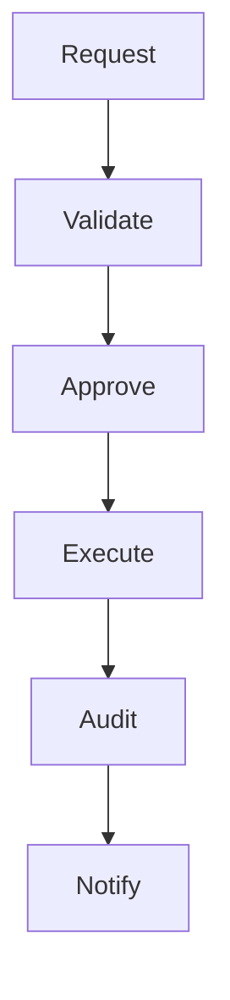

# Recommendation Execution Overview
Version: 1.0.0
Status: Enterprise Specification
Owner: Atlas Recommendation Domain
Source of Truth: Recommendation Catalog
Last Updated: 2026-07-13

## Purpose
Recommendation Execution defines governed execution for existing Recommendations in Atlas, preserving existing Domain ownership, Catalog naming, validation, audit, security, lifecycle, and execution evidence.

## Business Meaning
Recommendation Execution defines governed execution for existing Recommendations in Atlas, preserving existing Domain ownership, Catalog naming, validation, audit, security, lifecycle, and execution evidence.

## Execution Scope
Recommendation Execution defines governed execution for existing Recommendations in Atlas, preserving existing Domain ownership, Catalog naming, validation, audit, security, lifecycle, and execution evidence.

## Execution Lifecycle
Recommendation Execution defines governed execution for existing Recommendations in Atlas, preserving existing Domain ownership, Catalog naming, validation, audit, security, lifecycle, and execution evidence.

## Execution Objectives
Recommendation Execution defines governed execution for existing Recommendations in Atlas, preserving existing Domain ownership, Catalog naming, validation, audit, security, lifecycle, and execution evidence.

## Ownership
Recommendation Execution defines governed execution for existing Recommendations in Atlas, preserving existing Domain ownership, Catalog naming, validation, audit, security, lifecycle, and execution evidence.

## Aggregate Root（是否）
Recommendation Execution defines governed execution for existing Recommendations in Atlas, preserving existing Domain ownership, Catalog naming, validation, audit, security, lifecycle, and execution evidence.

## Relationship with
### Recommendation
Execution references Recommendation through existing Atlas contracts and never takes ownership of Recommendation state.

### Recommendation Lifecycle
Execution references Recommendation Lifecycle through existing Atlas contracts and never takes ownership of Recommendation Lifecycle state.

### Recommendation Evaluation
Execution references Recommendation Evaluation through existing Atlas contracts and never takes ownership of Recommendation Evaluation state.

### Recommendation Priority
Execution references Recommendation Priority through existing Atlas contracts and never takes ownership of Recommendation Priority state.

### Decision
Execution references Decision through existing Atlas contracts and never takes ownership of Decision state.

### Decision Execution
Execution references Decision Execution through existing Atlas contracts and never takes ownership of Decision Execution state.

### Goal
Execution references Goal through existing Atlas contracts and never takes ownership of Goal state.

### Scenario
Execution references Scenario through existing Atlas contracts and never takes ownership of Scenario state.

### Portfolio
Execution references Portfolio through existing Atlas contracts and never takes ownership of Portfolio state.

### CashFlow
Execution references CashFlow through existing Atlas contracts and never takes ownership of CashFlow state.

### Risk
Execution references Risk through existing Atlas contracts and never takes ownership of Risk state.

### Optimization
Execution references Optimization through existing Atlas contracts and never takes ownership of Optimization state.

### Simulation
Execution references Simulation through existing Atlas contracts and never takes ownership of Simulation state.

### Workflow
Execution references Workflow through existing Atlas contracts and never takes ownership of Workflow state.

### Automation
Execution references Automation through existing Atlas contracts and never takes ownership of Automation state.

### Business Calendar
Execution references Business Calendar through existing Atlas contracts and never takes ownership of Business Calendar state.

### Notification
Execution references Notification through existing Atlas contracts and never takes ownership of Notification state.

### User
Execution references User through existing Atlas contracts and never takes ownership of User state.

---
# Execution Architecture
## Execution Coordinator
Execution Coordinator enforces deterministic Recommendation Execution with tenant isolation, permission checks, policy validation, state control, audit records, and failure handling.

## Execution Engine
Execution Engine enforces deterministic Recommendation Execution with tenant isolation, permission checks, policy validation, state control, audit records, and failure handling.

## Workflow Engine
Workflow Engine enforces deterministic Recommendation Execution with tenant isolation, permission checks, policy validation, state control, audit records, and failure handling.

## Scheduling Engine
Scheduling Engine enforces deterministic Recommendation Execution with tenant isolation, permission checks, policy validation, state control, audit records, and failure handling.

## Task Dispatcher
Task Dispatcher enforces deterministic Recommendation Execution with tenant isolation, permission checks, policy validation, state control, audit records, and failure handling.

## Validation Engine
Validation Engine enforces deterministic Recommendation Execution with tenant isolation, permission checks, policy validation, state control, audit records, and failure handling.

## Approval Engine
Approval Engine enforces deterministic Recommendation Execution with tenant isolation, permission checks, policy validation, state control, audit records, and failure handling.

## Monitoring Engine
Monitoring Engine enforces deterministic Recommendation Execution with tenant isolation, permission checks, policy validation, state control, audit records, and failure handling.

## Recovery Engine
Recovery Engine enforces deterministic Recommendation Execution with tenant isolation, permission checks, policy validation, state control, audit records, and failure handling.

## Rollback Engine
Rollback Engine enforces deterministic Recommendation Execution with tenant isolation, permission checks, policy validation, state control, audit records, and failure handling.

## Audit Engine
Audit Engine enforces deterministic Recommendation Execution with tenant isolation, permission checks, policy validation, state control, audit records, and failure handling.

## Notification Engine
Notification Engine enforces deterministic Recommendation Execution with tenant isolation, permission checks, policy validation, state control, audit records, and failure handling.

---
# Execution Pipeline
## Execution Request
Execution Request is mandatory in the governed pipeline and records input, output, actor, timestamp, correlation id, validation result, and audit evidence.

## Pre Validation
Pre Validation is mandatory in the governed pipeline and records input, output, actor, timestamp, correlation id, validation result, and audit evidence.

## Rule Validation
Rule Validation is mandatory in the governed pipeline and records input, output, actor, timestamp, correlation id, validation result, and audit evidence.

## Approval Check
Approval Check is mandatory in the governed pipeline and records input, output, actor, timestamp, correlation id, validation result, and audit evidence.

## Dependency Check
Dependency Check is mandatory in the governed pipeline and records input, output, actor, timestamp, correlation id, validation result, and audit evidence.

## Resource Check
Resource Check is mandatory in the governed pipeline and records input, output, actor, timestamp, correlation id, validation result, and audit evidence.

## Scheduling
Scheduling is mandatory in the governed pipeline and records input, output, actor, timestamp, correlation id, validation result, and audit evidence.

## Execution
Execution is mandatory in the governed pipeline and records input, output, actor, timestamp, correlation id, validation result, and audit evidence.

## Progress Tracking
Progress Tracking is mandatory in the governed pipeline and records input, output, actor, timestamp, correlation id, validation result, and audit evidence.

## Verification
Verification is mandatory in the governed pipeline and records input, output, actor, timestamp, correlation id, validation result, and audit evidence.

## Completion
Completion is mandatory in the governed pipeline and records input, output, actor, timestamp, correlation id, validation result, and audit evidence.

## Rollback
Rollback is mandatory in the governed pipeline and records input, output, actor, timestamp, correlation id, validation result, and audit evidence.

## Recovery
Recovery is mandatory in the governed pipeline and records input, output, actor, timestamp, correlation id, validation result, and audit evidence.

## Audit
Audit is mandatory in the governed pipeline and records input, output, actor, timestamp, correlation id, validation result, and audit evidence.

## Notification
Notification is mandatory in the governed pipeline and records input, output, actor, timestamp, correlation id, validation result, and audit evidence.

---
# Execution Modes
## Manual
Manual mode is allowed only when Recommendation state, permissions, dependencies, resources, approval, audit, and policy checks pass.

## Automatic
Automatic mode is allowed only when Recommendation state, permissions, dependencies, resources, approval, audit, and policy checks pass.

## Scheduled
Scheduled mode is allowed only when Recommendation state, permissions, dependencies, resources, approval, audit, and policy checks pass.

## Event Driven
Event Driven mode is allowed only when Recommendation state, permissions, dependencies, resources, approval, audit, and policy checks pass.

## Workflow Driven
Workflow Driven mode is allowed only when Recommendation state, permissions, dependencies, resources, approval, audit, and policy checks pass.

## Batch
Batch mode is allowed only when Recommendation state, permissions, dependencies, resources, approval, audit, and policy checks pass.

## Parallel
Parallel mode is allowed only when Recommendation state, permissions, dependencies, resources, approval, audit, and policy checks pass.

## Incremental
Incremental mode is allowed only when Recommendation state, permissions, dependencies, resources, approval, audit, and policy checks pass.

## Simulation
Simulation mode is allowed only when Recommendation state, permissions, dependencies, resources, approval, audit, and policy checks pass.

## Dry Run
Dry Run mode is allowed only when Recommendation state, permissions, dependencies, resources, approval, audit, and policy checks pass.

## Emergency Execution
Emergency Execution mode is allowed only when Recommendation state, permissions, dependencies, resources, approval, audit, and policy checks pass.

---
# Execution Policies
## Priority Policy
Priority Policy defines eligibility, authority, timing, limits, failure outcome, event emission, and audit evidence for execution.

## Dependency Policy
Dependency Policy defines eligibility, authority, timing, limits, failure outcome, event emission, and audit evidence for execution.

## Retry Policy
Retry Policy defines eligibility, authority, timing, limits, failure outcome, event emission, and audit evidence for execution.

## Timeout Policy
Timeout Policy defines eligibility, authority, timing, limits, failure outcome, event emission, and audit evidence for execution.

## Cancellation Policy
Cancellation Policy defines eligibility, authority, timing, limits, failure outcome, event emission, and audit evidence for execution.

## Rollback Policy
Rollback Policy defines eligibility, authority, timing, limits, failure outcome, event emission, and audit evidence for execution.

## Recovery Policy
Recovery Policy defines eligibility, authority, timing, limits, failure outcome, event emission, and audit evidence for execution.

## Escalation Policy
Escalation Policy defines eligibility, authority, timing, limits, failure outcome, event emission, and audit evidence for execution.

## Approval Policy
Approval Policy defines eligibility, authority, timing, limits, failure outcome, event emission, and audit evidence for execution.

## Notification Policy
Notification Policy defines eligibility, authority, timing, limits, failure outcome, event emission, and audit evidence for execution.

## Audit Policy
Audit Policy defines eligibility, authority, timing, limits, failure outcome, event emission, and audit evidence for execution.

---
# Execution Monitoring
## Execution Progress
Execution Progress is tracked per execution, step, tenant, operator, Recommendation, workflow, automation, and correlation id.

## Execution Status
Execution Status is tracked per execution, step, tenant, operator, Recommendation, workflow, automation, and correlation id.

## Execution Health
Execution Health is tracked per execution, step, tenant, operator, Recommendation, workflow, automation, and correlation id.

## Execution Metrics
Execution Metrics is tracked per execution, step, tenant, operator, Recommendation, workflow, automation, and correlation id.

## Execution Errors
Execution Errors is tracked per execution, step, tenant, operator, Recommendation, workflow, automation, and correlation id.

## Execution Warnings
Execution Warnings is tracked per execution, step, tenant, operator, Recommendation, workflow, automation, and correlation id.

## Execution KPIs
Execution KPIs is tracked per execution, step, tenant, operator, Recommendation, workflow, automation, and correlation id.

## Execution Forecast
Execution Forecast is tracked per execution, step, tenant, operator, Recommendation, workflow, automation, and correlation id.

## Execution Timeline
Execution Timeline is tracked per execution, step, tenant, operator, Recommendation, workflow, automation, and correlation id.

## Execution Logs
Execution Logs is tracked per execution, step, tenant, operator, Recommendation, workflow, automation, and correlation id.

---
# Validation Rules
VR-001: Validate Recommendation reference, tenant, permission, state, mode, plan, dependency, resource, approval, schedule, risk, rollback, recovery, audit, and idempotency condition 1.
VR-002: Validate Recommendation reference, tenant, permission, state, mode, plan, dependency, resource, approval, schedule, risk, rollback, recovery, audit, and idempotency condition 2.
VR-003: Validate Recommendation reference, tenant, permission, state, mode, plan, dependency, resource, approval, schedule, risk, rollback, recovery, audit, and idempotency condition 3.
VR-004: Validate Recommendation reference, tenant, permission, state, mode, plan, dependency, resource, approval, schedule, risk, rollback, recovery, audit, and idempotency condition 4.
VR-005: Validate Recommendation reference, tenant, permission, state, mode, plan, dependency, resource, approval, schedule, risk, rollback, recovery, audit, and idempotency condition 5.
VR-006: Validate Recommendation reference, tenant, permission, state, mode, plan, dependency, resource, approval, schedule, risk, rollback, recovery, audit, and idempotency condition 6.
VR-007: Validate Recommendation reference, tenant, permission, state, mode, plan, dependency, resource, approval, schedule, risk, rollback, recovery, audit, and idempotency condition 7.
VR-008: Validate Recommendation reference, tenant, permission, state, mode, plan, dependency, resource, approval, schedule, risk, rollback, recovery, audit, and idempotency condition 8.
VR-009: Validate Recommendation reference, tenant, permission, state, mode, plan, dependency, resource, approval, schedule, risk, rollback, recovery, audit, and idempotency condition 9.
VR-010: Validate Recommendation reference, tenant, permission, state, mode, plan, dependency, resource, approval, schedule, risk, rollback, recovery, audit, and idempotency condition 10.
VR-011: Validate Recommendation reference, tenant, permission, state, mode, plan, dependency, resource, approval, schedule, risk, rollback, recovery, audit, and idempotency condition 11.
VR-012: Validate Recommendation reference, tenant, permission, state, mode, plan, dependency, resource, approval, schedule, risk, rollback, recovery, audit, and idempotency condition 12.
VR-013: Validate Recommendation reference, tenant, permission, state, mode, plan, dependency, resource, approval, schedule, risk, rollback, recovery, audit, and idempotency condition 13.
VR-014: Validate Recommendation reference, tenant, permission, state, mode, plan, dependency, resource, approval, schedule, risk, rollback, recovery, audit, and idempotency condition 14.
VR-015: Validate Recommendation reference, tenant, permission, state, mode, plan, dependency, resource, approval, schedule, risk, rollback, recovery, audit, and idempotency condition 15.
VR-016: Validate Recommendation reference, tenant, permission, state, mode, plan, dependency, resource, approval, schedule, risk, rollback, recovery, audit, and idempotency condition 16.
VR-017: Validate Recommendation reference, tenant, permission, state, mode, plan, dependency, resource, approval, schedule, risk, rollback, recovery, audit, and idempotency condition 17.
VR-018: Validate Recommendation reference, tenant, permission, state, mode, plan, dependency, resource, approval, schedule, risk, rollback, recovery, audit, and idempotency condition 18.
VR-019: Validate Recommendation reference, tenant, permission, state, mode, plan, dependency, resource, approval, schedule, risk, rollback, recovery, audit, and idempotency condition 19.
VR-020: Validate Recommendation reference, tenant, permission, state, mode, plan, dependency, resource, approval, schedule, risk, rollback, recovery, audit, and idempotency condition 20.
VR-021: Validate Recommendation reference, tenant, permission, state, mode, plan, dependency, resource, approval, schedule, risk, rollback, recovery, audit, and idempotency condition 21.
VR-022: Validate Recommendation reference, tenant, permission, state, mode, plan, dependency, resource, approval, schedule, risk, rollback, recovery, audit, and idempotency condition 22.
VR-023: Validate Recommendation reference, tenant, permission, state, mode, plan, dependency, resource, approval, schedule, risk, rollback, recovery, audit, and idempotency condition 23.
VR-024: Validate Recommendation reference, tenant, permission, state, mode, plan, dependency, resource, approval, schedule, risk, rollback, recovery, audit, and idempotency condition 24.
VR-025: Validate Recommendation reference, tenant, permission, state, mode, plan, dependency, resource, approval, schedule, risk, rollback, recovery, audit, and idempotency condition 25.
VR-026: Validate Recommendation reference, tenant, permission, state, mode, plan, dependency, resource, approval, schedule, risk, rollback, recovery, audit, and idempotency condition 26.
VR-027: Validate Recommendation reference, tenant, permission, state, mode, plan, dependency, resource, approval, schedule, risk, rollback, recovery, audit, and idempotency condition 27.
VR-028: Validate Recommendation reference, tenant, permission, state, mode, plan, dependency, resource, approval, schedule, risk, rollback, recovery, audit, and idempotency condition 28.
VR-029: Validate Recommendation reference, tenant, permission, state, mode, plan, dependency, resource, approval, schedule, risk, rollback, recovery, audit, and idempotency condition 29.
VR-030: Validate Recommendation reference, tenant, permission, state, mode, plan, dependency, resource, approval, schedule, risk, rollback, recovery, audit, and idempotency condition 30.
VR-031: Validate Recommendation reference, tenant, permission, state, mode, plan, dependency, resource, approval, schedule, risk, rollback, recovery, audit, and idempotency condition 31.
VR-032: Validate Recommendation reference, tenant, permission, state, mode, plan, dependency, resource, approval, schedule, risk, rollback, recovery, audit, and idempotency condition 32.
VR-033: Validate Recommendation reference, tenant, permission, state, mode, plan, dependency, resource, approval, schedule, risk, rollback, recovery, audit, and idempotency condition 33.
VR-034: Validate Recommendation reference, tenant, permission, state, mode, plan, dependency, resource, approval, schedule, risk, rollback, recovery, audit, and idempotency condition 34.
VR-035: Validate Recommendation reference, tenant, permission, state, mode, plan, dependency, resource, approval, schedule, risk, rollback, recovery, audit, and idempotency condition 35.
VR-036: Validate Recommendation reference, tenant, permission, state, mode, plan, dependency, resource, approval, schedule, risk, rollback, recovery, audit, and idempotency condition 36.
VR-037: Validate Recommendation reference, tenant, permission, state, mode, plan, dependency, resource, approval, schedule, risk, rollback, recovery, audit, and idempotency condition 37.
VR-038: Validate Recommendation reference, tenant, permission, state, mode, plan, dependency, resource, approval, schedule, risk, rollback, recovery, audit, and idempotency condition 38.
VR-039: Validate Recommendation reference, tenant, permission, state, mode, plan, dependency, resource, approval, schedule, risk, rollback, recovery, audit, and idempotency condition 39.
VR-040: Validate Recommendation reference, tenant, permission, state, mode, plan, dependency, resource, approval, schedule, risk, rollback, recovery, audit, and idempotency condition 40.
VR-041: Validate Recommendation reference, tenant, permission, state, mode, plan, dependency, resource, approval, schedule, risk, rollback, recovery, audit, and idempotency condition 41.
VR-042: Validate Recommendation reference, tenant, permission, state, mode, plan, dependency, resource, approval, schedule, risk, rollback, recovery, audit, and idempotency condition 42.
VR-043: Validate Recommendation reference, tenant, permission, state, mode, plan, dependency, resource, approval, schedule, risk, rollback, recovery, audit, and idempotency condition 43.
VR-044: Validate Recommendation reference, tenant, permission, state, mode, plan, dependency, resource, approval, schedule, risk, rollback, recovery, audit, and idempotency condition 44.
VR-045: Validate Recommendation reference, tenant, permission, state, mode, plan, dependency, resource, approval, schedule, risk, rollback, recovery, audit, and idempotency condition 45.
VR-046: Validate Recommendation reference, tenant, permission, state, mode, plan, dependency, resource, approval, schedule, risk, rollback, recovery, audit, and idempotency condition 46.
VR-047: Validate Recommendation reference, tenant, permission, state, mode, plan, dependency, resource, approval, schedule, risk, rollback, recovery, audit, and idempotency condition 47.
VR-048: Validate Recommendation reference, tenant, permission, state, mode, plan, dependency, resource, approval, schedule, risk, rollback, recovery, audit, and idempotency condition 48.
VR-049: Validate Recommendation reference, tenant, permission, state, mode, plan, dependency, resource, approval, schedule, risk, rollback, recovery, audit, and idempotency condition 49.
VR-050: Validate Recommendation reference, tenant, permission, state, mode, plan, dependency, resource, approval, schedule, risk, rollback, recovery, audit, and idempotency condition 50.
VR-051: Validate Recommendation reference, tenant, permission, state, mode, plan, dependency, resource, approval, schedule, risk, rollback, recovery, audit, and idempotency condition 51.
VR-052: Validate Recommendation reference, tenant, permission, state, mode, plan, dependency, resource, approval, schedule, risk, rollback, recovery, audit, and idempotency condition 52.
VR-053: Validate Recommendation reference, tenant, permission, state, mode, plan, dependency, resource, approval, schedule, risk, rollback, recovery, audit, and idempotency condition 53.
VR-054: Validate Recommendation reference, tenant, permission, state, mode, plan, dependency, resource, approval, schedule, risk, rollback, recovery, audit, and idempotency condition 54.
VR-055: Validate Recommendation reference, tenant, permission, state, mode, plan, dependency, resource, approval, schedule, risk, rollback, recovery, audit, and idempotency condition 55.
VR-056: Validate Recommendation reference, tenant, permission, state, mode, plan, dependency, resource, approval, schedule, risk, rollback, recovery, audit, and idempotency condition 56.
VR-057: Validate Recommendation reference, tenant, permission, state, mode, plan, dependency, resource, approval, schedule, risk, rollback, recovery, audit, and idempotency condition 57.
VR-058: Validate Recommendation reference, tenant, permission, state, mode, plan, dependency, resource, approval, schedule, risk, rollback, recovery, audit, and idempotency condition 58.
VR-059: Validate Recommendation reference, tenant, permission, state, mode, plan, dependency, resource, approval, schedule, risk, rollback, recovery, audit, and idempotency condition 59.
VR-060: Validate Recommendation reference, tenant, permission, state, mode, plan, dependency, resource, approval, schedule, risk, rollback, recovery, audit, and idempotency condition 60.

---
# Business Rules
BR-001: Recommendation Execution must use existing Atlas Catalog naming, preserve existing Domain ownership, enforce permissions, validate state, record audit, emit events, and prevent inconsistent execution condition 1.
BR-002: Recommendation Execution must use existing Atlas Catalog naming, preserve existing Domain ownership, enforce permissions, validate state, record audit, emit events, and prevent inconsistent execution condition 2.
BR-003: Recommendation Execution must use existing Atlas Catalog naming, preserve existing Domain ownership, enforce permissions, validate state, record audit, emit events, and prevent inconsistent execution condition 3.
BR-004: Recommendation Execution must use existing Atlas Catalog naming, preserve existing Domain ownership, enforce permissions, validate state, record audit, emit events, and prevent inconsistent execution condition 4.
BR-005: Recommendation Execution must use existing Atlas Catalog naming, preserve existing Domain ownership, enforce permissions, validate state, record audit, emit events, and prevent inconsistent execution condition 5.
BR-006: Recommendation Execution must use existing Atlas Catalog naming, preserve existing Domain ownership, enforce permissions, validate state, record audit, emit events, and prevent inconsistent execution condition 6.
BR-007: Recommendation Execution must use existing Atlas Catalog naming, preserve existing Domain ownership, enforce permissions, validate state, record audit, emit events, and prevent inconsistent execution condition 7.
BR-008: Recommendation Execution must use existing Atlas Catalog naming, preserve existing Domain ownership, enforce permissions, validate state, record audit, emit events, and prevent inconsistent execution condition 8.
BR-009: Recommendation Execution must use existing Atlas Catalog naming, preserve existing Domain ownership, enforce permissions, validate state, record audit, emit events, and prevent inconsistent execution condition 9.
BR-010: Recommendation Execution must use existing Atlas Catalog naming, preserve existing Domain ownership, enforce permissions, validate state, record audit, emit events, and prevent inconsistent execution condition 10.
BR-011: Recommendation Execution must use existing Atlas Catalog naming, preserve existing Domain ownership, enforce permissions, validate state, record audit, emit events, and prevent inconsistent execution condition 11.
BR-012: Recommendation Execution must use existing Atlas Catalog naming, preserve existing Domain ownership, enforce permissions, validate state, record audit, emit events, and prevent inconsistent execution condition 12.
BR-013: Recommendation Execution must use existing Atlas Catalog naming, preserve existing Domain ownership, enforce permissions, validate state, record audit, emit events, and prevent inconsistent execution condition 13.
BR-014: Recommendation Execution must use existing Atlas Catalog naming, preserve existing Domain ownership, enforce permissions, validate state, record audit, emit events, and prevent inconsistent execution condition 14.
BR-015: Recommendation Execution must use existing Atlas Catalog naming, preserve existing Domain ownership, enforce permissions, validate state, record audit, emit events, and prevent inconsistent execution condition 15.
BR-016: Recommendation Execution must use existing Atlas Catalog naming, preserve existing Domain ownership, enforce permissions, validate state, record audit, emit events, and prevent inconsistent execution condition 16.
BR-017: Recommendation Execution must use existing Atlas Catalog naming, preserve existing Domain ownership, enforce permissions, validate state, record audit, emit events, and prevent inconsistent execution condition 17.
BR-018: Recommendation Execution must use existing Atlas Catalog naming, preserve existing Domain ownership, enforce permissions, validate state, record audit, emit events, and prevent inconsistent execution condition 18.
BR-019: Recommendation Execution must use existing Atlas Catalog naming, preserve existing Domain ownership, enforce permissions, validate state, record audit, emit events, and prevent inconsistent execution condition 19.
BR-020: Recommendation Execution must use existing Atlas Catalog naming, preserve existing Domain ownership, enforce permissions, validate state, record audit, emit events, and prevent inconsistent execution condition 20.
BR-021: Recommendation Execution must use existing Atlas Catalog naming, preserve existing Domain ownership, enforce permissions, validate state, record audit, emit events, and prevent inconsistent execution condition 21.
BR-022: Recommendation Execution must use existing Atlas Catalog naming, preserve existing Domain ownership, enforce permissions, validate state, record audit, emit events, and prevent inconsistent execution condition 22.
BR-023: Recommendation Execution must use existing Atlas Catalog naming, preserve existing Domain ownership, enforce permissions, validate state, record audit, emit events, and prevent inconsistent execution condition 23.
BR-024: Recommendation Execution must use existing Atlas Catalog naming, preserve existing Domain ownership, enforce permissions, validate state, record audit, emit events, and prevent inconsistent execution condition 24.
BR-025: Recommendation Execution must use existing Atlas Catalog naming, preserve existing Domain ownership, enforce permissions, validate state, record audit, emit events, and prevent inconsistent execution condition 25.
BR-026: Recommendation Execution must use existing Atlas Catalog naming, preserve existing Domain ownership, enforce permissions, validate state, record audit, emit events, and prevent inconsistent execution condition 26.
BR-027: Recommendation Execution must use existing Atlas Catalog naming, preserve existing Domain ownership, enforce permissions, validate state, record audit, emit events, and prevent inconsistent execution condition 27.
BR-028: Recommendation Execution must use existing Atlas Catalog naming, preserve existing Domain ownership, enforce permissions, validate state, record audit, emit events, and prevent inconsistent execution condition 28.
BR-029: Recommendation Execution must use existing Atlas Catalog naming, preserve existing Domain ownership, enforce permissions, validate state, record audit, emit events, and prevent inconsistent execution condition 29.
BR-030: Recommendation Execution must use existing Atlas Catalog naming, preserve existing Domain ownership, enforce permissions, validate state, record audit, emit events, and prevent inconsistent execution condition 30.
BR-031: Recommendation Execution must use existing Atlas Catalog naming, preserve existing Domain ownership, enforce permissions, validate state, record audit, emit events, and prevent inconsistent execution condition 31.
BR-032: Recommendation Execution must use existing Atlas Catalog naming, preserve existing Domain ownership, enforce permissions, validate state, record audit, emit events, and prevent inconsistent execution condition 32.
BR-033: Recommendation Execution must use existing Atlas Catalog naming, preserve existing Domain ownership, enforce permissions, validate state, record audit, emit events, and prevent inconsistent execution condition 33.
BR-034: Recommendation Execution must use existing Atlas Catalog naming, preserve existing Domain ownership, enforce permissions, validate state, record audit, emit events, and prevent inconsistent execution condition 34.
BR-035: Recommendation Execution must use existing Atlas Catalog naming, preserve existing Domain ownership, enforce permissions, validate state, record audit, emit events, and prevent inconsistent execution condition 35.
BR-036: Recommendation Execution must use existing Atlas Catalog naming, preserve existing Domain ownership, enforce permissions, validate state, record audit, emit events, and prevent inconsistent execution condition 36.
BR-037: Recommendation Execution must use existing Atlas Catalog naming, preserve existing Domain ownership, enforce permissions, validate state, record audit, emit events, and prevent inconsistent execution condition 37.
BR-038: Recommendation Execution must use existing Atlas Catalog naming, preserve existing Domain ownership, enforce permissions, validate state, record audit, emit events, and prevent inconsistent execution condition 38.
BR-039: Recommendation Execution must use existing Atlas Catalog naming, preserve existing Domain ownership, enforce permissions, validate state, record audit, emit events, and prevent inconsistent execution condition 39.
BR-040: Recommendation Execution must use existing Atlas Catalog naming, preserve existing Domain ownership, enforce permissions, validate state, record audit, emit events, and prevent inconsistent execution condition 40.
BR-041: Recommendation Execution must use existing Atlas Catalog naming, preserve existing Domain ownership, enforce permissions, validate state, record audit, emit events, and prevent inconsistent execution condition 41.
BR-042: Recommendation Execution must use existing Atlas Catalog naming, preserve existing Domain ownership, enforce permissions, validate state, record audit, emit events, and prevent inconsistent execution condition 42.
BR-043: Recommendation Execution must use existing Atlas Catalog naming, preserve existing Domain ownership, enforce permissions, validate state, record audit, emit events, and prevent inconsistent execution condition 43.
BR-044: Recommendation Execution must use existing Atlas Catalog naming, preserve existing Domain ownership, enforce permissions, validate state, record audit, emit events, and prevent inconsistent execution condition 44.
BR-045: Recommendation Execution must use existing Atlas Catalog naming, preserve existing Domain ownership, enforce permissions, validate state, record audit, emit events, and prevent inconsistent execution condition 45.
BR-046: Recommendation Execution must use existing Atlas Catalog naming, preserve existing Domain ownership, enforce permissions, validate state, record audit, emit events, and prevent inconsistent execution condition 46.
BR-047: Recommendation Execution must use existing Atlas Catalog naming, preserve existing Domain ownership, enforce permissions, validate state, record audit, emit events, and prevent inconsistent execution condition 47.
BR-048: Recommendation Execution must use existing Atlas Catalog naming, preserve existing Domain ownership, enforce permissions, validate state, record audit, emit events, and prevent inconsistent execution condition 48.
BR-049: Recommendation Execution must use existing Atlas Catalog naming, preserve existing Domain ownership, enforce permissions, validate state, record audit, emit events, and prevent inconsistent execution condition 49.
BR-050: Recommendation Execution must use existing Atlas Catalog naming, preserve existing Domain ownership, enforce permissions, validate state, record audit, emit events, and prevent inconsistent execution condition 50.
BR-051: Recommendation Execution must use existing Atlas Catalog naming, preserve existing Domain ownership, enforce permissions, validate state, record audit, emit events, and prevent inconsistent execution condition 51.
BR-052: Recommendation Execution must use existing Atlas Catalog naming, preserve existing Domain ownership, enforce permissions, validate state, record audit, emit events, and prevent inconsistent execution condition 52.
BR-053: Recommendation Execution must use existing Atlas Catalog naming, preserve existing Domain ownership, enforce permissions, validate state, record audit, emit events, and prevent inconsistent execution condition 53.
BR-054: Recommendation Execution must use existing Atlas Catalog naming, preserve existing Domain ownership, enforce permissions, validate state, record audit, emit events, and prevent inconsistent execution condition 54.
BR-055: Recommendation Execution must use existing Atlas Catalog naming, preserve existing Domain ownership, enforce permissions, validate state, record audit, emit events, and prevent inconsistent execution condition 55.
BR-056: Recommendation Execution must use existing Atlas Catalog naming, preserve existing Domain ownership, enforce permissions, validate state, record audit, emit events, and prevent inconsistent execution condition 56.
BR-057: Recommendation Execution must use existing Atlas Catalog naming, preserve existing Domain ownership, enforce permissions, validate state, record audit, emit events, and prevent inconsistent execution condition 57.
BR-058: Recommendation Execution must use existing Atlas Catalog naming, preserve existing Domain ownership, enforce permissions, validate state, record audit, emit events, and prevent inconsistent execution condition 58.
BR-059: Recommendation Execution must use existing Atlas Catalog naming, preserve existing Domain ownership, enforce permissions, validate state, record audit, emit events, and prevent inconsistent execution condition 59.
BR-060: Recommendation Execution must use existing Atlas Catalog naming, preserve existing Domain ownership, enforce permissions, validate state, record audit, emit events, and prevent inconsistent execution condition 60.
BR-061: Recommendation Execution must use existing Atlas Catalog naming, preserve existing Domain ownership, enforce permissions, validate state, record audit, emit events, and prevent inconsistent execution condition 61.
BR-062: Recommendation Execution must use existing Atlas Catalog naming, preserve existing Domain ownership, enforce permissions, validate state, record audit, emit events, and prevent inconsistent execution condition 62.
BR-063: Recommendation Execution must use existing Atlas Catalog naming, preserve existing Domain ownership, enforce permissions, validate state, record audit, emit events, and prevent inconsistent execution condition 63.
BR-064: Recommendation Execution must use existing Atlas Catalog naming, preserve existing Domain ownership, enforce permissions, validate state, record audit, emit events, and prevent inconsistent execution condition 64.
BR-065: Recommendation Execution must use existing Atlas Catalog naming, preserve existing Domain ownership, enforce permissions, validate state, record audit, emit events, and prevent inconsistent execution condition 65.
BR-066: Recommendation Execution must use existing Atlas Catalog naming, preserve existing Domain ownership, enforce permissions, validate state, record audit, emit events, and prevent inconsistent execution condition 66.
BR-067: Recommendation Execution must use existing Atlas Catalog naming, preserve existing Domain ownership, enforce permissions, validate state, record audit, emit events, and prevent inconsistent execution condition 67.
BR-068: Recommendation Execution must use existing Atlas Catalog naming, preserve existing Domain ownership, enforce permissions, validate state, record audit, emit events, and prevent inconsistent execution condition 68.
BR-069: Recommendation Execution must use existing Atlas Catalog naming, preserve existing Domain ownership, enforce permissions, validate state, record audit, emit events, and prevent inconsistent execution condition 69.
BR-070: Recommendation Execution must use existing Atlas Catalog naming, preserve existing Domain ownership, enforce permissions, validate state, record audit, emit events, and prevent inconsistent execution condition 70.
BR-071: Recommendation Execution must use existing Atlas Catalog naming, preserve existing Domain ownership, enforce permissions, validate state, record audit, emit events, and prevent inconsistent execution condition 71.
BR-072: Recommendation Execution must use existing Atlas Catalog naming, preserve existing Domain ownership, enforce permissions, validate state, record audit, emit events, and prevent inconsistent execution condition 72.
BR-073: Recommendation Execution must use existing Atlas Catalog naming, preserve existing Domain ownership, enforce permissions, validate state, record audit, emit events, and prevent inconsistent execution condition 73.
BR-074: Recommendation Execution must use existing Atlas Catalog naming, preserve existing Domain ownership, enforce permissions, validate state, record audit, emit events, and prevent inconsistent execution condition 74.
BR-075: Recommendation Execution must use existing Atlas Catalog naming, preserve existing Domain ownership, enforce permissions, validate state, record audit, emit events, and prevent inconsistent execution condition 75.
BR-076: Recommendation Execution must use existing Atlas Catalog naming, preserve existing Domain ownership, enforce permissions, validate state, record audit, emit events, and prevent inconsistent execution condition 76.
BR-077: Recommendation Execution must use existing Atlas Catalog naming, preserve existing Domain ownership, enforce permissions, validate state, record audit, emit events, and prevent inconsistent execution condition 77.
BR-078: Recommendation Execution must use existing Atlas Catalog naming, preserve existing Domain ownership, enforce permissions, validate state, record audit, emit events, and prevent inconsistent execution condition 78.
BR-079: Recommendation Execution must use existing Atlas Catalog naming, preserve existing Domain ownership, enforce permissions, validate state, record audit, emit events, and prevent inconsistent execution condition 79.
BR-080: Recommendation Execution must use existing Atlas Catalog naming, preserve existing Domain ownership, enforce permissions, validate state, record audit, emit events, and prevent inconsistent execution condition 80.
BR-081: Recommendation Execution must use existing Atlas Catalog naming, preserve existing Domain ownership, enforce permissions, validate state, record audit, emit events, and prevent inconsistent execution condition 81.
BR-082: Recommendation Execution must use existing Atlas Catalog naming, preserve existing Domain ownership, enforce permissions, validate state, record audit, emit events, and prevent inconsistent execution condition 82.
BR-083: Recommendation Execution must use existing Atlas Catalog naming, preserve existing Domain ownership, enforce permissions, validate state, record audit, emit events, and prevent inconsistent execution condition 83.
BR-084: Recommendation Execution must use existing Atlas Catalog naming, preserve existing Domain ownership, enforce permissions, validate state, record audit, emit events, and prevent inconsistent execution condition 84.
BR-085: Recommendation Execution must use existing Atlas Catalog naming, preserve existing Domain ownership, enforce permissions, validate state, record audit, emit events, and prevent inconsistent execution condition 85.
BR-086: Recommendation Execution must use existing Atlas Catalog naming, preserve existing Domain ownership, enforce permissions, validate state, record audit, emit events, and prevent inconsistent execution condition 86.
BR-087: Recommendation Execution must use existing Atlas Catalog naming, preserve existing Domain ownership, enforce permissions, validate state, record audit, emit events, and prevent inconsistent execution condition 87.
BR-088: Recommendation Execution must use existing Atlas Catalog naming, preserve existing Domain ownership, enforce permissions, validate state, record audit, emit events, and prevent inconsistent execution condition 88.
BR-089: Recommendation Execution must use existing Atlas Catalog naming, preserve existing Domain ownership, enforce permissions, validate state, record audit, emit events, and prevent inconsistent execution condition 89.
BR-090: Recommendation Execution must use existing Atlas Catalog naming, preserve existing Domain ownership, enforce permissions, validate state, record audit, emit events, and prevent inconsistent execution condition 90.
BR-091: Recommendation Execution must use existing Atlas Catalog naming, preserve existing Domain ownership, enforce permissions, validate state, record audit, emit events, and prevent inconsistent execution condition 91.
BR-092: Recommendation Execution must use existing Atlas Catalog naming, preserve existing Domain ownership, enforce permissions, validate state, record audit, emit events, and prevent inconsistent execution condition 92.
BR-093: Recommendation Execution must use existing Atlas Catalog naming, preserve existing Domain ownership, enforce permissions, validate state, record audit, emit events, and prevent inconsistent execution condition 93.
BR-094: Recommendation Execution must use existing Atlas Catalog naming, preserve existing Domain ownership, enforce permissions, validate state, record audit, emit events, and prevent inconsistent execution condition 94.
BR-095: Recommendation Execution must use existing Atlas Catalog naming, preserve existing Domain ownership, enforce permissions, validate state, record audit, emit events, and prevent inconsistent execution condition 95.
BR-096: Recommendation Execution must use existing Atlas Catalog naming, preserve existing Domain ownership, enforce permissions, validate state, record audit, emit events, and prevent inconsistent execution condition 96.
BR-097: Recommendation Execution must use existing Atlas Catalog naming, preserve existing Domain ownership, enforce permissions, validate state, record audit, emit events, and prevent inconsistent execution condition 97.
BR-098: Recommendation Execution must use existing Atlas Catalog naming, preserve existing Domain ownership, enforce permissions, validate state, record audit, emit events, and prevent inconsistent execution condition 98.
BR-099: Recommendation Execution must use existing Atlas Catalog naming, preserve existing Domain ownership, enforce permissions, validate state, record audit, emit events, and prevent inconsistent execution condition 99.
BR-100: Recommendation Execution must use existing Atlas Catalog naming, preserve existing Domain ownership, enforce permissions, validate state, record audit, emit events, and prevent inconsistent execution condition 100.

---
# State Machine
## States
- Draft
- Requested
- Validated
- ApprovalPending
- Approved
- Rejected
- DependencyBlocked
- ResourceBlocked
- Scheduled
- Queued
- Running
- Paused
- Retrying
- Verifying
- Completed
- Failed
- Cancelling
- Cancelled
- RollingBack
- RolledBack
- Recovering
- Recovered
- Archiving
- Archived
- Restoring
- Deleting
- Deleted
## Transitions
- Draft -> Requested
- Requested -> Validated
- Validated -> ApprovalPending
- ApprovalPending -> Approved
- ApprovalPending -> Rejected
- Approved -> Scheduled
- Scheduled -> Queued
- Queued -> Running
- Running -> Paused
- Paused -> Running
- Running -> Retrying
- Retrying -> Running
- Running -> Verifying
- Verifying -> Completed
- Running -> Failed
- Failed -> Retrying
- Failed -> Recovering
- Recovering -> Recovered
- Recovered -> Queued
- Completed -> RollingBack
- Failed -> RollingBack
- RollingBack -> RolledBack
- Requested -> Cancelling
- Scheduled -> Cancelling
- Queued -> Cancelling
- Running -> Cancelling
- Cancelling -> Cancelled
- Completed -> Archiving
- Cancelled -> Archiving
- Failed -> Archiving
- RolledBack -> Archiving
- Archived -> Restoring
- Archived -> Deleting
- Deleting -> Deleted
## Triggers
- CreateExecution
- StartExecution
- PauseExecution
- ResumeExecution
- RetryExecution
- CancelExecution
- CompleteExecution
- RollbackExecution
- RecoverExecution
- ArchiveExecution
- RestoreExecution
- DeleteExecution
- GenerateExecutionPlan
## Invariant
- Invariant 1 requires single Recommendation reference, tenant isolation, legal state, append-only audit, row version, actor, timestamp, correlation id, and permission evidence.
- Invariant 2 requires single Recommendation reference, tenant isolation, legal state, append-only audit, row version, actor, timestamp, correlation id, and permission evidence.
- Invariant 3 requires single Recommendation reference, tenant isolation, legal state, append-only audit, row version, actor, timestamp, correlation id, and permission evidence.
- Invariant 4 requires single Recommendation reference, tenant isolation, legal state, append-only audit, row version, actor, timestamp, correlation id, and permission evidence.
- Invariant 5 requires single Recommendation reference, tenant isolation, legal state, append-only audit, row version, actor, timestamp, correlation id, and permission evidence.
- Invariant 6 requires single Recommendation reference, tenant isolation, legal state, append-only audit, row version, actor, timestamp, correlation id, and permission evidence.
- Invariant 7 requires single Recommendation reference, tenant isolation, legal state, append-only audit, row version, actor, timestamp, correlation id, and permission evidence.
- Invariant 8 requires single Recommendation reference, tenant isolation, legal state, append-only audit, row version, actor, timestamp, correlation id, and permission evidence.
## Illegal Transition
- Illegal transition 1 is rejected with conflict error, audit record, and no domain mutation.
- Illegal transition 2 is rejected with conflict error, audit record, and no domain mutation.
- Illegal transition 3 is rejected with conflict error, audit record, and no domain mutation.
- Illegal transition 4 is rejected with conflict error, audit record, and no domain mutation.
- Illegal transition 5 is rejected with conflict error, audit record, and no domain mutation.
- Illegal transition 6 is rejected with conflict error, audit record, and no domain mutation.
- Illegal transition 7 is rejected with conflict error, audit record, and no domain mutation.
- Illegal transition 8 is rejected with conflict error, audit record, and no domain mutation.

---
# Commands
## CreateExecution
Command CreateExecution requires tenant id, actor id, Recommendation reference when applicable, idempotency key, correlation id, reason when required, permission context, validation result, optimistic version, and audit metadata.

## StartExecution
Command StartExecution requires tenant id, actor id, Recommendation reference when applicable, idempotency key, correlation id, reason when required, permission context, validation result, optimistic version, and audit metadata.

## PauseExecution
Command PauseExecution requires tenant id, actor id, Recommendation reference when applicable, idempotency key, correlation id, reason when required, permission context, validation result, optimistic version, and audit metadata.

## ResumeExecution
Command ResumeExecution requires tenant id, actor id, Recommendation reference when applicable, idempotency key, correlation id, reason when required, permission context, validation result, optimistic version, and audit metadata.

## RetryExecution
Command RetryExecution requires tenant id, actor id, Recommendation reference when applicable, idempotency key, correlation id, reason when required, permission context, validation result, optimistic version, and audit metadata.

## CancelExecution
Command CancelExecution requires tenant id, actor id, Recommendation reference when applicable, idempotency key, correlation id, reason when required, permission context, validation result, optimistic version, and audit metadata.

## CompleteExecution
Command CompleteExecution requires tenant id, actor id, Recommendation reference when applicable, idempotency key, correlation id, reason when required, permission context, validation result, optimistic version, and audit metadata.

## RollbackExecution
Command RollbackExecution requires tenant id, actor id, Recommendation reference when applicable, idempotency key, correlation id, reason when required, permission context, validation result, optimistic version, and audit metadata.

## RecoverExecution
Command RecoverExecution requires tenant id, actor id, Recommendation reference when applicable, idempotency key, correlation id, reason when required, permission context, validation result, optimistic version, and audit metadata.

## ArchiveExecution
Command ArchiveExecution requires tenant id, actor id, Recommendation reference when applicable, idempotency key, correlation id, reason when required, permission context, validation result, optimistic version, and audit metadata.

## RestoreExecution
Command RestoreExecution requires tenant id, actor id, Recommendation reference when applicable, idempotency key, correlation id, reason when required, permission context, validation result, optimistic version, and audit metadata.

## DeleteExecution
Command DeleteExecution requires tenant id, actor id, Recommendation reference when applicable, idempotency key, correlation id, reason when required, permission context, validation result, optimistic version, and audit metadata.

## GenerateExecutionPlan
Command GenerateExecutionPlan requires tenant id, actor id, Recommendation reference when applicable, idempotency key, correlation id, reason when required, permission context, validation result, optimistic version, and audit metadata.

## ValidateExecution
Command ValidateExecution requires tenant id, actor id, Recommendation reference when applicable, idempotency key, correlation id, reason when required, permission context, validation result, optimistic version, and audit metadata.

## ApproveExecution
Command ApproveExecution requires tenant id, actor id, Recommendation reference when applicable, idempotency key, correlation id, reason when required, permission context, validation result, optimistic version, and audit metadata.

## RejectExecution
Command RejectExecution requires tenant id, actor id, Recommendation reference when applicable, idempotency key, correlation id, reason when required, permission context, validation result, optimistic version, and audit metadata.

## ScheduleExecution
Command ScheduleExecution requires tenant id, actor id, Recommendation reference when applicable, idempotency key, correlation id, reason when required, permission context, validation result, optimistic version, and audit metadata.

## DispatchExecution
Command DispatchExecution requires tenant id, actor id, Recommendation reference when applicable, idempotency key, correlation id, reason when required, permission context, validation result, optimistic version, and audit metadata.

## VerifyExecution
Command VerifyExecution requires tenant id, actor id, Recommendation reference when applicable, idempotency key, correlation id, reason when required, permission context, validation result, optimistic version, and audit metadata.

## FailExecution
Command FailExecution requires tenant id, actor id, Recommendation reference when applicable, idempotency key, correlation id, reason when required, permission context, validation result, optimistic version, and audit metadata.

## EscalateExecution
Command EscalateExecution requires tenant id, actor id, Recommendation reference when applicable, idempotency key, correlation id, reason when required, permission context, validation result, optimistic version, and audit metadata.

## NotifyExecution
Command NotifyExecution requires tenant id, actor id, Recommendation reference when applicable, idempotency key, correlation id, reason when required, permission context, validation result, optimistic version, and audit metadata.

## CreateRecommendation
Command CreateRecommendation requires tenant id, actor id, Recommendation reference when applicable, idempotency key, correlation id, reason when required, permission context, validation result, optimistic version, and audit metadata.

## EvaluateRecommendation
Command EvaluateRecommendation requires tenant id, actor id, Recommendation reference when applicable, idempotency key, correlation id, reason when required, permission context, validation result, optimistic version, and audit metadata.

## PrioritizeRecommendation
Command PrioritizeRecommendation requires tenant id, actor id, Recommendation reference when applicable, idempotency key, correlation id, reason when required, permission context, validation result, optimistic version, and audit metadata.

## PublishRecommendation
Command PublishRecommendation requires tenant id, actor id, Recommendation reference when applicable, idempotency key, correlation id, reason when required, permission context, validation result, optimistic version, and audit metadata.

## AcceptRecommendation
Command AcceptRecommendation requires tenant id, actor id, Recommendation reference when applicable, idempotency key, correlation id, reason when required, permission context, validation result, optimistic version, and audit metadata.

## DeclineRecommendation
Command DeclineRecommendation requires tenant id, actor id, Recommendation reference when applicable, idempotency key, correlation id, reason when required, permission context, validation result, optimistic version, and audit metadata.

## CreateDecision
Command CreateDecision requires tenant id, actor id, Recommendation reference when applicable, idempotency key, correlation id, reason when required, permission context, validation result, optimistic version, and audit metadata.

## ExecuteDecision
Command ExecuteDecision requires tenant id, actor id, Recommendation reference when applicable, idempotency key, correlation id, reason when required, permission context, validation result, optimistic version, and audit metadata.

## UpdateGoal
Command UpdateGoal requires tenant id, actor id, Recommendation reference when applicable, idempotency key, correlation id, reason when required, permission context, validation result, optimistic version, and audit metadata.

## RunScenario
Command RunScenario requires tenant id, actor id, Recommendation reference when applicable, idempotency key, correlation id, reason when required, permission context, validation result, optimistic version, and audit metadata.

## UpdatePortfolio
Command UpdatePortfolio requires tenant id, actor id, Recommendation reference when applicable, idempotency key, correlation id, reason when required, permission context, validation result, optimistic version, and audit metadata.

## UpdateCashFlow
Command UpdateCashFlow requires tenant id, actor id, Recommendation reference when applicable, idempotency key, correlation id, reason when required, permission context, validation result, optimistic version, and audit metadata.

## AssessRisk
Command AssessRisk requires tenant id, actor id, Recommendation reference when applicable, idempotency key, correlation id, reason when required, permission context, validation result, optimistic version, and audit metadata.

## RunOptimization
Command RunOptimization requires tenant id, actor id, Recommendation reference when applicable, idempotency key, correlation id, reason when required, permission context, validation result, optimistic version, and audit metadata.

## RunSimulation
Command RunSimulation requires tenant id, actor id, Recommendation reference when applicable, idempotency key, correlation id, reason when required, permission context, validation result, optimistic version, and audit metadata.

## StartWorkflow
Command StartWorkflow requires tenant id, actor id, Recommendation reference when applicable, idempotency key, correlation id, reason when required, permission context, validation result, optimistic version, and audit metadata.

## TriggerAutomation
Command TriggerAutomation requires tenant id, actor id, Recommendation reference when applicable, idempotency key, correlation id, reason when required, permission context, validation result, optimistic version, and audit metadata.

## ResolveBusinessCalendar
Command ResolveBusinessCalendar requires tenant id, actor id, Recommendation reference when applicable, idempotency key, correlation id, reason when required, permission context, validation result, optimistic version, and audit metadata.

## CreateNotification
Command CreateNotification requires tenant id, actor id, Recommendation reference when applicable, idempotency key, correlation id, reason when required, permission context, validation result, optimistic version, and audit metadata.

---
# Domain Events
## ExecutionCreated
Event ExecutionCreated is immutable, tenant-scoped, correlation-aware, ordered by occurred_at, permission-filtered for projection, and retained for audit.

## ExecutionStarted
Event ExecutionStarted is immutable, tenant-scoped, correlation-aware, ordered by occurred_at, permission-filtered for projection, and retained for audit.

## ExecutionPaused
Event ExecutionPaused is immutable, tenant-scoped, correlation-aware, ordered by occurred_at, permission-filtered for projection, and retained for audit.

## ExecutionResumed
Event ExecutionResumed is immutable, tenant-scoped, correlation-aware, ordered by occurred_at, permission-filtered for projection, and retained for audit.

## ExecutionCompleted
Event ExecutionCompleted is immutable, tenant-scoped, correlation-aware, ordered by occurred_at, permission-filtered for projection, and retained for audit.

## ExecutionCancelled
Event ExecutionCancelled is immutable, tenant-scoped, correlation-aware, ordered by occurred_at, permission-filtered for projection, and retained for audit.

## ExecutionFailed
Event ExecutionFailed is immutable, tenant-scoped, correlation-aware, ordered by occurred_at, permission-filtered for projection, and retained for audit.

## ExecutionRetried
Event ExecutionRetried is immutable, tenant-scoped, correlation-aware, ordered by occurred_at, permission-filtered for projection, and retained for audit.

## ExecutionRecovered
Event ExecutionRecovered is immutable, tenant-scoped, correlation-aware, ordered by occurred_at, permission-filtered for projection, and retained for audit.

## ExecutionRolledBack
Event ExecutionRolledBack is immutable, tenant-scoped, correlation-aware, ordered by occurred_at, permission-filtered for projection, and retained for audit.

## ExecutionArchived
Event ExecutionArchived is immutable, tenant-scoped, correlation-aware, ordered by occurred_at, permission-filtered for projection, and retained for audit.

## ExecutionRestored
Event ExecutionRestored is immutable, tenant-scoped, correlation-aware, ordered by occurred_at, permission-filtered for projection, and retained for audit.

## ExecutionDeleted
Event ExecutionDeleted is immutable, tenant-scoped, correlation-aware, ordered by occurred_at, permission-filtered for projection, and retained for audit.

## ExecutionPlanGenerated
Event ExecutionPlanGenerated is immutable, tenant-scoped, correlation-aware, ordered by occurred_at, permission-filtered for projection, and retained for audit.

## ExecutionValidated
Event ExecutionValidated is immutable, tenant-scoped, correlation-aware, ordered by occurred_at, permission-filtered for projection, and retained for audit.

## ExecutionApprovalRequested
Event ExecutionApprovalRequested is immutable, tenant-scoped, correlation-aware, ordered by occurred_at, permission-filtered for projection, and retained for audit.

## ExecutionApproved
Event ExecutionApproved is immutable, tenant-scoped, correlation-aware, ordered by occurred_at, permission-filtered for projection, and retained for audit.

## ExecutionRejected
Event ExecutionRejected is immutable, tenant-scoped, correlation-aware, ordered by occurred_at, permission-filtered for projection, and retained for audit.

## ExecutionScheduled
Event ExecutionScheduled is immutable, tenant-scoped, correlation-aware, ordered by occurred_at, permission-filtered for projection, and retained for audit.

## ExecutionDispatched
Event ExecutionDispatched is immutable, tenant-scoped, correlation-aware, ordered by occurred_at, permission-filtered for projection, and retained for audit.

## ExecutionVerified
Event ExecutionVerified is immutable, tenant-scoped, correlation-aware, ordered by occurred_at, permission-filtered for projection, and retained for audit.

## ExecutionEscalated
Event ExecutionEscalated is immutable, tenant-scoped, correlation-aware, ordered by occurred_at, permission-filtered for projection, and retained for audit.

## ExecutionNotificationRequested
Event ExecutionNotificationRequested is immutable, tenant-scoped, correlation-aware, ordered by occurred_at, permission-filtered for projection, and retained for audit.

## RecommendationExecutionLinked
Event RecommendationExecutionLinked is immutable, tenant-scoped, correlation-aware, ordered by occurred_at, permission-filtered for projection, and retained for audit.

## DecisionExecutionRequested
Event DecisionExecutionRequested is immutable, tenant-scoped, correlation-aware, ordered by occurred_at, permission-filtered for projection, and retained for audit.

## GoalExecutionImpacted
Event GoalExecutionImpacted is immutable, tenant-scoped, correlation-aware, ordered by occurred_at, permission-filtered for projection, and retained for audit.

## ScenarioExecutionReferenced
Event ScenarioExecutionReferenced is immutable, tenant-scoped, correlation-aware, ordered by occurred_at, permission-filtered for projection, and retained for audit.

## PortfolioExecutionImpacted
Event PortfolioExecutionImpacted is immutable, tenant-scoped, correlation-aware, ordered by occurred_at, permission-filtered for projection, and retained for audit.

## CashFlowExecutionImpacted
Event CashFlowExecutionImpacted is immutable, tenant-scoped, correlation-aware, ordered by occurred_at, permission-filtered for projection, and retained for audit.

## RiskExecutionAssessed
Event RiskExecutionAssessed is immutable, tenant-scoped, correlation-aware, ordered by occurred_at, permission-filtered for projection, and retained for audit.

## OptimizationExecutionReferenced
Event OptimizationExecutionReferenced is immutable, tenant-scoped, correlation-aware, ordered by occurred_at, permission-filtered for projection, and retained for audit.

## SimulationExecutionReferenced
Event SimulationExecutionReferenced is immutable, tenant-scoped, correlation-aware, ordered by occurred_at, permission-filtered for projection, and retained for audit.

## WorkflowExecutionAdvanced
Event WorkflowExecutionAdvanced is immutable, tenant-scoped, correlation-aware, ordered by occurred_at, permission-filtered for projection, and retained for audit.

## AutomationExecutionTriggered
Event AutomationExecutionTriggered is immutable, tenant-scoped, correlation-aware, ordered by occurred_at, permission-filtered for projection, and retained for audit.

## BusinessCalendarExecutionResolved
Event BusinessCalendarExecutionResolved is immutable, tenant-scoped, correlation-aware, ordered by occurred_at, permission-filtered for projection, and retained for audit.

## NotificationExecutionSent
Event NotificationExecutionSent is immutable, tenant-scoped, correlation-aware, ordered by occurred_at, permission-filtered for projection, and retained for audit.

---
# Repository
## Interface
- 1 item supports RecommendationExecution persistence, retrieval, search, projection, tenant isolation, optimistic concurrency, and audit access.
- 2 item supports RecommendationExecution persistence, retrieval, search, projection, tenant isolation, optimistic concurrency, and audit access.
- 3 item supports RecommendationExecution persistence, retrieval, search, projection, tenant isolation, optimistic concurrency, and audit access.
- 4 item supports RecommendationExecution persistence, retrieval, search, projection, tenant isolation, optimistic concurrency, and audit access.
- 5 item supports RecommendationExecution persistence, retrieval, search, projection, tenant isolation, optimistic concurrency, and audit access.
## Methods
- 1 item supports RecommendationExecution persistence, retrieval, search, projection, tenant isolation, optimistic concurrency, and audit access.
- 2 item supports RecommendationExecution persistence, retrieval, search, projection, tenant isolation, optimistic concurrency, and audit access.
- 3 item supports RecommendationExecution persistence, retrieval, search, projection, tenant isolation, optimistic concurrency, and audit access.
- 4 item supports RecommendationExecution persistence, retrieval, search, projection, tenant isolation, optimistic concurrency, and audit access.
- 5 item supports RecommendationExecution persistence, retrieval, search, projection, tenant isolation, optimistic concurrency, and audit access.
## Queries
- 1 item supports RecommendationExecution persistence, retrieval, search, projection, tenant isolation, optimistic concurrency, and audit access.
- 2 item supports RecommendationExecution persistence, retrieval, search, projection, tenant isolation, optimistic concurrency, and audit access.
- 3 item supports RecommendationExecution persistence, retrieval, search, projection, tenant isolation, optimistic concurrency, and audit access.
- 4 item supports RecommendationExecution persistence, retrieval, search, projection, tenant isolation, optimistic concurrency, and audit access.
- 5 item supports RecommendationExecution persistence, retrieval, search, projection, tenant isolation, optimistic concurrency, and audit access.
## Filtering
- 1 item supports RecommendationExecution persistence, retrieval, search, projection, tenant isolation, optimistic concurrency, and audit access.
- 2 item supports RecommendationExecution persistence, retrieval, search, projection, tenant isolation, optimistic concurrency, and audit access.
- 3 item supports RecommendationExecution persistence, retrieval, search, projection, tenant isolation, optimistic concurrency, and audit access.
- 4 item supports RecommendationExecution persistence, retrieval, search, projection, tenant isolation, optimistic concurrency, and audit access.
- 5 item supports RecommendationExecution persistence, retrieval, search, projection, tenant isolation, optimistic concurrency, and audit access.
## Sorting
- 1 item supports RecommendationExecution persistence, retrieval, search, projection, tenant isolation, optimistic concurrency, and audit access.
- 2 item supports RecommendationExecution persistence, retrieval, search, projection, tenant isolation, optimistic concurrency, and audit access.
- 3 item supports RecommendationExecution persistence, retrieval, search, projection, tenant isolation, optimistic concurrency, and audit access.
- 4 item supports RecommendationExecution persistence, retrieval, search, projection, tenant isolation, optimistic concurrency, and audit access.
- 5 item supports RecommendationExecution persistence, retrieval, search, projection, tenant isolation, optimistic concurrency, and audit access.
## Aggregation
- 1 item supports RecommendationExecution persistence, retrieval, search, projection, tenant isolation, optimistic concurrency, and audit access.
- 2 item supports RecommendationExecution persistence, retrieval, search, projection, tenant isolation, optimistic concurrency, and audit access.
- 3 item supports RecommendationExecution persistence, retrieval, search, projection, tenant isolation, optimistic concurrency, and audit access.
- 4 item supports RecommendationExecution persistence, retrieval, search, projection, tenant isolation, optimistic concurrency, and audit access.
- 5 item supports RecommendationExecution persistence, retrieval, search, projection, tenant isolation, optimistic concurrency, and audit access.
## Projection
- 1 item supports RecommendationExecution persistence, retrieval, search, projection, tenant isolation, optimistic concurrency, and audit access.
- 2 item supports RecommendationExecution persistence, retrieval, search, projection, tenant isolation, optimistic concurrency, and audit access.
- 3 item supports RecommendationExecution persistence, retrieval, search, projection, tenant isolation, optimistic concurrency, and audit access.
- 4 item supports RecommendationExecution persistence, retrieval, search, projection, tenant isolation, optimistic concurrency, and audit access.
- 5 item supports RecommendationExecution persistence, retrieval, search, projection, tenant isolation, optimistic concurrency, and audit access.
## Specification
- 1 item supports RecommendationExecution persistence, retrieval, search, projection, tenant isolation, optimistic concurrency, and audit access.
- 2 item supports RecommendationExecution persistence, retrieval, search, projection, tenant isolation, optimistic concurrency, and audit access.
- 3 item supports RecommendationExecution persistence, retrieval, search, projection, tenant isolation, optimistic concurrency, and audit access.
- 4 item supports RecommendationExecution persistence, retrieval, search, projection, tenant isolation, optimistic concurrency, and audit access.
- 5 item supports RecommendationExecution persistence, retrieval, search, projection, tenant isolation, optimistic concurrency, and audit access.

---
# Domain Service Interaction
- RecommendationDomainService validates or executes only its owned concern through existing contracts.
- RecommendationEvaluationDomainService validates or executes only its owned concern through existing contracts.
- RecommendationPriorityDomainService validates or executes only its owned concern through existing contracts.
- DecisionDomainService validates or executes only its owned concern through existing contracts.
- DecisionExecutionDomainService validates or executes only its owned concern through existing contracts.
- GoalDomainService validates or executes only its owned concern through existing contracts.
- ScenarioDomainService validates or executes only its owned concern through existing contracts.
- PortfolioDomainService validates or executes only its owned concern through existing contracts.
- CashFlowDomainService validates or executes only its owned concern through existing contracts.
- RiskDomainService validates or executes only its owned concern through existing contracts.
- OptimizationDomainService validates or executes only its owned concern through existing contracts.
- SimulationDomainService validates or executes only its owned concern through existing contracts.
- WorkflowDomainService validates or executes only its owned concern through existing contracts.
- AutomationDomainService validates or executes only its owned concern through existing contracts.
- BusinessCalendarDomainService validates or executes only its owned concern through existing contracts.
- NotificationDomainService validates or executes only its owned concern through existing contracts.
- AuditDomainService validates or executes only its owned concern through existing contracts.
- SecurityDomainService validates or executes only its owned concern through existing contracts.

---
# Application Service Interaction
- RecommendationExecutionApplicationService coordinates commands, queries, projections, permissions, idempotency, and audit without changing Domain ownership.
- RecommendationExecutionQueryService coordinates commands, queries, projections, permissions, idempotency, and audit without changing Domain ownership.
- ExecutionPlanApplicationService coordinates commands, queries, projections, permissions, idempotency, and audit without changing Domain ownership.
- ExecutionBatchApplicationService coordinates commands, queries, projections, permissions, idempotency, and audit without changing Domain ownership.
- ExecutionMonitoringApplicationService coordinates commands, queries, projections, permissions, idempotency, and audit without changing Domain ownership.
- ExecutionRollbackApplicationService coordinates commands, queries, projections, permissions, idempotency, and audit without changing Domain ownership.
- ExecutionRecoveryApplicationService coordinates commands, queries, projections, permissions, idempotency, and audit without changing Domain ownership.
- ExecutionNotificationApplicationService coordinates commands, queries, projections, permissions, idempotency, and audit without changing Domain ownership.
- ExecutionAuditApplicationService coordinates commands, queries, projections, permissions, idempotency, and audit without changing Domain ownership.
- WorkflowApplicationService coordinates commands, queries, projections, permissions, idempotency, and audit without changing Domain ownership.
- AutomationApplicationService coordinates commands, queries, projections, permissions, idempotency, and audit without changing Domain ownership.
- BusinessCalendarApplicationService coordinates commands, queries, projections, permissions, idempotency, and audit without changing Domain ownership.
- UserApplicationService coordinates commands, queries, projections, permissions, idempotency, and audit without changing Domain ownership.

---
# API
## REST Endpoints
REST Endpoints supports JSON contracts, idempotency, tenant context, permission checks, validation errors, state conflicts, paged search, filtered projection, and batch item results.

## HTTP Methods
HTTP Methods supports JSON contracts, idempotency, tenant context, permission checks, validation errors, state conflicts, paged search, filtered projection, and batch item results.

## Request
Request supports JSON contracts, idempotency, tenant context, permission checks, validation errors, state conflicts, paged search, filtered projection, and batch item results.

## Response
Response supports JSON contracts, idempotency, tenant context, permission checks, validation errors, state conflicts, paged search, filtered projection, and batch item results.

## Errors
Errors supports JSON contracts, idempotency, tenant context, permission checks, validation errors, state conflicts, paged search, filtered projection, and batch item results.

## Pagination
Pagination supports JSON contracts, idempotency, tenant context, permission checks, validation errors, state conflicts, paged search, filtered projection, and batch item results.

## Filtering
Filtering supports JSON contracts, idempotency, tenant context, permission checks, validation errors, state conflicts, paged search, filtered projection, and batch item results.

## Sorting
Sorting supports JSON contracts, idempotency, tenant context, permission checks, validation errors, state conflicts, paged search, filtered projection, and batch item results.

## Projection
Projection supports JSON contracts, idempotency, tenant context, permission checks, validation errors, state conflicts, paged search, filtered projection, and batch item results.

## Execution API
Execution API supports JSON contracts, idempotency, tenant context, permission checks, validation errors, state conflicts, paged search, filtered projection, and batch item results.

## Batch API
Batch API supports JSON contracts, idempotency, tenant context, permission checks, validation errors, state conflicts, paged search, filtered projection, and batch item results.

---
# DTO
## Create DTO
Fields: id, tenantId, recommendationId, status, mode, priority, ownerUserId, operatorUserId, plan, result, progressPercent, schedule, timestamps, version, correlationId, idempotencyKey, metadata, links.

## Update DTO
Fields: id, tenantId, recommendationId, status, mode, priority, ownerUserId, operatorUserId, plan, result, progressPercent, schedule, timestamps, version, correlationId, idempotencyKey, metadata, links.

## Execution DTO
Fields: id, tenantId, recommendationId, status, mode, priority, ownerUserId, operatorUserId, plan, result, progressPercent, schedule, timestamps, version, correlationId, idempotencyKey, metadata, links.

## Execution Plan DTO
Fields: id, tenantId, recommendationId, status, mode, priority, ownerUserId, operatorUserId, plan, result, progressPercent, schedule, timestamps, version, correlationId, idempotencyKey, metadata, links.

## Execution Result DTO
Fields: id, tenantId, recommendationId, status, mode, priority, ownerUserId, operatorUserId, plan, result, progressPercent, schedule, timestamps, version, correlationId, idempotencyKey, metadata, links.

## Execution Log DTO
Fields: id, tenantId, recommendationId, status, mode, priority, ownerUserId, operatorUserId, plan, result, progressPercent, schedule, timestamps, version, correlationId, idempotencyKey, metadata, links.

## Execution Status DTO
Fields: id, tenantId, recommendationId, status, mode, priority, ownerUserId, operatorUserId, plan, result, progressPercent, schedule, timestamps, version, correlationId, idempotencyKey, metadata, links.

## Summary DTO
Fields: id, tenantId, recommendationId, status, mode, priority, ownerUserId, operatorUserId, plan, result, progressPercent, schedule, timestamps, version, correlationId, idempotencyKey, metadata, links.

## Detail DTO
Fields: id, tenantId, recommendationId, status, mode, priority, ownerUserId, operatorUserId, plan, result, progressPercent, schedule, timestamps, version, correlationId, idempotencyKey, metadata, links.

## Search DTO
Fields: id, tenantId, recommendationId, status, mode, priority, ownerUserId, operatorUserId, plan, result, progressPercent, schedule, timestamps, version, correlationId, idempotencyKey, metadata, links.

---
# Database Mapping
## Table
Table is defined for recommendation_executions, recommendation_execution_steps, recommendation_execution_logs, recommendation_execution_histories, recommendation_execution_metrics, and recommendation_execution_audits.

## Columns
Columns is defined for recommendation_executions, recommendation_execution_steps, recommendation_execution_logs, recommendation_execution_histories, recommendation_execution_metrics, and recommendation_execution_audits.

## Indexes
Indexes is defined for recommendation_executions, recommendation_execution_steps, recommendation_execution_logs, recommendation_execution_histories, recommendation_execution_metrics, and recommendation_execution_audits.

## Constraints
Constraints is defined for recommendation_executions, recommendation_execution_steps, recommendation_execution_logs, recommendation_execution_histories, recommendation_execution_metrics, and recommendation_execution_audits.

## FK
FK is defined for recommendation_executions, recommendation_execution_steps, recommendation_execution_logs, recommendation_execution_histories, recommendation_execution_metrics, and recommendation_execution_audits.

## Unique
Unique is defined for recommendation_executions, recommendation_execution_steps, recommendation_execution_logs, recommendation_execution_histories, recommendation_execution_metrics, and recommendation_execution_audits.

## Check Constraint
Check Constraint is defined for recommendation_executions, recommendation_execution_steps, recommendation_execution_logs, recommendation_execution_histories, recommendation_execution_metrics, and recommendation_execution_audits.

## Partition Strategy
Partition Strategy is defined for recommendation_executions, recommendation_execution_steps, recommendation_execution_logs, recommendation_execution_histories, recommendation_execution_metrics, and recommendation_execution_audits.

---
# PostgreSQL Schema
```sql
CREATE TABLE recommendation_executions (id uuid PRIMARY KEY, tenant_id uuid NOT NULL, recommendation_id uuid NOT NULL, status varchar(40) NOT NULL, mode varchar(40) NOT NULL, priority varchar(40) NOT NULL, owner_user_id uuid NULL, operator_user_id uuid NOT NULL, workflow_id uuid NULL, automation_id uuid NULL, progress_percent numeric(5,2) NOT NULL DEFAULT 0, plan_json jsonb NOT NULL DEFAULT '{}'::jsonb, result_json jsonb NOT NULL DEFAULT '{}'::jsonb, metadata_json jsonb NOT NULL DEFAULT '{}'::jsonb, scheduled_at timestamptz NULL, started_at timestamptz NULL, completed_at timestamptz NULL, failed_at timestamptz NULL, archived_at timestamptz NULL, deleted_at timestamptz NULL, created_at timestamptz NOT NULL, updated_at timestamptz NOT NULL, row_version bigint NOT NULL DEFAULT 0, correlation_id varchar(100) NOT NULL, idempotency_key varchar(120) NOT NULL);
CREATE UNIQUE INDEX ux_re_tenant_id ON recommendation_executions(tenant_id, id);
CREATE UNIQUE INDEX ux_re_idempotency ON recommendation_executions(tenant_id, idempotency_key);
CREATE INDEX idx_re_status ON recommendation_executions(tenant_id, status);
CREATE INDEX idx_re_recommendation ON recommendation_executions(tenant_id, recommendation_id);
CREATE INDEX idx_re_schedule ON recommendation_executions(tenant_id, scheduled_at);
CREATE TABLE recommendation_execution_steps (id uuid PRIMARY KEY, tenant_id uuid NOT NULL, execution_id uuid NOT NULL, step_order int NOT NULL, step_key varchar(120) NOT NULL, status varchar(40) NOT NULL, command_name varchar(120) NOT NULL, input_json jsonb NOT NULL DEFAULT '{}'::jsonb, output_json jsonb NOT NULL DEFAULT '{}'::jsonb, created_at timestamptz NOT NULL, updated_at timestamptz NOT NULL);
CREATE TABLE recommendation_execution_logs (id uuid PRIMARY KEY, tenant_id uuid NOT NULL, execution_id uuid NOT NULL, level varchar(20) NOT NULL, message text NOT NULL, data_json jsonb NOT NULL DEFAULT '{}'::jsonb, created_at timestamptz NOT NULL);
CREATE TABLE recommendation_execution_histories (id uuid PRIMARY KEY, tenant_id uuid NOT NULL, execution_id uuid NOT NULL, from_status varchar(40) NULL, to_status varchar(40) NOT NULL, actor_user_id uuid NOT NULL, reason text NULL, created_at timestamptz NOT NULL);
CREATE TABLE recommendation_execution_metrics (id uuid PRIMARY KEY, tenant_id uuid NOT NULL, execution_id uuid NOT NULL, metric_name varchar(120) NOT NULL, metric_value numeric(18,4) NOT NULL, created_at timestamptz NOT NULL);
CREATE TABLE recommendation_execution_audits (id uuid PRIMARY KEY, tenant_id uuid NOT NULL, execution_id uuid NOT NULL, action varchar(120) NOT NULL, actor_user_id uuid NOT NULL, audit_json jsonb NOT NULL DEFAULT '{}'::jsonb, created_at timestamptz NOT NULL);
CREATE VIEW vw_recommendation_execution_summary AS SELECT tenant_id, status, mode, priority, count(*) AS execution_count FROM recommendation_executions WHERE deleted_at IS NULL GROUP BY tenant_id, status, mode, priority;
CREATE MATERIALIZED VIEW mv_recommendation_execution_kpi AS SELECT tenant_id, count(*) AS total_count FROM recommendation_executions GROUP BY tenant_id;
```

---
# EF Core Mapping
- Enterprise requirement 1 enforces tenant isolation, permission filtering, deterministic mapping, cache consistency, immutable audit, and operational performance.
- Enterprise requirement 2 enforces tenant isolation, permission filtering, deterministic mapping, cache consistency, immutable audit, and operational performance.
- Enterprise requirement 3 enforces tenant isolation, permission filtering, deterministic mapping, cache consistency, immutable audit, and operational performance.
- Enterprise requirement 4 enforces tenant isolation, permission filtering, deterministic mapping, cache consistency, immutable audit, and operational performance.
- Enterprise requirement 5 enforces tenant isolation, permission filtering, deterministic mapping, cache consistency, immutable audit, and operational performance.

# Cache Strategy
- Enterprise requirement 1 enforces tenant isolation, permission filtering, deterministic mapping, cache consistency, immutable audit, and operational performance.
- Enterprise requirement 2 enforces tenant isolation, permission filtering, deterministic mapping, cache consistency, immutable audit, and operational performance.
- Enterprise requirement 3 enforces tenant isolation, permission filtering, deterministic mapping, cache consistency, immutable audit, and operational performance.
- Enterprise requirement 4 enforces tenant isolation, permission filtering, deterministic mapping, cache consistency, immutable audit, and operational performance.
- Enterprise requirement 5 enforces tenant isolation, permission filtering, deterministic mapping, cache consistency, immutable audit, and operational performance.

# Security
- Enterprise requirement 1 enforces tenant isolation, permission filtering, deterministic mapping, cache consistency, immutable audit, and operational performance.
- Enterprise requirement 2 enforces tenant isolation, permission filtering, deterministic mapping, cache consistency, immutable audit, and operational performance.
- Enterprise requirement 3 enforces tenant isolation, permission filtering, deterministic mapping, cache consistency, immutable audit, and operational performance.
- Enterprise requirement 4 enforces tenant isolation, permission filtering, deterministic mapping, cache consistency, immutable audit, and operational performance.
- Enterprise requirement 5 enforces tenant isolation, permission filtering, deterministic mapping, cache consistency, immutable audit, and operational performance.

# Audit
- Enterprise requirement 1 enforces tenant isolation, permission filtering, deterministic mapping, cache consistency, immutable audit, and operational performance.
- Enterprise requirement 2 enforces tenant isolation, permission filtering, deterministic mapping, cache consistency, immutable audit, and operational performance.
- Enterprise requirement 3 enforces tenant isolation, permission filtering, deterministic mapping, cache consistency, immutable audit, and operational performance.
- Enterprise requirement 4 enforces tenant isolation, permission filtering, deterministic mapping, cache consistency, immutable audit, and operational performance.
- Enterprise requirement 5 enforces tenant isolation, permission filtering, deterministic mapping, cache consistency, immutable audit, and operational performance.

# Performance
- Enterprise requirement 1 enforces tenant isolation, permission filtering, deterministic mapping, cache consistency, immutable audit, and operational performance.
- Enterprise requirement 2 enforces tenant isolation, permission filtering, deterministic mapping, cache consistency, immutable audit, and operational performance.
- Enterprise requirement 3 enforces tenant isolation, permission filtering, deterministic mapping, cache consistency, immutable audit, and operational performance.
- Enterprise requirement 4 enforces tenant isolation, permission filtering, deterministic mapping, cache consistency, immutable audit, and operational performance.
- Enterprise requirement 5 enforces tenant isolation, permission filtering, deterministic mapping, cache consistency, immutable audit, and operational performance.

# Example JSON
## Create
```json
{ "tenantId": "00000000-0000-0000-0000-000000000001", "executionId": "10000000-0000-0000-0000-000000000001", "recommendationId": "20000000-0000-0000-0000-000000000001", "mode": "Manual", "status": "Requested", "correlationId": "corr-re-0001", "idempotencyKey": "idem-re-0001" }
```

## Start
```json
{ "tenantId": "00000000-0000-0000-0000-000000000001", "executionId": "10000000-0000-0000-0000-000000000001", "recommendationId": "20000000-0000-0000-0000-000000000001", "mode": "Manual", "status": "Requested", "correlationId": "corr-re-0001", "idempotencyKey": "idem-re-0001" }
```

## Pause
```json
{ "tenantId": "00000000-0000-0000-0000-000000000001", "executionId": "10000000-0000-0000-0000-000000000001", "recommendationId": "20000000-0000-0000-0000-000000000001", "mode": "Manual", "status": "Requested", "correlationId": "corr-re-0001", "idempotencyKey": "idem-re-0001" }
```

## Resume
```json
{ "tenantId": "00000000-0000-0000-0000-000000000001", "executionId": "10000000-0000-0000-0000-000000000001", "recommendationId": "20000000-0000-0000-0000-000000000001", "mode": "Manual", "status": "Requested", "correlationId": "corr-re-0001", "idempotencyKey": "idem-re-0001" }
```

## Retry
```json
{ "tenantId": "00000000-0000-0000-0000-000000000001", "executionId": "10000000-0000-0000-0000-000000000001", "recommendationId": "20000000-0000-0000-0000-000000000001", "mode": "Manual", "status": "Requested", "correlationId": "corr-re-0001", "idempotencyKey": "idem-re-0001" }
```

## Rollback
```json
{ "tenantId": "00000000-0000-0000-0000-000000000001", "executionId": "10000000-0000-0000-0000-000000000001", "recommendationId": "20000000-0000-0000-0000-000000000001", "mode": "Manual", "status": "Requested", "correlationId": "corr-re-0001", "idempotencyKey": "idem-re-0001" }
```

## Recover
```json
{ "tenantId": "00000000-0000-0000-0000-000000000001", "executionId": "10000000-0000-0000-0000-000000000001", "recommendationId": "20000000-0000-0000-0000-000000000001", "mode": "Manual", "status": "Requested", "correlationId": "corr-re-0001", "idempotencyKey": "idem-re-0001" }
```

## Complete
```json
{ "tenantId": "00000000-0000-0000-0000-000000000001", "executionId": "10000000-0000-0000-0000-000000000001", "recommendationId": "20000000-0000-0000-0000-000000000001", "mode": "Manual", "status": "Requested", "correlationId": "corr-re-0001", "idempotencyKey": "idem-re-0001" }
```

## Detail
```json
{ "tenantId": "00000000-0000-0000-0000-000000000001", "executionId": "10000000-0000-0000-0000-000000000001", "recommendationId": "20000000-0000-0000-0000-000000000001", "mode": "Manual", "status": "Requested", "correlationId": "corr-re-0001", "idempotencyKey": "idem-re-0001" }
```

## Search
```json
{ "tenantId": "00000000-0000-0000-0000-000000000001", "executionId": "10000000-0000-0000-0000-000000000001", "recommendationId": "20000000-0000-0000-0000-000000000001", "mode": "Manual", "status": "Requested", "correlationId": "corr-re-0001", "idempotencyKey": "idem-re-0001" }
```

## Execution Plan
```json
{ "tenantId": "00000000-0000-0000-0000-000000000001", "executionId": "10000000-0000-0000-0000-000000000001", "recommendationId": "20000000-0000-0000-0000-000000000001", "mode": "Manual", "status": "Requested", "correlationId": "corr-re-0001", "idempotencyKey": "idem-re-0001" }
```

---
# Mermaid
## Class Diagram

## Sequence Diagram

## ER Diagram

## Complete State Diagram

## Execution Flow

## Retry Flow

## Rollback Flow

## Recovery Flow


---
# Testing
## Unit Test
Unit Test covers commands, state transitions, repository persistence, API contracts, workflow coordination, validation, audit, performance, concurrency, retry, rollback, and recovery.

## Integration Test
Integration Test covers commands, state transitions, repository persistence, API contracts, workflow coordination, validation, audit, performance, concurrency, retry, rollback, and recovery.

## Execution Test
Execution Test covers commands, state transitions, repository persistence, API contracts, workflow coordination, validation, audit, performance, concurrency, retry, rollback, and recovery.

## Workflow Test
Workflow Test covers commands, state transitions, repository persistence, API contracts, workflow coordination, validation, audit, performance, concurrency, retry, rollback, and recovery.

## Validation Test
Validation Test covers commands, state transitions, repository persistence, API contracts, workflow coordination, validation, audit, performance, concurrency, retry, rollback, and recovery.

## Performance Test
Performance Test covers commands, state transitions, repository persistence, API contracts, workflow coordination, validation, audit, performance, concurrency, retry, rollback, and recovery.

## Concurrency Test
Concurrency Test covers commands, state transitions, repository persistence, API contracts, workflow coordination, validation, audit, performance, concurrency, retry, rollback, and recovery.

## Recovery Test
Recovery Test covers commands, state transitions, repository persistence, API contracts, workflow coordination, validation, audit, performance, concurrency, retry, rollback, and recovery.

## Stress Test
Stress Test covers commands, state transitions, repository persistence, API contracts, workflow coordination, validation, audit, performance, concurrency, retry, rollback, and recovery.

---
# Edge Cases
EC-001: Execution handles edge condition 1 with deterministic validation, no unauthorized mutation, recorded audit, clear error, and recoverable state when applicable.
EC-002: Execution handles edge condition 2 with deterministic validation, no unauthorized mutation, recorded audit, clear error, and recoverable state when applicable.
EC-003: Execution handles edge condition 3 with deterministic validation, no unauthorized mutation, recorded audit, clear error, and recoverable state when applicable.
EC-004: Execution handles edge condition 4 with deterministic validation, no unauthorized mutation, recorded audit, clear error, and recoverable state when applicable.
EC-005: Execution handles edge condition 5 with deterministic validation, no unauthorized mutation, recorded audit, clear error, and recoverable state when applicable.
EC-006: Execution handles edge condition 6 with deterministic validation, no unauthorized mutation, recorded audit, clear error, and recoverable state when applicable.
EC-007: Execution handles edge condition 7 with deterministic validation, no unauthorized mutation, recorded audit, clear error, and recoverable state when applicable.
EC-008: Execution handles edge condition 8 with deterministic validation, no unauthorized mutation, recorded audit, clear error, and recoverable state when applicable.
EC-009: Execution handles edge condition 9 with deterministic validation, no unauthorized mutation, recorded audit, clear error, and recoverable state when applicable.
EC-010: Execution handles edge condition 10 with deterministic validation, no unauthorized mutation, recorded audit, clear error, and recoverable state when applicable.
EC-011: Execution handles edge condition 11 with deterministic validation, no unauthorized mutation, recorded audit, clear error, and recoverable state when applicable.
EC-012: Execution handles edge condition 12 with deterministic validation, no unauthorized mutation, recorded audit, clear error, and recoverable state when applicable.
EC-013: Execution handles edge condition 13 with deterministic validation, no unauthorized mutation, recorded audit, clear error, and recoverable state when applicable.
EC-014: Execution handles edge condition 14 with deterministic validation, no unauthorized mutation, recorded audit, clear error, and recoverable state when applicable.
EC-015: Execution handles edge condition 15 with deterministic validation, no unauthorized mutation, recorded audit, clear error, and recoverable state when applicable.
EC-016: Execution handles edge condition 16 with deterministic validation, no unauthorized mutation, recorded audit, clear error, and recoverable state when applicable.
EC-017: Execution handles edge condition 17 with deterministic validation, no unauthorized mutation, recorded audit, clear error, and recoverable state when applicable.
EC-018: Execution handles edge condition 18 with deterministic validation, no unauthorized mutation, recorded audit, clear error, and recoverable state when applicable.
EC-019: Execution handles edge condition 19 with deterministic validation, no unauthorized mutation, recorded audit, clear error, and recoverable state when applicable.
EC-020: Execution handles edge condition 20 with deterministic validation, no unauthorized mutation, recorded audit, clear error, and recoverable state when applicable.
EC-021: Execution handles edge condition 21 with deterministic validation, no unauthorized mutation, recorded audit, clear error, and recoverable state when applicable.
EC-022: Execution handles edge condition 22 with deterministic validation, no unauthorized mutation, recorded audit, clear error, and recoverable state when applicable.
EC-023: Execution handles edge condition 23 with deterministic validation, no unauthorized mutation, recorded audit, clear error, and recoverable state when applicable.
EC-024: Execution handles edge condition 24 with deterministic validation, no unauthorized mutation, recorded audit, clear error, and recoverable state when applicable.
EC-025: Execution handles edge condition 25 with deterministic validation, no unauthorized mutation, recorded audit, clear error, and recoverable state when applicable.
EC-026: Execution handles edge condition 26 with deterministic validation, no unauthorized mutation, recorded audit, clear error, and recoverable state when applicable.
EC-027: Execution handles edge condition 27 with deterministic validation, no unauthorized mutation, recorded audit, clear error, and recoverable state when applicable.
EC-028: Execution handles edge condition 28 with deterministic validation, no unauthorized mutation, recorded audit, clear error, and recoverable state when applicable.
EC-029: Execution handles edge condition 29 with deterministic validation, no unauthorized mutation, recorded audit, clear error, and recoverable state when applicable.
EC-030: Execution handles edge condition 30 with deterministic validation, no unauthorized mutation, recorded audit, clear error, and recoverable state when applicable.
EC-031: Execution handles edge condition 31 with deterministic validation, no unauthorized mutation, recorded audit, clear error, and recoverable state when applicable.
EC-032: Execution handles edge condition 32 with deterministic validation, no unauthorized mutation, recorded audit, clear error, and recoverable state when applicable.
EC-033: Execution handles edge condition 33 with deterministic validation, no unauthorized mutation, recorded audit, clear error, and recoverable state when applicable.
EC-034: Execution handles edge condition 34 with deterministic validation, no unauthorized mutation, recorded audit, clear error, and recoverable state when applicable.
EC-035: Execution handles edge condition 35 with deterministic validation, no unauthorized mutation, recorded audit, clear error, and recoverable state when applicable.
EC-036: Execution handles edge condition 36 with deterministic validation, no unauthorized mutation, recorded audit, clear error, and recoverable state when applicable.
EC-037: Execution handles edge condition 37 with deterministic validation, no unauthorized mutation, recorded audit, clear error, and recoverable state when applicable.
EC-038: Execution handles edge condition 38 with deterministic validation, no unauthorized mutation, recorded audit, clear error, and recoverable state when applicable.
EC-039: Execution handles edge condition 39 with deterministic validation, no unauthorized mutation, recorded audit, clear error, and recoverable state when applicable.
EC-040: Execution handles edge condition 40 with deterministic validation, no unauthorized mutation, recorded audit, clear error, and recoverable state when applicable.

---
# Version History
| Version | Date | Status | Notes |
|---|---|---|---|
| 1.0.0 | 2026-07-13 | Enterprise Specification | Initial Recommendation Execution enterprise specification. |

## Phase 2 Executable Specification Addendum

### Recommendation Execution Contract

| Field | Requirement |
|---|---|
| Aggregate | RecommendationExecution |
| Identity | executionId |
| Scope | tenantId, recommendationId, executionMode |
| Inputs | approvedRecommendation, executionPlan, dependencyState, resourceState, approvalState, idempotencyKey |
| Outputs | executionStatus, stepResults, verificationResult, rollbackState, recoveryState, auditReference |
| Idempotency | Same tenant and idempotencyKey must not execute duplicate side effects. |

### Required Commands

| Command | Purpose |
|---|---|
| RequestRecommendationExecution | Create execution request. |
| StartRecommendationExecution | Start validated execution plan. |
| PauseRecommendationExecution | Pause active execution. |
| ResumeRecommendationExecution | Resume paused execution. |
| RetryRecommendationExecution | Retry failed recoverable step. |
| RollBackRecommendationExecution | Execute approved rollback path. |
| RecoverRecommendationExecution | Recover failed execution through recovery policy. |
| CompleteRecommendationExecution | Mark execution complete after verification. |

### Addendum Validation Rules

1. Recommendation must be approved, accepted, or otherwise execution-eligible by lifecycle policy.
2. Execution requires permission, dependency, resource, approval, schedule, and idempotency validation.
3. Automatic and scheduled execution require policy-approved mode and actor context.
4. Rollback requires rollback policy and compensating step evidence.
5. Completion requires verification result and immutable audit record.

### Addendum Testing Matrix

| Scenario | Expected Result |
|---|---|
| Duplicate idempotency key | Prior execution result is returned. |
| Missing dependency | Execution remains blocked. |
| Step failure with retry policy | Retry is scheduled and audited. |
| Rollback required | Rollback steps execute with evidence. |
| Complete without verification | Validation fails. |

### Addendum Version History

| Version | Date | Description |
|---|---|---|
| 1.0-p2 | 2026-07-15 | Phase 2 executable addendum added. |
