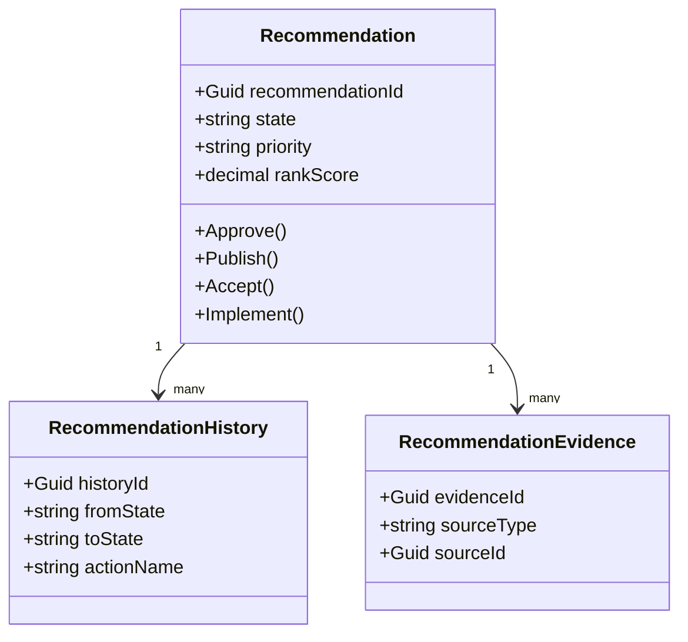
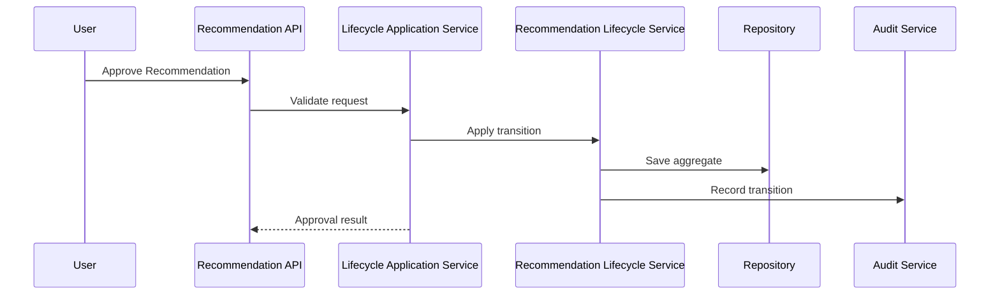
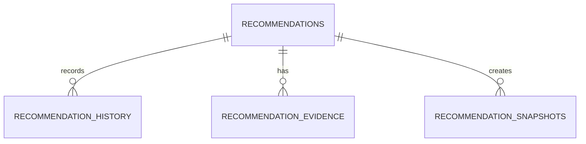
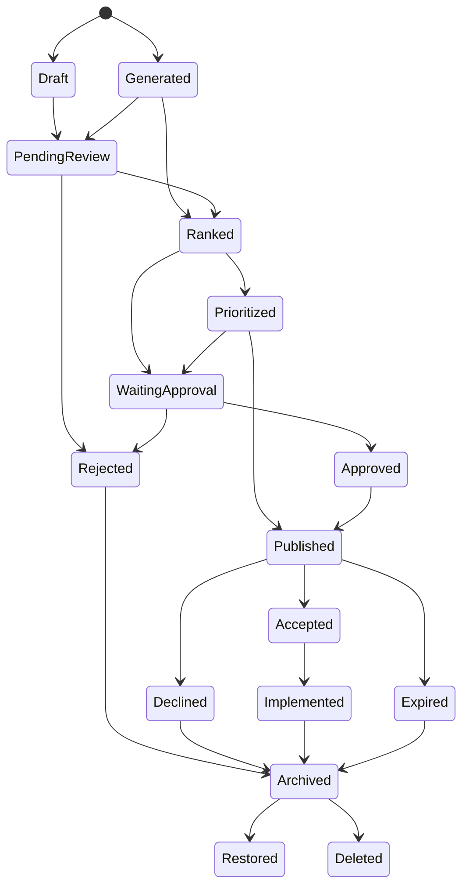
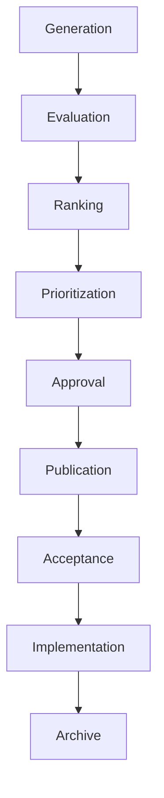
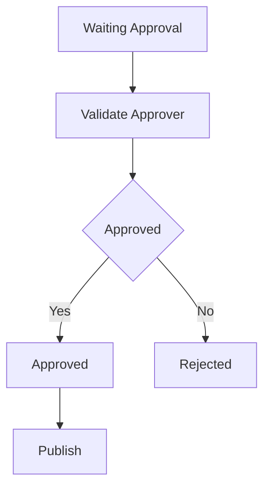
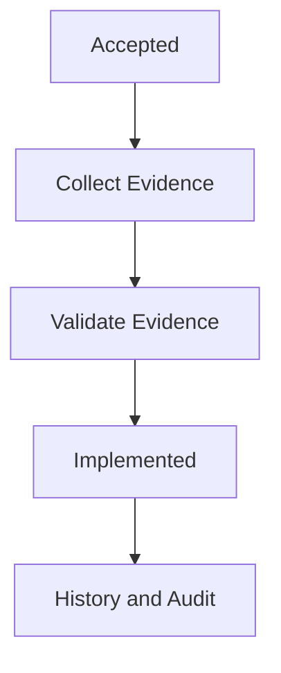

# Recommendation Lifecycle Overview
Version: 1.0.0
Status: Enterprise Specification
Owner: Atlas Recommendation Domain
Source of Truth: Recommendation Catalog
Last Updated: 2026-07-13
## Split Navigation
- [Recommendation lifecycle states and workflow](recommendation-lifecycle/states-and-workflow.md)
- [Recommendation lifecycle execution and audit](recommendation-lifecycle/execution-and-audit.md)

## Purpose
Recommendation Lifecycle defines how Atlas creates, evaluates, ranks, approves, publishes, accepts, implements, archives, restores, and deletes Recommendations. It governs lifecycle state without changing Decision, Goal, Scenario, Portfolio, CashFlow, Notification, Workflow, Automation, Business Calendar, or User domains.
It provides enterprise-grade consistency for Recommendation status, priority, ranking, history, audit, and implementation tracking.

## Business Meaning
A Recommendation is an actionable business suggestion generated or maintained inside Atlas from existing domain data. Recommendation Lifecycle ensures each Recommendation has a controlled state, explicit owner, auditable transition, and permission-aware visibility.
The lifecycle turns Recommendation signals into governed business actions while preserving domain ownership.

## Lifecycle Scope
Scope includes Recommendation creation, generation, evaluation, ranking, prioritization, approval, publication, acceptance, decline, implementation, expiration, archive, restore, deletion, snapshot, history, audit, and recovery. Scope excludes creation of new Atlas business concepts and excludes direct mutation of Decision, Goal, Scenario, Portfolio, CashFlow, Notification, Workflow, Automation, Business Calendar, or User records.

## Lifecycle Objectives
1. Keep Recommendation state deterministic and auditable. 2. Ensure every lifecycle transition has a valid trigger and permission. 3. Preserve ranking, priority, evidence, and business meaning. 4. Coordinate with Decision, Goal, Scenario, Portfolio, CashFlow, Optimization, Simulation, Workflow, Automation, Notification, Business Calendar, and User context. 5. Support enterprise APIs, repositories, database mapping, cache, security, audit, and performance. 6. Prevent stale, unauthorized, duplicate, or inconsistent Recommendations from driving action.

## Ownership
Recommendation Lifecycle is owned by the Recommendation domain. Recommendation source evidence remains owned by the originating domain.
Recommendation approval and implementation ownership are assigned by permission, Workflow, or Recommendation policy.

## Aggregate Root
Recommendation is the aggregate root when it owns identity, lifecycle state, ranking, priority, approval state, publication state, acceptance state, implementation state, history, audit, and snapshot references. Lifecycle state is part of the Recommendation aggregate.
Recommendation Lifecycle must not become the owner of Decision, Goal, Scenario, Portfolio, CashFlow, Notification, Workflow, Automation, Business Calendar, or User state.

## Relationship with Recommendation
Recommendation is the primary aggregate governed by the lifecycle. Every lifecycle command applies to exactly one Recommendation unless the command is explicitly a bulk lifecycle operation.

## Relationship with Decision
Decision provides business context, approval relevance, execution relevance, and adoption impact. Recommendation may reference Decision, but lifecycle commands must not mutate Decision directly.

## Relationship with Decision Lifecycle
Decision Lifecycle provides Decision state and timing. Recommendation Lifecycle may use Decision state to validate publish, accept, implement, expire, or archive transitions.

## Relationship with Decision Evaluation
Decision Evaluation provides evidence, criteria scores, quality score, and confidence. Recommendation Evaluation can use those values as input without owning them.

## Relationship with Goal
Goal provides alignment, priority, progress, health, and business value context. Recommendation priority and ranking may depend on Goal alignment.

## Relationship with Scenario
Scenario provides assumption-based comparison and outcome projection. Recommendation may be generated or ranked from Scenario comparison.

## Relationship with Portfolio
Portfolio provides exposure, allocation, performance, and concentration context. Recommendation may reference Portfolio impact and constraints.

## Relationship with CashFlow
CashFlow provides timing, amount, gap, surplus, and shortfall context. Recommendation may be ranked by CashFlow impact.

## Relationship with Notification
Notification delivers Recommendation lifecycle awareness to authorized Users. Notification owns channel, delivery, read state, and retry behavior.

## Relationship with Recommendation History
Recommendation History records immutable lifecycle transitions, field changes, ranking changes, priority changes, and implementation updates.

## Relationship with Recommendation Audit
Recommendation Audit records command source, permission result, policy result, approval result, export, access, and recovery activity.

## Relationship with Recommendation Priority
Recommendation Priority determines business ordering and urgency. Priority can be calculated, overridden by authorized User, or inherited from Goal, Decision, Risk, CashFlow, or Portfolio context.

## Relationship with Recommendation Engine
Recommendation Engine generates and refreshes Recommendations from existing Atlas data. Lifecycle accepts Recommendation Engine output only after validation and duplicate checks.

## Relationship with Recommendation Rule
Recommendation Rule defines generation, ranking, approval, expiration, and notification criteria. Lifecycle stores rule identifier and rule version when rule-driven.

## Relationship with Optimization
Optimization provides candidate improvements and objective scores. Recommendation may be generated from Optimization result.

## Relationship with Simulation
Simulation provides projected outcomes under assumptions. Recommendation may be generated or ranked from Simulation output.

## Relationship with Workflow
Workflow coordinates approval, review, publication, acceptance, implementation, and escalation. Lifecycle commands may be triggered by Workflow events.

## Relationship with Automation
Automation triggers scheduled generation, refresh, expiration, notification, and archive checks.

## Relationship with Business Calendar
Business Calendar defines business-day due dates, review windows, expiration windows, and escalation windows.

## Relationship with User
User provides owner, reviewer, approver, acceptor, implementer, viewer, and audit actor context. All lifecycle output must be permission-filtered per User.

---

# Lifecycle Architecture

## Lifecycle Coordinator
Lifecycle Coordinator validates commands, loads Recommendation aggregate, checks permissions, applies state transition, records events, invalidates cache, and writes audit.

## Recommendation Engine
Recommendation Engine generates or refreshes Recommendation content from existing Atlas sources. It must provide evidence, confidence, rule version, and source references.

## State Machine
State Machine enforces legal Recommendation states and transitions. It prevents illegal transitions and preserves invariants.

## Workflow Engine
Workflow Engine routes review, approval, publication, acceptance, and implementation work.

## Validation Engine
Validation Engine checks business, financial, Goal, Scenario, Portfolio, CashFlow, priority, dependency, permission, and consistency rules.

## Ranking Engine
Ranking Engine calculates rank from value, urgency, confidence, risk, effort, Goal alignment, and impact.

## Priority Engine
Priority Engine calculates priority and validates authorized priority overrides.

## Approval Engine
Approval Engine evaluates approval requirements and approval transitions.

## Audit Engine
Audit Engine records every command, transition, validation result, approval result, ranking change, implementation change, and recovery action.

## Recovery Engine
Recovery Engine handles failed generation, failed ranking, failed approval, failed publication, failed implementation, and failed cache invalidation.

## History Engine
History Engine writes immutable lifecycle records with prior state, next state, actor, reason, correlation identifier, and timestamp.

## Notification Engine
Notification Engine requests Notification creation for publish, approval, rejection, acceptance, decline, implementation, expiration, and escalation events.

---

# Recommendation States

## Draft
Purpose: Represents a manually created Recommendation that is not ready for evaluation. Entry Criteria: CreateRecommendation command succeeds with minimum required fields.
Exit Criteria: Required content and evidence are complete. Allowed Commands: UpdateRecommendation, EvaluateRecommendation, DeleteRecommendation, CloneRecommendation, CreateSnapshot.
Allowed Events: RecommendationCreated, RecommendationUpdated, RecommendationSnapshotCreated. Business Constraints: Draft Recommendations cannot be published, accepted, or implemented.

## Generated
Purpose: Represents a Recommendation produced by Recommendation Engine. Entry Criteria: GenerateRecommendation command succeeds with evidence and rule version.
Exit Criteria: Recommendation is ready for evaluation or ranking. Allowed Commands: EvaluateRecommendation, RankRecommendation, ArchiveRecommendation, DeleteRecommendation, CreateSnapshot.
Allowed Events: RecommendationGenerated, RecommendationEvaluated, RecommendationRanked. Business Constraints: Generated Recommendations must include source evidence.

## Pending Review
Purpose: Represents a Recommendation waiting for business review. Entry Criteria: Evaluation requires human or workflow review.
Exit Criteria: Reviewer completes review and sends to ranking, prioritization, approval, or rejection. Allowed Commands: UpdateRecommendation, EvaluateRecommendation, RankRecommendation, RejectRecommendation, ArchiveRecommendation.
Allowed Events: RecommendationUpdated, RecommendationEvaluated, RecommendationRanked, RecommendationRejected. Business Constraints: Review must respect assigned reviewer permission.

## Ranked
Purpose: Represents a Recommendation with calculated rank. Entry Criteria: RankRecommendation command succeeds.
Exit Criteria: Priority is assigned or approval is requested. Allowed Commands: RankRecommendation, ApproveRecommendation, RejectRecommendation, ArchiveRecommendation.
Allowed Events: RecommendationRanked, RecommendationApproved, RecommendationRejected. Business Constraints: Rank requires complete ranking inputs.

## Prioritized
Purpose: Represents a Recommendation with validated priority. Entry Criteria: Priority Engine assigns or validates priority.
Exit Criteria: Approval is requested or publication is allowed. Allowed Commands: UpdateRecommendation, ApproveRecommendation, RejectRecommendation, PublishRecommendation.
Allowed Events: RecommendationUpdated, RecommendationApproved, RecommendationRejected, RecommendationPublished. Business Constraints: Priority override requires permission and reason.

## Waiting Approval
Purpose: Represents a Recommendation awaiting approval. Entry Criteria: Approval Engine determines approval is required.
Exit Criteria: Approval or rejection is recorded. Allowed Commands: ApproveRecommendation, RejectRecommendation, ArchiveRecommendation.
Allowed Events: RecommendationApproved, RecommendationRejected, RecommendationArchived. Business Constraints: Approver must be authorized and cannot violate approval segregation.

## Approved
Purpose: Represents a Recommendation approved for publication or acceptance. Entry Criteria: ApproveRecommendation command succeeds.
Exit Criteria: Recommendation is published, archived, or rejected by policy reversal. Allowed Commands: PublishRecommendation, ArchiveRecommendation, CreateSnapshot.
Allowed Events: RecommendationApproved, RecommendationPublished, RecommendationArchived. Business Constraints: Approved Recommendation cannot be edited without returning to review.

## Rejected
Purpose: Represents a Recommendation rejected during review or approval. Entry Criteria: RejectRecommendation command succeeds.
Exit Criteria: Recommendation is archived, restored, or deleted by retention policy. Allowed Commands: ArchiveRecommendation, RestoreRecommendation, DeleteRecommendation, CreateSnapshot.
Allowed Events: RecommendationRejected, RecommendationArchived, RecommendationRestored, RecommendationDeleted. Business Constraints: Rejection reason is required.

## Published
Purpose: Represents a Recommendation visible for acceptance or decline. Entry Criteria: PublishRecommendation command succeeds.
Exit Criteria: User accepts, declines, expires, or archive policy applies. Allowed Commands: AcceptRecommendation, DeclineRecommendation, ArchiveRecommendation, CreateSnapshot.
Allowed Events: RecommendationPublished, RecommendationAccepted, RecommendationDeclined, RecommendationArchived. Business Constraints: Published Recommendation must be visible only to authorized Users.

## Accepted
Purpose: Represents a Recommendation accepted by authorized User. Entry Criteria: AcceptRecommendation command succeeds.
Exit Criteria: Implementation starts, archive applies, or expiration applies. Allowed Commands: ImplementRecommendation, ArchiveRecommendation, CreateSnapshot.
Allowed Events: RecommendationAccepted, RecommendationImplemented, RecommendationArchived. Business Constraints: Acceptance reason may be required by policy.

## Declined
Purpose: Represents a Recommendation declined by authorized User. Entry Criteria: DeclineRecommendation command succeeds.
Exit Criteria: Archive, restore, or delete applies. Allowed Commands: ArchiveRecommendation, RestoreRecommendation, DeleteRecommendation, CreateSnapshot.
Allowed Events: RecommendationDeclined, RecommendationArchived, RecommendationRestored, RecommendationDeleted. Business Constraints: Decline reason is required.

## Implemented
Purpose: Represents a Recommendation whose action has been completed or applied. Entry Criteria: ImplementRecommendation command succeeds with implementation evidence.
Exit Criteria: Archive or snapshot applies. Allowed Commands: ArchiveRecommendation, CreateSnapshot.
Allowed Events: RecommendationImplemented, RecommendationArchived, RecommendationSnapshotCreated. Business Constraints: Implementation evidence is required.

## Expired
Purpose: Represents a Recommendation no longer actionable due to time, source state, or Business Calendar rules. Entry Criteria: Expiration rule is reached or source condition is no longer current.
Exit Criteria: Archive, restore, or delete applies. Allowed Commands: ArchiveRecommendation, RestoreRecommendation, DeleteRecommendation, CreateSnapshot.
Allowed Events: RecommendationArchived, RecommendationRestored, RecommendationDeleted, RecommendationSnapshotCreated. Business Constraints: Expiration must record reason and timestamp.

## Archived
Purpose: Represents a retained read-only Recommendation. Entry Criteria: ArchiveRecommendation command succeeds.
Exit Criteria: Restore or delete applies. Allowed Commands: RestoreRecommendation, DeleteRecommendation, CreateSnapshot.
Allowed Events: RecommendationArchived, RecommendationRestored, RecommendationDeleted. Business Constraints: Archived Recommendation cannot be updated, ranked, approved, published, accepted, declined, or implemented.

## Deleted
Purpose: Represents a soft-deleted Recommendation excluded from standard queries. Entry Criteria: DeleteRecommendation command succeeds.
Exit Criteria: None unless retention policy supports administrative restore. Allowed Commands: CreateSnapshot only when audit policy allows.
Allowed Events: RecommendationDeleted. Business Constraints: Deleted Recommendation cannot be modified or published.

## Restored
Purpose: Represents a Recommendation restored from archive or deletion policy path. Entry Criteria: RestoreRecommendation command succeeds.
Exit Criteria: Recommendation returns to valid prior state or review state. Allowed Commands: EvaluateRecommendation, RankRecommendation, ArchiveRecommendation, DeleteRecommendation.
Allowed Events: RecommendationRestored, RecommendationEvaluated, RecommendationRanked, RecommendationArchived. Business Constraints: Restore requires source context validation.

## Historical
Purpose: Represents a read-only historical projection for reporting or audit. Entry Criteria: Retention or snapshot process creates historical projection.
Exit Criteria: Retention deletion if allowed. Allowed Commands: CreateSnapshot.
Allowed Events: RecommendationSnapshotCreated. Business Constraints: Historical projection must not drive active workflow.

## Template
Purpose: Represents a reusable Recommendation pattern defined by authorized configuration. Entry Criteria: CloneRecommendation or template creation policy succeeds.
Exit Criteria: New Recommendation is created from template. Allowed Commands: CloneRecommendation, UpdateRecommendation, ArchiveRecommendation.
Allowed Events: RecommendationCreated, RecommendationUpdated, RecommendationArchived. Business Constraints: Template must not reference live Decision outcome as mutable state.

---

# Transition Matrix

## Legal Transition
1. `Draft -> Pending Review`. 2. `Draft -> Deleted`. 3. `Generated -> Pending Review`. 4. `Generated -> Ranked`. 5. `Generated -> Archived`. 6. `Pending Review -> Ranked`. 7. `Pending Review -> Rejected`. 8. `Ranked -> Prioritized`. 9. `Ranked -> Waiting Approval`. 10. `Prioritized -> Waiting Approval`. 11. `Prioritized -> Published`. 12. `Waiting Approval -> Approved`. 13. `Waiting Approval -> Rejected`. 14. `Approved -> Published`. 15. `Approved -> Archived`. 16. `Rejected -> Archived`. 17. `Published -> Accepted`. 18. `Published -> Declined`. 19. `Published -> Expired`. 20. `Accepted -> Implemented`. 21. `Accepted -> Archived`. 22. `Declined -> Archived`. 23. `Implemented -> Archived`. 24. `Expired -> Archived`. 25. `Archived -> Restored`. 26. `Archived -> Deleted`. 27. `Restored -> Pending Review`. 28. `Restored -> Ranked`. 29. `Template -> Draft`. 30. `Template -> Archived`.

## Illegal Transition
1. `Deleted -> Published`. 2. `Deleted -> Accepted`. 3. `Archived -> Implemented`. 4. `Draft -> Published`. 5. `Generated -> Accepted`. 6. `Pending Review -> Implemented`. 7. `Ranked -> Accepted`. 8. `Prioritized -> Implemented`. 9. `Waiting Approval -> Published`. 10. `Rejected -> Published`. 11. `Declined -> Implemented`. 12. `Expired -> Accepted`. 13. `Implemented -> Draft`. 14. `Historical -> Published`. 15. `Template -> Implemented`.

## Trigger
Triggers include manual command, Recommendation Engine output, Workflow event, Automation schedule, Business Calendar expiration, approval action, user acceptance, implementation evidence, source domain event, and retention policy.

## Pre-condition
Pre-condition includes valid Recommendation identity, tenant access, current version match, legal current state, permission, source context availability, validation success, and idempotency key.

## Post-condition
Post-condition includes updated state, incremented version, persisted history, emitted Domain Event, updated cache invalidation, and audit record.

## Invariant
Tenant, Recommendation identity, creation timestamp, source evidence identity, and immutable history cannot change.

## Rollback Strategy
Failed command rolls back aggregate state and persistence transaction. Failed notification or cache invalidation records recovery task without reverting successful lifecycle transition.

## Recovery Strategy
Recovery uses idempotency key, correlation identifier, prior state, retry policy, and audit trail to resume or compensate.

---

# Recommendation Validation

## Business Validation
Recommendation must have title, business meaning, category, owner, source, and actionable content when moving beyond Draft.

## Financial Validation
Financial Recommendation must include amount, currency, period, confidence, and source evidence.

## Goal Validation
Goal-related Recommendation must reference authorized Goal and alignment score.

## Scenario Validation
Scenario-related Recommendation must reference compatible Scenario output.

## Portfolio Validation
Portfolio-related Recommendation must reference Portfolio identifier and exposure evidence.

## CashFlow Validation
CashFlow-related Recommendation must reference period, amount, and impact direction.

## Priority Validation
Priority must be valid, justified, and consistent with ranking unless authorized override exists.

## Dependency Validation
Recommendation dependencies must not be blocked, deleted, or unauthorized.

## Permission Validation
User must have command-specific permission and access to referenced source data.

## Consistency Validation
Lifecycle state, version, rank, priority, approval, publication, acceptance, and implementation status must be internally consistent.

---

# Recommendation Workflow

## Generation
Recommendation is created manually or generated by Recommendation Engine.

## Evaluation
Recommendation is evaluated for business validity, evidence, confidence, and applicability.

## Ranking
Ranking Engine calculates rank from value, urgency, confidence, impact, risk, effort, and alignment.

## Prioritization
Priority Engine assigns priority or validates override.

## Approval
Approval Engine determines required approvals and records approval or rejection.

## Publication
Approved Recommendation becomes visible to authorized target Users.

## Acceptance
Authorized User accepts Recommendation for implementation.

## Implementation
Implementation evidence confirms accepted Recommendation has been applied.

## Verification
Verification confirms Recommendation outcome and source state.

## Archive
Recommendation is retained read-only after completion, rejection, decline, expiration, or retention action.

---

# Validation Rules

1. `recommendation_id` is required. 2. `tenant_id` is required. 3. `title` is required. 4. `business_meaning` is required after Draft. 5. `category` must exist in Recommendation Catalog. 6. `state` must be valid. 7. `priority` must be valid. 8. `rank_score` must be between `0.0000` and `1.0000`. 9. `confidence_score` must be between `0.0000` and `1.0000`. 10. `business_value_score` must be between `0.0000` and `1.0000`. 11. `owner_user_id` is required. 12. Source type must be valid. 13. Source identifier is required for generated Recommendation. 14. Rule version is required for rule-generated Recommendation. 15. Evaluation result is required before ranking. 16. Ranking inputs are required before Ranked. 17. Priority reason is required for priority override. 18. Approval reason is required for approval. 19. Rejection reason is required for rejection. 20. Publication target is required before Published. 21. Acceptance actor is required for Accepted. 22. Decline reason is required for Declined. 23. Implementation evidence is required for Implemented. 24. Expiration reason is required for Expired. 25. Archive reason is required for Archived. 26. Restore reason is required for Restored. 27. Delete reason is required for Deleted. 28. Snapshot name is required for snapshot command. 29. Version must match for update commands. 30. Idempotency key is required for command endpoints. 31. Correlation identifier is required for event-driven commands. 32. Date range start must not exceed date range end. 33. Expiration date must use Business Calendar when policy requires. 34. Currency is required for financial Recommendation. 35. CashFlow period is required for CashFlow Recommendation. 36. Portfolio identifier is required for Portfolio Recommendation. 37. Scenario identifier is required for Scenario Recommendation. 38. Goal identifier is required for Goal Recommendation. 39. Decision identifier is required for Decision-scoped Recommendation. 40. Archived Recommendation cannot be updated. 41. Deleted Recommendation cannot be updated. 42. Published Recommendation cannot be modified without review policy. 43. Accepted Recommendation cannot be declined. 44. Declined Recommendation cannot be implemented. 45. Expired Recommendation cannot be accepted. 46. Implementation cannot occur before acceptance. 47. Approval cannot occur without approver permission. 48. Approver cannot violate segregation rule. 49. Field-level security must apply before response. 50. Masked fields cannot be exported without permission. 51. Bulk command size must not exceed limit. 52. Search sort field must be allowlisted. 53. Search filter field must be allowlisted. 54. Projection name must be valid. 55. Tenant isolation must be enforced before aggregation. 56. Cache key must include tenant and authorization context. 57. Audit write must include operator or system actor. 58. History record must include prior and next state. 59. Snapshot must preserve immutable source version. 60. Restore must validate current source context.

---

# Business Rules

1. Recommendation Lifecycle must not redesign Atlas. 2. Recommendation Lifecycle must not modify other domain ownership. 3. Recommendation Lifecycle must not create unknown business concepts. 4. Recommendation must remain tenant-isolated. 5. Recommendation must have one current lifecycle state. 6. Recommendation state transition must be legal. 7. Every state transition must be auditable. 8. Every command must be idempotent. 9. Every generated Recommendation must include evidence. 10. Every rule-generated Recommendation must include rule version. 11. Draft Recommendation cannot be published. 12. Draft Recommendation cannot be accepted. 13. Draft Recommendation cannot be implemented. 14. Generated Recommendation must pass validation before ranking. 15. Pending Review Recommendation must be reviewed by authorized User or Workflow. 16. Ranked Recommendation must have rank score. 17. Prioritized Recommendation must have priority. 18. Waiting Approval Recommendation cannot be published. 19. Approved Recommendation can be published. 20. Rejected Recommendation requires rejection reason. 21. Published Recommendation can be accepted or declined. 22. Accepted Recommendation can be implemented. 23. Declined Recommendation cannot be implemented. 24. Implemented Recommendation requires evidence. 25. Expired Recommendation cannot be accepted. 26. Archived Recommendation is read-only. 27. Deleted Recommendation is excluded from normal queries. 28. Restored Recommendation must pass validation. 29. Historical Recommendation is read-only. 30. Template Recommendation cannot be implemented directly. 31. Priority override requires permission. 32. Priority override requires reason. 33. Ranking recalculation must record prior rank. 34. Ranking recalculation must record new rank. 35. Approval must record approver. 36. Approval must record timestamp. 37. Rejection must record rejector. 38. Publication must record target audience. 39. Acceptance must record accepting User. 40. Decline must record declining User. 41. Implementation must record implementer. 42. Snapshot must preserve state and version. 43. Clone must create a new Recommendation identifier. 44. Clone must not copy audit actor as current actor. 45. Recommendation cannot mutate Decision directly. 46. Recommendation cannot mutate Goal directly. 47. Recommendation cannot mutate Scenario directly. 48. Recommendation cannot mutate Portfolio directly. 49. Recommendation cannot mutate CashFlow directly. 50. Recommendation cannot mutate Notification directly. 51. Recommendation may request Notification through Notification command. 52. Recommendation may be generated from Optimization output. 53. Recommendation may be generated from Simulation output. 54. Recommendation may be generated from Decision Evaluation output. 55. Recommendation may be ranked by Goal alignment. 56. Recommendation may be ranked by CashFlow impact. 57. Recommendation may be ranked by Portfolio impact. 58. Recommendation may be ranked by business value. 59. Recommendation may be ranked by confidence. 60. Recommendation may be ranked by urgency. 61. Recommendation may be ranked by implementation effort. 62. Recommendation with missing evidence must have lower confidence. 63. Recommendation with stale source data must be marked stale. 64. Stale Recommendation must be refreshed before approval when policy requires. 65. Recommendation expiration uses Business Calendar. 66. Approval due date uses Business Calendar. 67. Implementation due date uses Business Calendar. 68. Notification recipients must be authorized. 69. Published Recommendation visibility must respect permissions. 70. Search must exclude deleted records by default. 71. Search must exclude archived records unless requested. 72. Summary projection must not include restricted evidence. 73. Detail projection must apply field-level security. 74. Export must record access history. 75. Export must apply masking. 76. Cache must include authorization hash. 77. Cache must be invalidated after lifecycle transition. 78. Cache must be invalidated after priority change. 79. Cache must be invalidated after ranking change. 80. Cache must be invalidated after approval change. 81. Cache must be invalidated after implementation change. 82. Bulk generation must isolate per-item failure. 83. Bulk ranking must preserve deterministic ordering. 84. Concurrent update must use version check. 85. Duplicate generation must be prevented by fingerprint. 86. Duplicate active Recommendation for same source and rule is not allowed. 87. Manual Recommendation duplicate must warn or reject by policy. 88. Recommendation History is append-only. 89. Recommendation Audit is append-only. 90. Recovery must not skip audit. 91. Failed Notification must not roll back successful lifecycle transition. 92. Failed cache invalidation must create recovery task. 93. Workflow cancellation must not delete Recommendation. 94. Automation retry must use idempotency key. 95. Decision archive may archive related Recommendations by policy. 96. Decision restore may restore related Recommendations by policy. 97. Goal cancellation may expire related Recommendations by policy. 98. CashFlow change may trigger Recommendation refresh. 99. Portfolio change may trigger Recommendation refresh. 100. Scenario change may trigger Recommendation refresh. 101. Simulation result change may trigger Recommendation refresh. 102. Optimization result change may trigger Recommendation refresh. 103. User permission change must invalidate Recommendation cache. 104. Compliance hold can block deletion. 105. Retention policy controls hard deletion.

---

# State Machine

## Complete State Matrix
| From | To | Trigger | Guard |
|---|---|---|---|
| Draft | Pending Review | EvaluateRecommendation | Content complete |
| Draft | Deleted | DeleteRecommendation | Retention allows |
| Generated | Pending Review | EvaluateRecommendation | Evidence complete |
| Generated | Ranked | RankRecommendation | Evaluation passed |
| Pending Review | Ranked | RankRecommendation | Review passed |
| Pending Review | Rejected | RejectRecommendation | Reason provided |
| Ranked | Prioritized | RankRecommendation | Priority calculated |
| Ranked | Waiting Approval | Approve route | Approval required |
| Prioritized | Waiting Approval | Approval route | Approval required |
| Prioritized | Published | PublishRecommendation | Approval not required |
| Waiting Approval | Approved | ApproveRecommendation | Approver valid |
| Waiting Approval | Rejected | RejectRecommendation | Rejector valid |
| Approved | Published | PublishRecommendation | Target valid |
| Published | Accepted | AcceptRecommendation | Actor valid |
| Published | Declined | DeclineRecommendation | Reason provided |
| Published | Expired | Business Calendar | Expired |
| Accepted | Implemented | ImplementRecommendation | Evidence valid |
| Rejected | Archived | ArchiveRecommendation | Archive allowed |
| Declined | Archived | ArchiveRecommendation | Archive allowed |
| Implemented | Archived | ArchiveRecommendation | Archive allowed |
| Expired | Archived | ArchiveRecommendation | Archive allowed |
| Archived | Restored | RestoreRecommendation | Context valid |
| Archived | Deleted | DeleteRecommendation | Retention allows |

## Transitions
Transitions must be executed through commands or authorized system triggers.

## Triggers
Triggers include command, workflow, automation, rule, Business Calendar, source event, and retention policy.

## Invariant
Lifecycle state, version, history, audit, and source evidence must remain consistent.

## Illegal Transition
Illegal transitions are rejected with `409 Conflict` or domain validation error.

---

# Commands

1. `CreateRecommendation`: Creates manual Recommendation. 2. `UpdateRecommendation`: Updates mutable Recommendation data. 3. `GenerateRecommendation`: Generates Recommendation from source evidence. 4. `EvaluateRecommendation`: Evaluates Recommendation validity. 5. `RankRecommendation`: Calculates rank. 6. `ApproveRecommendation`: Approves Recommendation. 7. `RejectRecommendation`: Rejects Recommendation. 8. `PublishRecommendation`: Publishes Recommendation. 9. `AcceptRecommendation`: Accepts Recommendation. 10. `DeclineRecommendation`: Declines Recommendation. 11. `ImplementRecommendation`: Marks implementation complete with evidence. 12. `ArchiveRecommendation`: Archives Recommendation. 13. `RestoreRecommendation`: Restores Recommendation. 14. `DeleteRecommendation`: Soft deletes Recommendation. 15. `CloneRecommendation`: Creates new Recommendation from existing Recommendation. 16. `CreateSnapshot`: Creates immutable Recommendation snapshot.

## All Related Domain Commands
1. `PrioritizeRecommendation`. 2. `RecalculateRecommendationRank`. 3. `RefreshRecommendation`. 4. `ExpireRecommendation`. 5. `PublishRecommendationBatch`. 6. `ArchiveRecommendationBatch`. 7. `AssignRecommendationOwner`. 8. `ChangeRecommendationPriority`. 9. `AttachRecommendationEvidence`. 10. `DetachRecommendationEvidence`.

---

# Domain Events

1. `RecommendationCreated`. 2. `RecommendationUpdated`. 3. `RecommendationGenerated`. 4. `RecommendationEvaluated`. 5. `RecommendationRanked`. 6. `RecommendationApproved`. 7. `RecommendationRejected`. 8. `RecommendationPublished`. 9. `RecommendationAccepted`. 10. `RecommendationDeclined`. 11. `RecommendationImplemented`. 12. `RecommendationArchived`. 13. `RecommendationRestored`. 14. `RecommendationDeleted`. 15. `RecommendationSnapshotCreated`. 16. `RecommendationPrioritized`. 17. `RecommendationRankChanged`. 18. `RecommendationPriorityChanged`. 19. `RecommendationExpired`. 20. `RecommendationOwnerAssigned`. 21. `RecommendationEvidenceAttached`. 22. `RecommendationEvidenceDetached`. 23. `RecommendationRefreshFailed`. 24. `RecommendationNotificationRequested`.

---

# Repository

## Interface
```csharp
public interface IRecommendationRepository
{
    Task<Recommendation?> GetByIdAsync(Guid tenantId, Guid recommendationId, CancellationToken cancellationToken);
    Task<Recommendation?> GetByFingerprintAsync(Guid tenantId, string fingerprint, CancellationToken cancellationToken);
    Task<IReadOnlyList<Recommendation>> SearchAsync(RecommendationSearchSpecification specification, CancellationToken cancellationToken);
    Task AddAsync(Recommendation recommendation, CancellationToken cancellationToken);
    Task UpdateAsync(Recommendation recommendation, CancellationToken cancellationToken);
    Task AddHistoryAsync(RecommendationHistory history, CancellationToken cancellationToken);
    Task SaveChangesAsync(CancellationToken cancellationToken);
}
```

## Methods
1. `GetByIdAsync`. 2. `GetByDecisionIdAsync`. 3. `GetByGoalIdAsync`. 4. `GetByScenarioIdAsync`. 5. `GetByPortfolioIdAsync`. 6. `GetByCashFlowIdAsync`. 7. `GetByFingerprintAsync`. 8. `SearchAsync`. 9. `CountAsync`. 10. `AggregateByStateAsync`. 11. `AggregateByPriorityAsync`. 12. `AddAsync`. 13. `UpdateAsync`. 14. `AddHistoryAsync`. 15. `AddSnapshotAsync`. 16. `SoftDeleteAsync`. 17. `SaveChangesAsync`.

## Queries
1. Active Recommendations by tenant. 2. Recommendations by Decision. 3. Recommendations by Goal. 4. Recommendations by Scenario. 5. Recommendations by Portfolio. 6. Recommendations by CashFlow period. 7. Recommendations pending approval. 8. Recommendations pending implementation. 9. Expired Recommendations. 10. Archived Recommendations. 11. Recommendation snapshots. 12. Recommendation history.

## Filtering
1. `tenant_id`. 2. `recommendation_id`. 3. `state`. 4. `priority`. 5. `category`. 6. `decision_id`. 7. `goal_id`. 8. `scenario_id`. 9. `portfolio_id`. 10. `cashflow_id`. 11. `owner_user_id`. 12. `generated_from`. 13. `generated_to`. 14. `expires_from`. 15. `expires_to`.

## Sorting
1. `rank_score desc`. 2. `priority desc`. 3. `confidence_score desc`. 4. `business_value_score desc`. 5. `created_at desc`. 6. `updated_at desc`. 7. `expires_at asc`. 8. `state asc`.

## Aggregation
1. Count by state. 2. Count by priority. 3. Count by category. 4. Count by owner. 5. Average rank score. 6. Average confidence score. 7. Published count. 8. Accepted count. 9. Implemented count. 10. Expired count.

## Projection
1. Summary projection. 2. Detail projection. 3. Lifecycle projection. 4. State projection. 5. Transition projection. 6. Priority projection. 7. Ranking projection. 8. Snapshot projection. 9. Search projection. 10. Audit projection.

## Specification
`RecommendationSearchSpecification` includes tenant, authorization context, filters, sorting, pagination, projection, include archived flag, and include deleted flag.

---

# Domain Service Interaction

1. `RecommendationLifecycleService` validates transitions. 2. `RecommendationGenerationService` handles generated content and evidence. 3. `RecommendationValidationService` applies validation categories. 4. `RecommendationRankingService` calculates rank. 5. `RecommendationPriorityService` calculates priority. 6. `RecommendationApprovalService` validates approval rules. 7. `RecommendationPublicationService` validates publish target. 8. `RecommendationAcceptanceService` validates accept and decline. 9. `RecommendationImplementationService` validates implementation evidence. 10. `RecommendationExpirationService` calculates expiration. 11. `RecommendationSnapshotService` creates snapshots. 12. `RecommendationHistoryService` writes history. 13. `RecommendationAuditService` writes audit. 14. `RecommendationNotificationService` requests Notification. 15. `RecommendationCacheService` invalidates cache.

---

# Application Service Interaction

1. `CreateRecommendationApplicationService`. 2. `UpdateRecommendationApplicationService`. 3. `GenerateRecommendationApplicationService`. 4. `EvaluateRecommendationApplicationService`. 5. `RankRecommendationApplicationService`. 6. `ApproveRecommendationApplicationService`. 7. `RejectRecommendationApplicationService`. 8. `PublishRecommendationApplicationService`. 9. `AcceptRecommendationApplicationService`. 10. `DeclineRecommendationApplicationService`. 11. `ImplementRecommendationApplicationService`. 12. `ArchiveRecommendationApplicationService`. 13. `RestoreRecommendationApplicationService`. 14. `DeleteRecommendationApplicationService`. 15. `CloneRecommendationApplicationService`. 16. `CreateRecommendationSnapshotApplicationService`. 17. `SearchRecommendationApplicationService`. 18. `DecisionApplicationService` supplies Decision context. 19. `GoalApplicationService` supplies Goal context. 20. `ScenarioApplicationService` supplies Scenario context. 21. `PortfolioApplicationService` supplies Portfolio context. 22. `CashFlowApplicationService` supplies CashFlow context. 23. `NotificationApplicationService` handles Notification commands. 24. `WorkflowApplicationService` handles approval and implementation routing. 25. `BusinessCalendarApplicationService` handles business date calculation.

---

# API

## REST Endpoints
| Endpoint | Method | Purpose |
|---|---:|---|
| `/api/recommendations` | `POST` | Create Recommendation |
| `/api/recommendations` | `GET` | Search Recommendations |
| `/api/recommendations/{recommendationId}` | `GET` | Get detail |
| `/api/recommendations/{recommendationId}` | `PATCH` | Update Recommendation |
| `/api/recommendations/generate` | `POST` | Generate Recommendation |
| `/api/recommendations/{recommendationId}/evaluate` | `POST` | Evaluate Recommendation |
| `/api/recommendations/{recommendationId}/rank` | `POST` | Rank Recommendation |
| `/api/recommendations/{recommendationId}/approve` | `POST` | Approve Recommendation |
| `/api/recommendations/{recommendationId}/reject` | `POST` | Reject Recommendation |
| `/api/recommendations/{recommendationId}/publish` | `POST` | Publish Recommendation |
| `/api/recommendations/{recommendationId}/accept` | `POST` | Accept Recommendation |
| `/api/recommendations/{recommendationId}/decline` | `POST` | Decline Recommendation |
| `/api/recommendations/{recommendationId}/implement` | `POST` | Implement Recommendation |
| `/api/recommendations/{recommendationId}/archive` | `POST` | Archive Recommendation |
| `/api/recommendations/{recommendationId}/restore` | `POST` | Restore Recommendation |
| `/api/recommendations/{recommendationId}` | `DELETE` | Delete Recommendation |
| `/api/recommendations/{recommendationId}/clone` | `POST` | Clone Recommendation |
| `/api/recommendations/{recommendationId}/snapshots` | `POST` | Create snapshot |

## HTTP Methods
`GET` reads Recommendation resources. `POST` creates resources or executes lifecycle commands.
`PATCH` updates mutable fields. `DELETE` performs soft deletion.

## Request
Requests include tenant context, authorization token, idempotency key for command endpoints, version for concurrency, correlation identifier, filters, sorting, pagination, and projection where applicable.

## Response
Responses include data, metadata, links, errors, trace identifier, timestamp, and version.

## Errors
1. `400 Bad Request`: Validation failed. 2. `401 Unauthorized`: Authentication missing. 3. `403 Forbidden`: Permission denied. 4. `404 Not Found`: Recommendation not found. 5. `409 Conflict`: Invalid state transition or duplicate fingerprint. 6. `412 Precondition Failed`: Version conflict. 7. `422 Unprocessable Entity`: Business rule violation. 8. `429 Too Many Requests`: Bulk or generation limit exceeded. 9. `500 Internal Server Error`: Unexpected failure.

## Pagination
Pagination includes `pageNumber`, `pageSize`, `totalCount`, `totalPages`, and `hasNext`.

## Filtering
Filtering supports allowlisted Recommendation fields and related identifiers.

## Sorting
Sorting supports allowlisted fields and stable secondary sort.

## Projection
Projection options include summary, detail, lifecycle, state, transition, priority, ranking, snapshot, search, and audit.

## Bulk Operations
Bulk operations include generate, evaluate, rank, publish, archive, expire, and export where configured.

## Lifecycle Operations
Lifecycle operations are command endpoints that enforce state machine rules.

---

# DTO

## Create DTO
```json
{
  "title": "Reduce cash flow pressure",
  "businessMeaning": "Adjust timing to reduce projected shortfall.",
  "category": "CashFlowRecommendation",
  "ownerUserId": "11111111-1111-1111-1111-111111111111",
  "sourceType": "CashFlow",
  "sourceId": "22222222-2222-2222-2222-222222222222"
}
```

## Update DTO
```json
{
  "title": "Reduce projected cash flow pressure",
  "businessMeaning": "Adjust Decision timing to reduce shortfall.",
  "version": 2
}
```

## Recommendation DTO
Fields: `recommendationId`, `tenantId`, `title`, `category`, `state`, `priority`, `rankScore`, `confidenceScore`, `ownerUserId`, `version`.

## Lifecycle DTO
Fields: `state`, `enteredAt`, `expiresAt`, `lastTransition`, `allowedCommands`.

## State DTO
Fields: `state`, `purpose`, `entryCriteria`, `exitCriteria`, `allowedCommands`, `businessConstraints`.

## Transition DTO
Fields: `fromState`, `toState`, `trigger`, `preCondition`, `postCondition`, `operatorUserId`, `occurredAt`.

## Priority DTO
Fields: `priority`, `priorityScore`, `reason`, `isOverride`, `updatedBy`, `updatedAt`.

## Ranking DTO
Fields: `rankScore`, `rankPosition`, `rankingInputs`, `formula`, `calculatedAt`.

## Snapshot DTO
Fields: `snapshotId`, `recommendationId`, `state`, `version`, `snapshotData`, `createdAt`.

## Summary DTO
Fields: `recommendationId`, `title`, `state`, `priority`, `rankScore`, `confidenceScore`, `updatedAt`.

## Detail DTO
Fields: summary fields, `businessMeaning`, `evidence`, `history`, `audit`, `approval`, `implementation`.

## Search DTO
Fields: `filters`, `sort`, `pagination`, `projection`, `includeArchived`, `includeDeleted`.

---

# Database Mapping

## Table
Primary table: `recommendations`. History table: `recommendation_history`.
Snapshot table: `recommendation_snapshots`. Evidence table: `recommendation_evidence`.

## Columns
1. `recommendation_id`. 2. `tenant_id`. 3. `fingerprint`. 4. `title`. 5. `business_meaning`. 6. `category`. 7. `state`. 8. `priority`. 9. `rank_score`. 10. `confidence_score`. 11. `business_value_score`. 12. `owner_user_id`. 13. `source_type`. 14. `source_id`. 15. `rule_id`. 16. `rule_version`. 17. `expires_at`. 18. `published_at`. 19. `accepted_at`. 20. `implemented_at`. 21. `archived_at`. 22. `deleted_at`. 23. `created_at`. 24. `updated_at`. 25. `version`.

## Indexes
1. Primary key on `recommendation_id`. 2. Index on `tenant_id`, `state`. 3. Index on `tenant_id`, `priority`. 4. Index on `tenant_id`, `owner_user_id`. 5. Index on `tenant_id`, `source_type`, `source_id`. 6. Index on `tenant_id`, `expires_at`. 7. Unique active fingerprint index.

## Constraints
1. Tenant identifier not null. 2. Title not null. 3. Category not null. 4. State not null. 5. Priority not null. 6. Score range checks. 7. Version greater than zero.

## FK
History, evidence, and snapshot records reference `recommendations.recommendation_id`.

## Unique
Active fingerprint must be unique per tenant where deleted is null and state is not Archived or Deleted.

## Check Constraint
State, priority, score range, and version constraints are enforced at database level.

## Partition Strategy
History and snapshots may be partitioned by tenant and month.

---

# PostgreSQL Schema

```sql
CREATE TABLE recommendations (
    recommendation_id uuid PRIMARY KEY,
    tenant_id uuid NOT NULL,
    fingerprint varchar(160) NOT NULL,
    title varchar(240) NOT NULL,
    business_meaning text NULL,
    category varchar(80) NOT NULL,
    state varchar(40) NOT NULL,
    priority varchar(20) NOT NULL,
    rank_score numeric(7,4) NOT NULL DEFAULT 0,
    confidence_score numeric(7,4) NOT NULL DEFAULT 0,
    business_value_score numeric(7,4) NOT NULL DEFAULT 0,
    owner_user_id uuid NOT NULL,
    source_type varchar(80) NULL,
    source_id uuid NULL,
    rule_id uuid NULL,
    rule_version integer NULL,
    expires_at timestamptz NULL,
    published_at timestamptz NULL,
    accepted_at timestamptz NULL,
    implemented_at timestamptz NULL,
    archived_at timestamptz NULL,
    deleted_at timestamptz NULL,
    created_at timestamptz NOT NULL,
    updated_at timestamptz NOT NULL,
    version integer NOT NULL DEFAULT 1,
    CONSTRAINT ck_recommendations_state CHECK (state IN ('Draft','Generated','PendingReview','Ranked','Prioritized','WaitingApproval','Approved','Rejected','Published','Accepted','Declined','Implemented','Expired','Archived','Deleted','Restored','Historical','Template')),
    CONSTRAINT ck_recommendations_priority CHECK (priority IN ('Low','Medium','High','Critical')),
    CONSTRAINT ck_recommendations_scores CHECK (rank_score BETWEEN 0 AND 1 AND confidence_score BETWEEN 0 AND 1 AND business_value_score BETWEEN 0 AND 1),
    CONSTRAINT ck_recommendations_version CHECK (version > 0)
);

CREATE TABLE recommendation_history (
    history_id uuid PRIMARY KEY,
    recommendation_id uuid NOT NULL REFERENCES recommendations(recommendation_id),
    tenant_id uuid NOT NULL,
    from_state varchar(40) NULL,
    to_state varchar(40) NOT NULL,
    action_name varchar(80) NOT NULL,
    reason text NULL,
    operator_user_id uuid NULL,
    correlation_id varchar(120) NOT NULL,
    occurred_at timestamptz NOT NULL
);

CREATE TABLE recommendation_evidence (
    evidence_id uuid PRIMARY KEY,
    recommendation_id uuid NOT NULL REFERENCES recommendations(recommendation_id),
    tenant_id uuid NOT NULL,
    source_type varchar(80) NOT NULL,
    source_id uuid NOT NULL,
    evidence_name varchar(120) NOT NULL,
    evidence_value text NULL,
    captured_at timestamptz NOT NULL,
    created_at timestamptz NOT NULL
);

CREATE TABLE recommendation_snapshots (
    snapshot_id uuid PRIMARY KEY,
    recommendation_id uuid NOT NULL REFERENCES recommendations(recommendation_id),
    tenant_id uuid NOT NULL,
    snapshot_name varchar(160) NOT NULL,
    snapshot_data jsonb NOT NULL,
    created_by uuid NULL,
    created_at timestamptz NOT NULL
);

CREATE INDEX ix_recommendations_tenant_state ON recommendations (tenant_id, state);
CREATE INDEX ix_recommendations_tenant_priority ON recommendations (tenant_id, priority);
CREATE INDEX ix_recommendations_tenant_owner ON recommendations (tenant_id, owner_user_id);
CREATE INDEX ix_recommendations_source ON recommendations (tenant_id, source_type, source_id);
CREATE INDEX ix_recommendations_expires ON recommendations (tenant_id, expires_at) WHERE expires_at IS NOT NULL AND deleted_at IS NULL;
CREATE UNIQUE INDEX ux_recommendations_active_fingerprint ON recommendations (tenant_id, fingerprint) WHERE deleted_at IS NULL AND state NOT IN ('Archived','Deleted');
CREATE INDEX ix_recommendation_history_recommendation ON recommendation_history (tenant_id, recommendation_id, occurred_at DESC);
CREATE INDEX ix_recommendation_evidence_recommendation ON recommendation_evidence (tenant_id, recommendation_id);
CREATE INDEX ix_recommendation_snapshots_recommendation ON recommendation_snapshots (tenant_id, recommendation_id, created_at DESC);

CREATE VIEW v_recommendation_summary AS
SELECT recommendation_id, tenant_id, title, category, state, priority, rank_score, confidence_score, owner_user_id, updated_at
FROM recommendations
WHERE deleted_at IS NULL;

CREATE MATERIALIZED VIEW mv_recommendation_lifecycle_metrics AS
SELECT tenant_id, state, priority, count(*) AS recommendation_count, avg(rank_score) AS avg_rank_score, avg(confidence_score) AS avg_confidence_score
FROM recommendations
WHERE deleted_at IS NULL
GROUP BY tenant_id, state, priority;

CREATE INDEX ix_mv_recommendation_lifecycle_metrics ON mv_recommendation_lifecycle_metrics (tenant_id, state, priority);
```

## Indexes
Indexes support state, priority, owner, source, expiration, history, evidence, and snapshot reads.

## Constraints
Constraints enforce state, priority, score range, and version validity.

## Views
`v_recommendation_summary` supports search and summary projection.

## Materialized Views
`mv_recommendation_lifecycle_metrics` supports dashboard, analytics, and reporting.

---

# EF Core Mapping

## Fluent API
```csharp
builder.ToTable("recommendations");
builder.HasKey(x => x.RecommendationId);
builder.Property(x => x.TenantId).IsRequired();
builder.Property(x => x.Fingerprint).HasMaxLength(160).IsRequired();
builder.Property(x => x.Title).HasMaxLength(240).IsRequired();
builder.Property(x => x.Category).HasMaxLength(80).IsRequired();
builder.Property(x => x.State).HasMaxLength(40).IsRequired();
builder.Property(x => x.Priority).HasMaxLength(20).IsRequired();
builder.Property(x => x.RankScore).HasPrecision(7, 4);
builder.Property(x => x.ConfidenceScore).HasPrecision(7, 4);
builder.Property(x => x.BusinessValueScore).HasPrecision(7, 4);
builder.Property(x => x.Version).IsConcurrencyToken();
```

## Owned Types
1. `RecommendationLifecycle`. 2. `RecommendationPriority`. 3. `RecommendationRanking`. 4. `RecommendationSource`. 5. `RecommendationAuditMetadata`.

## Indexes
```csharp
builder.HasIndex(x => new { x.TenantId, x.State });
builder.HasIndex(x => new { x.TenantId, x.Priority });
builder.HasIndex(x => new { x.TenantId, x.OwnerUserId });
builder.HasIndex(x => new { x.TenantId, x.SourceType, x.SourceId });
builder.HasIndex(x => new { x.TenantId, x.Fingerprint }).IsUnique().HasFilter("deleted_at IS NULL AND state NOT IN ('Archived','Deleted')");
```

## Value Conversion
State, priority, category, source type, and command result convert to string. Scores convert to decimal with four-place precision.

## Query Filters
Global query filter enforces tenant and excludes soft-deleted records by default.

---

# Cache Strategy

## Redis Key
1. `atlas:tenant:{tenantId}:recommendation:{recommendationId}:detail:{authHash}`. 2. `atlas:tenant:{tenantId}:recommendation:{recommendationId}:lifecycle:{authHash}`. 3. `atlas:tenant:{tenantId}:recommendations:search:{filterHash}:{authHash}`. 4. `atlas:tenant:{tenantId}:recommendations:metrics:{projection}:{authHash}`. 5. `atlas:tenant:{tenantId}:recommendations:pending-approval:{authHash}`.

## Recommendation Cache
Recommendation cache stores summary, detail, and lifecycle projections after permission filtering.

## Lifecycle Cache
Lifecycle cache stores state, allowed commands, transition history summary, and due dates.

## TTL
Detail TTL is 5 minutes. Lifecycle TTL is 3 minutes.
Search TTL is 2 minutes. Metrics TTL is 5 minutes.

## Refresh Strategy
Refresh cache after lifecycle transition, priority change, ranking change, evidence change, approval change, implementation change, archive, restore, or delete.

## Invalidation
Invalidate by tenant, Recommendation, owner, source, state, priority, and projection.

---

# Security

## Authorization
Authorization validates tenant access, Recommendation access, source access, command permission, projection permission, and field permission.

## Permissions
1. `Recommendation.Read`. 2. `Recommendation.Create`. 3. `Recommendation.Update`. 4. `Recommendation.Generate`. 5. `Recommendation.Evaluate`. 6. `Recommendation.Rank`. 7. `Recommendation.Approve`. 8. `Recommendation.Reject`. 9. `Recommendation.Publish`. 10. `Recommendation.Accept`. 11. `Recommendation.Decline`. 12. `Recommendation.Implement`. 13. `Recommendation.Archive`. 14. `Recommendation.Restore`. 15. `Recommendation.Delete`. 16. `Recommendation.Snapshot`.

## Recommendation Permissions
Recommendation permissions control lifecycle commands, search, detail, export, and snapshot access.

## Approval Permissions
Approval permissions require approver role and segregation compliance.

## Field Level Security
Financial amounts, CashFlow values, Portfolio exposure, Risk notes, User behavior, approval comments, and audit details must be masked when unauthorized.

## Data Masking
Masked values must not be cached or exported as raw values.

---

# Audit

## Recommendation History
Stores state transition history and lifecycle field changes.

## Lifecycle History
Stores command, trigger, prior state, next state, and correlation identifier.

## Approval History
Stores approver, decision, reason, timestamp, and policy result.

## Ranking History
Stores prior rank, new rank, formula, input references, and calculation timestamp.

## Implementation History
Stores implementer, evidence, result, and verification state.

## Operator History
Stores User or system actor for every lifecycle command.

---

# Performance

## Lifecycle Optimization
Use summary projection for lists and detail projection only on demand.

## Batch Recommendation Processing
Batch generation, ranking, expiration, and archive operations must partition by tenant and source.

## Parallel Ranking
Independent Recommendations may be ranked in parallel with deterministic ordering after merge.

## Caching
Cache summary, lifecycle, metrics, and pending approval projections.

## Materialized Views
Use materialized lifecycle metrics for dashboard and reporting.

## Incremental Processing
Incremental refresh uses source change cursor and idempotent replay.

---

# Example JSON

## Create
```json
{
  "title": "Improve Decision timing",
  "businessMeaning": "Move the Decision date to reduce CashFlow pressure.",
  "category": "CashFlowRecommendation",
  "ownerUserId": "11111111-1111-1111-1111-111111111111"
}
```

## Update
```json
{
  "title": "Improve Decision timing for next period",
  "version": 2
}
```

## Generate
```json
{
  "sourceType": "DecisionEvaluation",
  "sourceId": "22222222-2222-2222-2222-222222222222",
  "ruleId": "33333333-3333-3333-3333-333333333333",
  "correlationId": "recommendation-generation-20260713-001"
}
```

## Approve
```json
{
  "approvalReason": "Recommendation meets policy and evidence requirements.",
  "version": 4
}
```

## Reject
```json
{
  "rejectionReason": "Evidence is insufficient for publication.",
  "version": 4
}
```

## Publish
```json
{
  "targetUserIds": ["11111111-1111-1111-1111-111111111111"],
  "version": 5
}
```

## Accept
```json
{
  "acceptanceReason": "Recommendation will be implemented.",
  "version": 6
}
```

## Implement
```json
{
  "implementationEvidence": [
    {
      "sourceType": "Decision",
      "sourceId": "22222222-2222-2222-2222-222222222222",
      "evidenceName": "implementationStatus",
      "evidenceValue": "Completed"
    }
  ],
  "version": 7
}
```

## Archive
```json
{
  "archiveReason": "Recommendation lifecycle completed.",
  "version": 8
}
```

## Restore
```json
{
  "restoreReason": "Business review requires restored Recommendation.",
  "version": 9
}
```

## Search
```json
{
  "filters": {
    "state": ["Published", "Accepted"],
    "priority": ["High", "Critical"]
  },
  "sort": [{ "field": "rankScore", "direction": "desc" }],
  "pagination": { "pageNumber": 1, "pageSize": 25 },
  "projection": "summary"
}
```

## Summary
```json
{
  "recommendationId": "44444444-4444-4444-4444-444444444444",
  "title": "Improve Decision timing",
  "state": "Published",
  "priority": "High",
  "rankScore": 0.86,
  "confidenceScore": 0.82
}
```

## Detail
```json
{
  "recommendationId": "44444444-4444-4444-4444-444444444444",
  "title": "Improve Decision timing",
  "businessMeaning": "Move the Decision date to reduce CashFlow pressure.",
  "state": "Published",
  "priority": "High",
  "history": [],
  "evidence": []
}
```

## Snapshot
```json
{
  "snapshotName": "Approval Snapshot",
  "includeEvidence": true,
  "includeHistory": true
}
```

---

# Mermaid

## Class Diagram


## Sequence Diagram


## ER Diagram


## Complete State Diagram


## Lifecycle Flow


## Approval Flow


## Implementation Flow


---

# Testing

## Unit Test
1. Validate legal transition. 2. Reject illegal transition. 3. Validate priority calculation. 4. Validate rank calculation. 5. Validate approval permission. 6. Validate source evidence requirement. 7. Validate expiration calculation. 8. Validate duplicate fingerprint. 9. Validate cache key. 10. Validate projection masking.

## Integration Test
1. Create Recommendation. 2. Generate Recommendation. 3. Evaluate Recommendation. 4. Rank Recommendation. 5. Approve Recommendation. 6. Reject Recommendation. 7. Publish Recommendation. 8. Accept Recommendation. 9. Decline Recommendation. 10. Implement Recommendation. 11. Archive Recommendation. 12. Restore Recommendation. 13. Delete Recommendation. 14. Create snapshot.

## Lifecycle Test
1. Draft to Pending Review. 2. Generated to Ranked. 3. Ranked to Prioritized. 4. Waiting Approval to Approved. 5. Published to Accepted. 6. Published to Declined. 7. Accepted to Implemented. 8. Implemented to Archived. 9. Archived to Restored. 10. Archived to Deleted.

## Validation Test
1. Missing title. 2. Missing source evidence. 3. Invalid state. 4. Invalid priority. 5. Invalid rank score. 6. Invalid confidence score. 7. Missing rejection reason. 8. Missing implementation evidence. 9. Invalid date range. 10. Unauthorized command.

## Approval Test
1. Authorized approver approves. 2. Unauthorized approver rejected. 3. Segregation violation rejected. 4. Approval reason required. 5. Approval history persisted.

## Ranking Test
1. Ranking formula produces deterministic score. 2. Missing input lowers confidence. 3. Ranking history stores prior score. 4. Parallel ranking remains deterministic. 5. Priority override does not overwrite rank.

## Performance Test
1. Search 100,000 Recommendations. 2. Batch generate 10,000 Recommendations. 3. Parallel rank 10,000 Recommendations. 4. Refresh materialized metrics. 5. Read lifecycle projection under target latency.

## Concurrency Test
1. Concurrent update version conflict. 2. Concurrent approve and reject. 3. Concurrent publish and archive. 4. Concurrent accept and decline. 5. Concurrent rank recalculation.

## Recovery Test
1. Failed generation recovery. 2. Failed ranking recovery. 3. Failed Notification recovery. 4. Failed cache invalidation recovery. 5. Failed audit write handling.

---

# Edge Cases

1. Recommendation does not exist. 2. Recommendation exists but User lacks access. 3. Source Decision is archived. 4. Source Goal is cancelled. 5. Source Scenario is unavailable. 6. Source Portfolio value is stale. 7. Source CashFlow period is missing. 8. Rule version is inactive. 9. Duplicate generation event arrives. 10. Duplicate fingerprint is created concurrently. 11. Ranking input is incomplete. 12. Confidence score is zero. 13. Rank score exceeds allowed range. 14. Priority override lacks reason. 15. Approval route has no approver. 16. Approver violates segregation rule. 17. Recommendation expires during approval. 18. Recommendation expires after publication. 19. User accepts after expiration. 20. User declines after acceptance. 21. Implementation evidence is missing. 22. Implementation evidence is masked. 23. Archive blocked by compliance hold. 24. Delete blocked by retention. 25. Restore source context is unavailable. 26. Snapshot creation fails. 27. Notification request fails. 28. Cache invalidation fails. 29. Audit write fails. 30. History write fails. 31. Bulk generation partially fails. 32. Bulk ranking partially fails. 33. Search filter field is unsupported. 34. Sort field is unsupported. 35. Projection is invalid. 36. Export includes masked field. 37. Business Calendar changes expiration. 38. User permission changes after publication. 39. Decision state changes after acceptance. 40. Optimization result changes after ranking. 41. Simulation output changes after publication. 42. Workflow is cancelled during approval. 43. Automation retries same command. 44. Version conflict occurs during implementation. 45. Historical projection is requested for active command.

---

# Version History

| Version | Date | Author | Change |
|---|---:|---|---|
| 1.0.0 | 2026-07-13 | Atlas Recommendation Domain | Enterprise specification for Recommendation Lifecycle. |

## Phase 2 Executable Specification Addendum

### Recommendation Lifecycle Contract

| Field | Requirement |
|---|---|
| Aggregate | Recommendation |
| Identity | recommendationId |
| Scope | tenantId, ownerUserId, sourceReference |
| Required State | state, priority, rankScore, confidenceScore, sourceEvidence, version |
| Outputs | lifecycleState, allowedCommands, transitionHistory, auditReference |
| Invariant | Every lifecycle transition must be legal, permissioned, versioned, and audited. |

### Required Commands

| Command | Purpose |
|---|---|
| CreateRecommendation | Create draft recommendation. |
| GenerateRecommendation | Create recommendation from engine output. |
| RankRecommendation | Rank recommendation with deterministic inputs. |
| PrioritizeRecommendation | Assign or validate priority. |
| ApproveRecommendation | Approve for publication or acceptance. |
| PublishRecommendation | Make recommendation visible to authorized users. |
| AcceptRecommendation | Record user acceptance. |
| DeclineRecommendation | Record user decline. |
| ImplementRecommendation | Record implementation evidence. |
| ArchiveRecommendation | Move recommendation to retained read-only state. |
| ReplayRecommendationLifecycle | Rebuild lifecycle state from history. |

### Addendum Validation Rules

1. Current state and requested command must be legal in the transition matrix.
2. Lifecycle command must include actor, reason when required, version, and correlation id.
3. Duplicate active fingerprint is not allowed per tenant.
4. Implementation requires evidence and authorized implementer.
5. Replay must produce one current state and immutable transition history.

### Addendum Testing Matrix

| Scenario | Expected Result |
|---|---|
| Draft to published | Illegal transition is rejected. |
| Waiting approval to approved | Authorized approver transitions state. |
| Published to accepted after expiration | Command is rejected. |
| Duplicate fingerprint | Creation or generation fails. |
| Replay lifecycle | Current state and history match stored transitions. |

### Addendum Version History

| Version | Date | Description |
|---|---|---|
| 1.0-p2 | 2026-07-15 | Phase 2 executable addendum added. |
